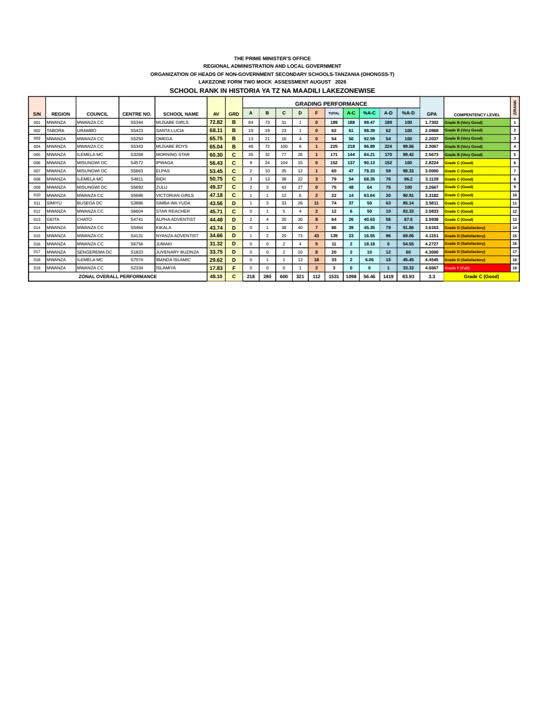
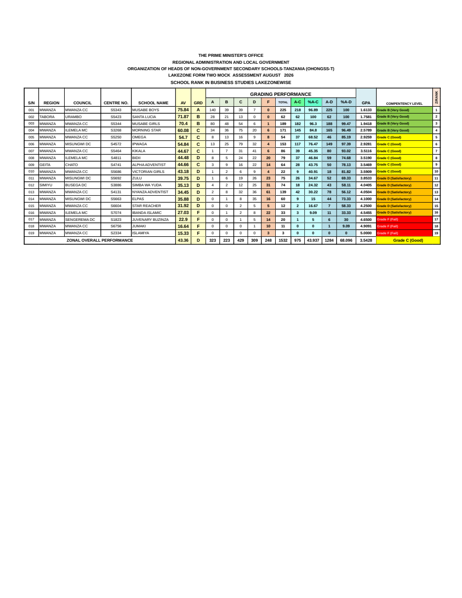
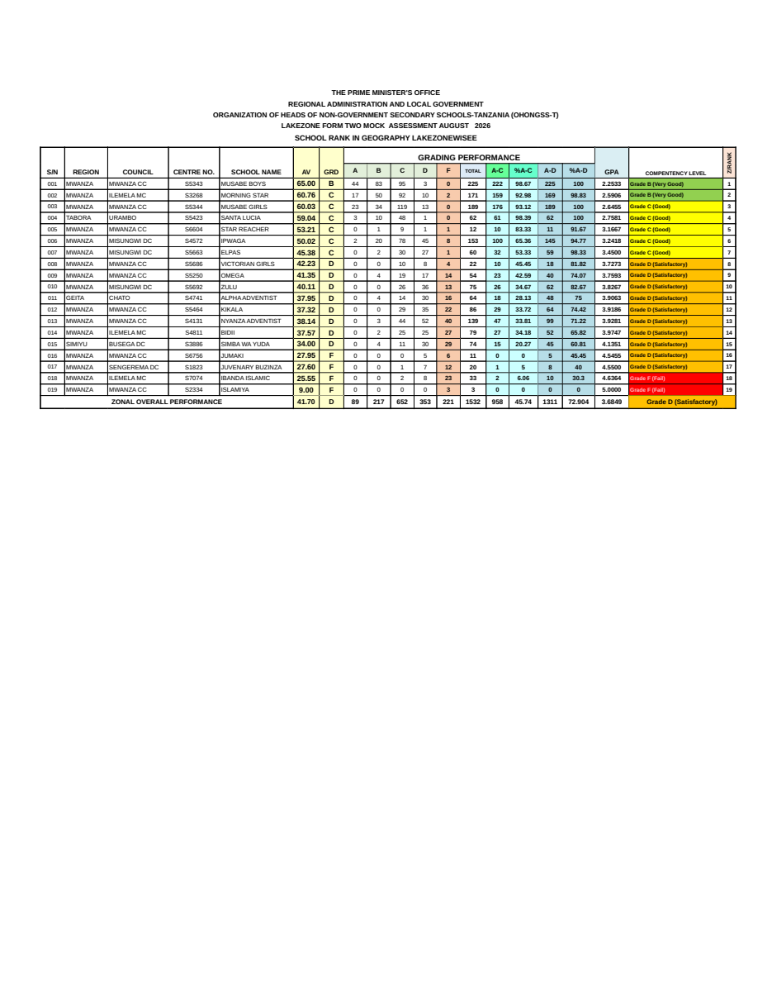
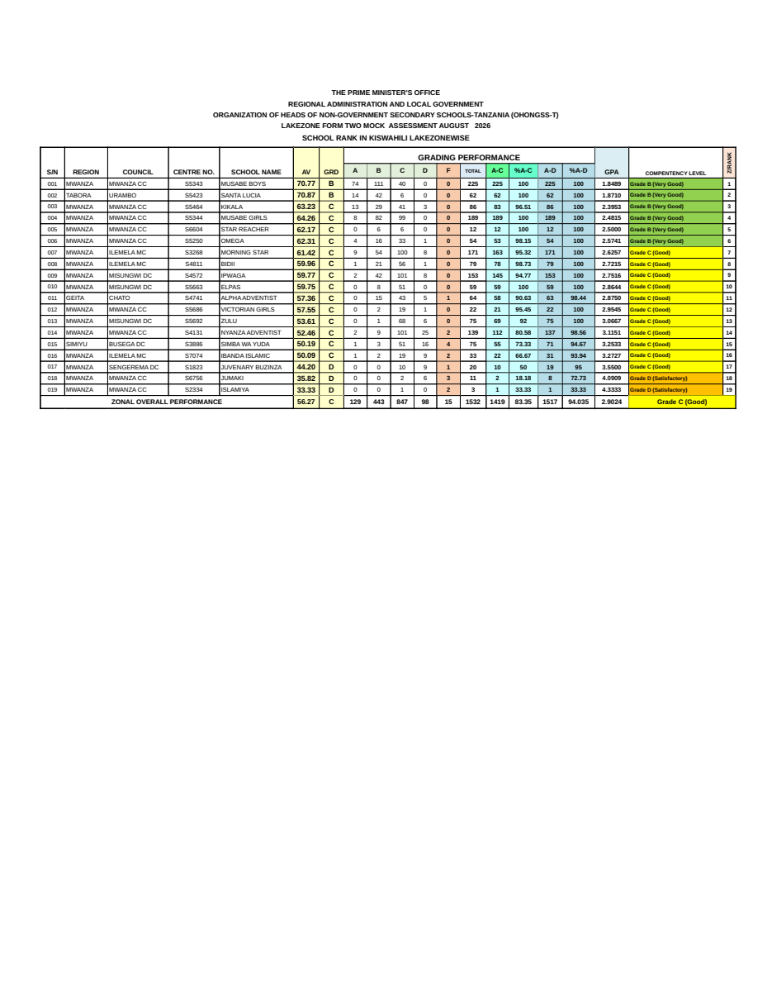
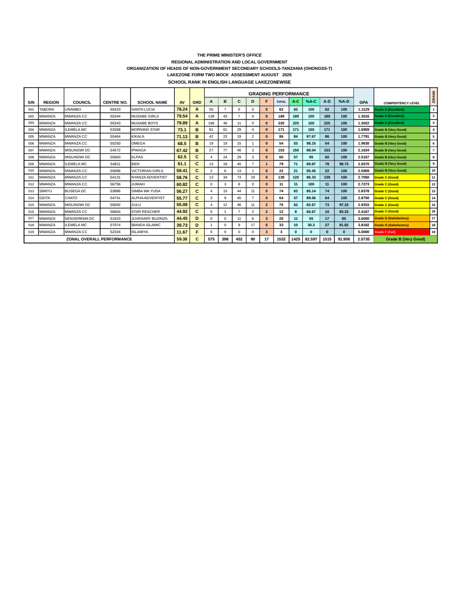
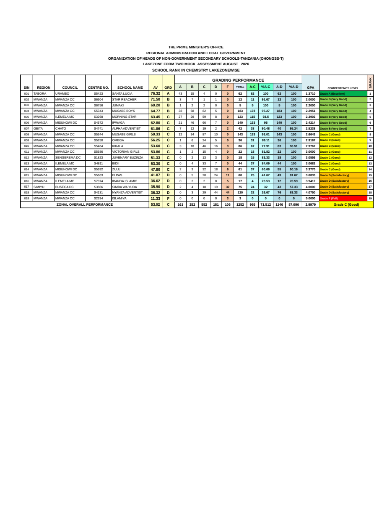
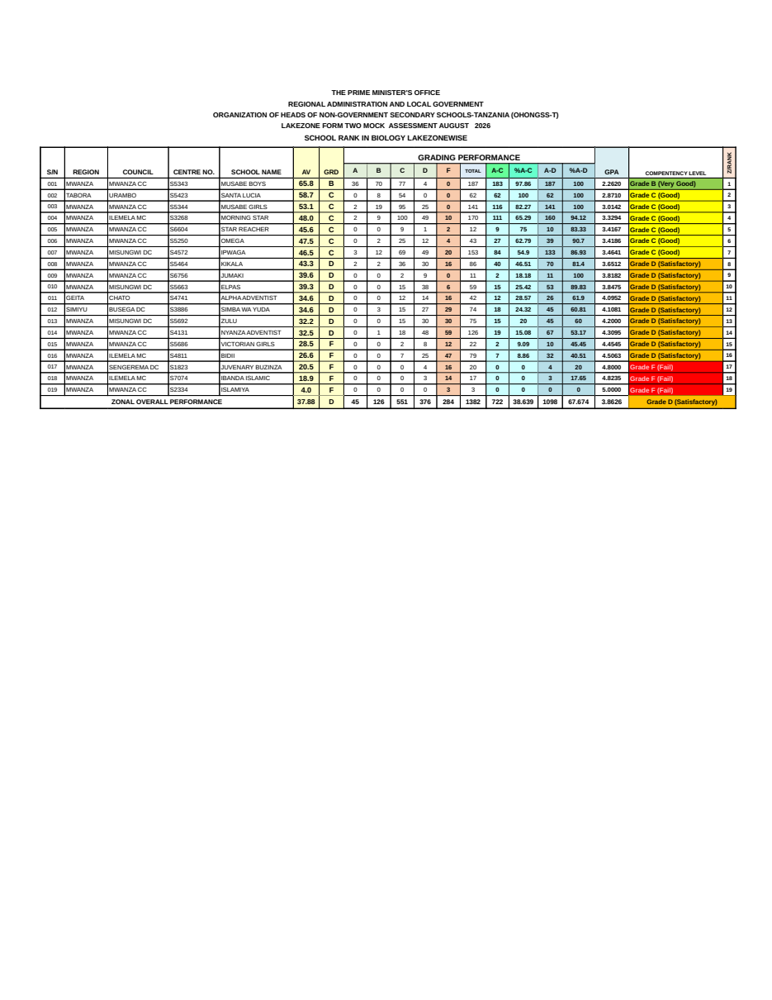
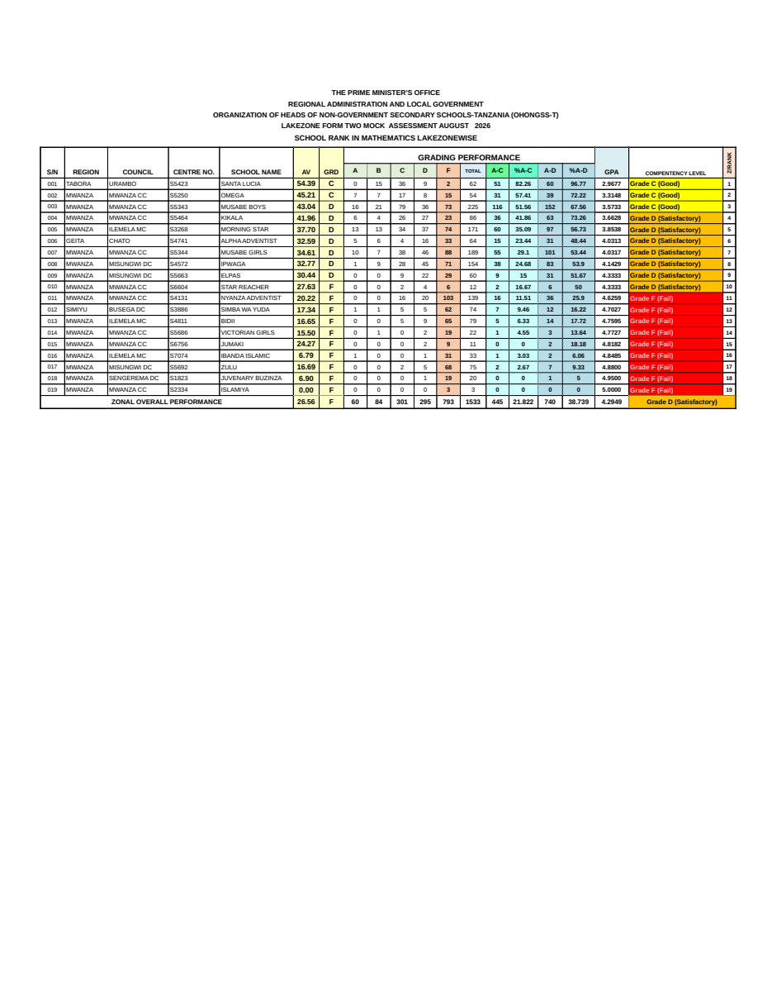
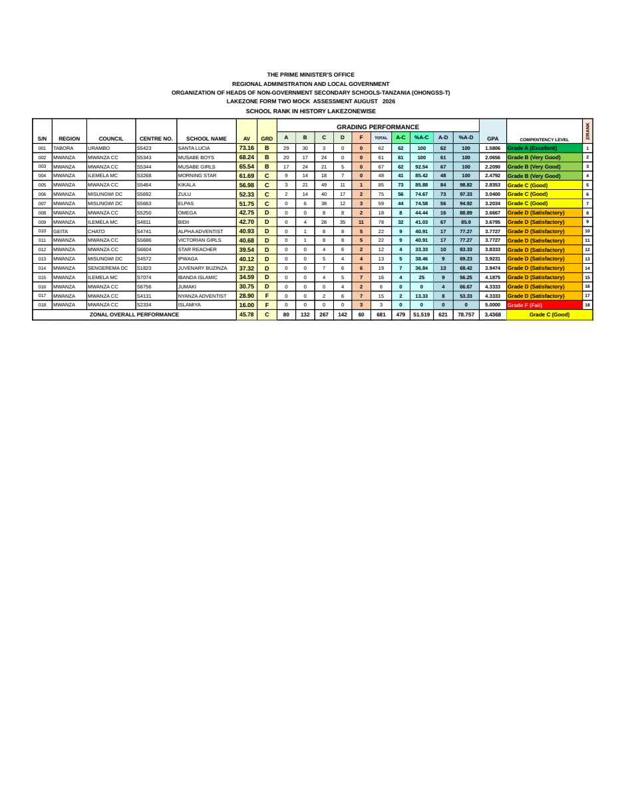
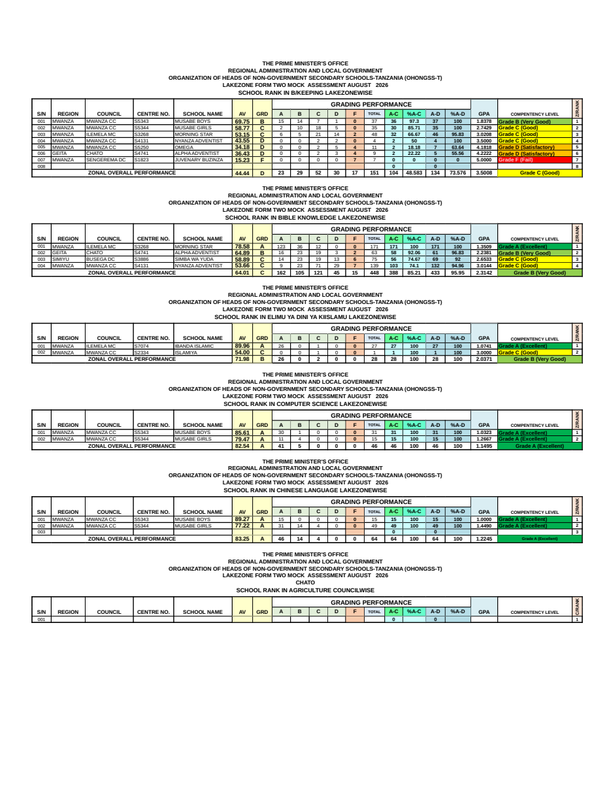

# Original vs generated

**`reference/original.pdf` is missing - no comparison possible yet.**

Upload the original PDF to `reference/original.pdf`, then run `python scripts/compare.py`.

Generated pages:

