# Original vs generated

Columns: **original | generated | diff** (pink = sub-pixel differences, red = real differences).

Pixel diff = share of pixels that differ at 110 dpi; tolerant = still different when a 1px shift is allowed (ignores sub-pixel anti-aliasing).

| page | pixel diff | tolerant diff | words missing | words extra | fills only in original | fills only in generated |
|---|---|---|---|---|---|---|
| 1 | 9.82% | 4.83% | 0 | 0 | #65ffab #d2fce6 #d8e4bc #ebf1de #f2dcdb #fabf8f #fcd5b4 #fde9d9 | #66ff99 #66ffcc #ddebf7 #e2efda #f8cbad #fce4d6 |
| 2 | 10.90% | 6.53% | 0 | 0 | #65ffab #d8e4bc #ebf1de #fabf8f #fcd5b4 #fde9d9 | #66ff99 #66ffcc #ddebf7 #e2efda #f8cbad #fce4d6 |
| 3 | 9.92% | 5.27% | 0 | 0 | #65ffab #d8e4bc #ebf1de #fabf8f #fcd5b4 #fde9d9 | #66ff99 #66ffcc #ddebf7 #e2efda #f8cbad #fce4d6 |
| 4 | 10.86% | 6.70% | 0 | 0 | #65ffab #d8e4bc #ebf1de #fabf8f #fcd5b4 #fde9d9 | #66ff99 #66ffcc #ddebf7 #e2efda #f8cbad #fce4d6 |
| 5 | 10.89% | 6.85% | 0 | 0 | #65ffab #d8e4bc #ebf1de #fabf8f #fcd5b4 #fde9d9 | #66ff99 #66ffcc #ddebf7 #e2efda #f8cbad #fce4d6 |
| 6 | 10.61% | 6.11% | 0 | 0 | #65ffab #d8e4bc #ebf1de #fabf8f #fcd5b4 #fde9d9 | #66ff99 #66ffcc #ddebf7 #e2efda #f8cbad #fce4d6 |
| 7 | 10.73% | 6.14% | 0 | 0 | #65ffab #d8e4bc #ebf1de #fabf8f #fcd5b4 #fde9d9 | #66ff99 #66ffcc #ddebf7 #e2efda #f8cbad #fce4d6 |
| 8 | 10.72% | 6.13% | 0 | 0 | #65ffab #d8e4bc #ebf1de #fabf8f #fcd5b4 #fde9d9 | #66ff99 #66ffcc #ddebf7 #e2efda #f8cbad #fce4d6 |
| 9 | 10.63% | 6.12% | 0 | 0 | #65ffab #d8e4bc #ebf1de #fabf8f #fcd5b4 #fde9d9 | #66ff99 #66ffcc #ddebf7 #e2efda #f8cbad #fce4d6 |
| 10 | 9.90% | 5.22% | 0 | 0 | #65ffab #d8e4bc #ebf1de #fabf8f #fcd5b4 #fde9d9 | #66ff99 #66ffcc #ddebf7 #e2efda #f8cbad #fce4d6 |
| 11 | 28.36% | 23.29% | 0 | 0 | #65ffab #d8e4bc #ebf1de #fabf8f #fcd5b4 #fde9d9 | #66ff99 #66ffcc #ddebf7 #e2efda #f8cbad #fce4d6 |

## Page 1

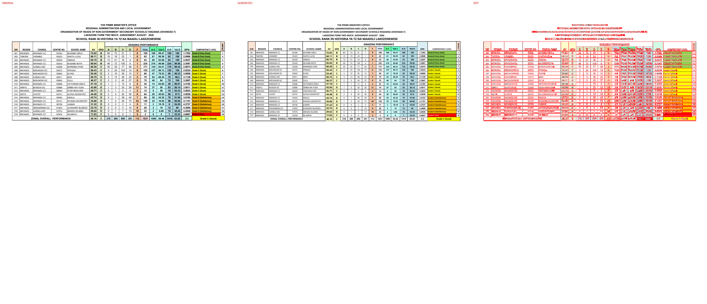

## Page 2

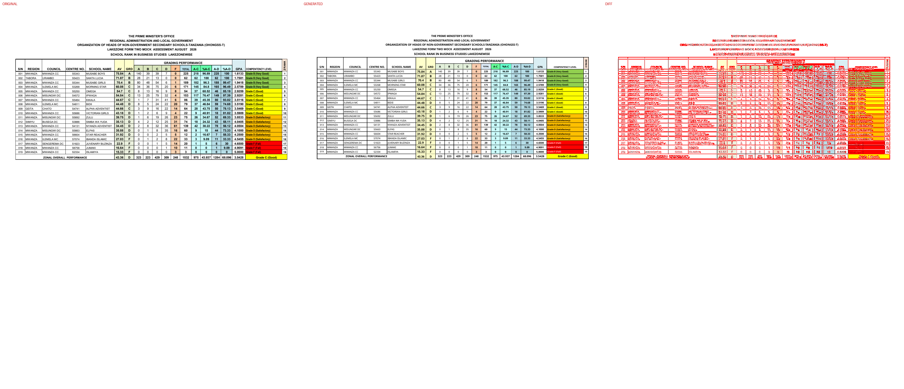

## Page 3

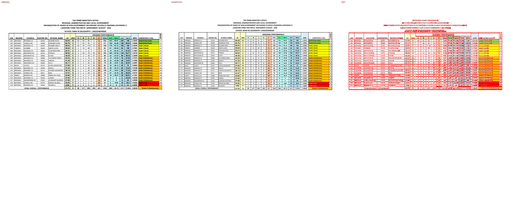

## Page 4

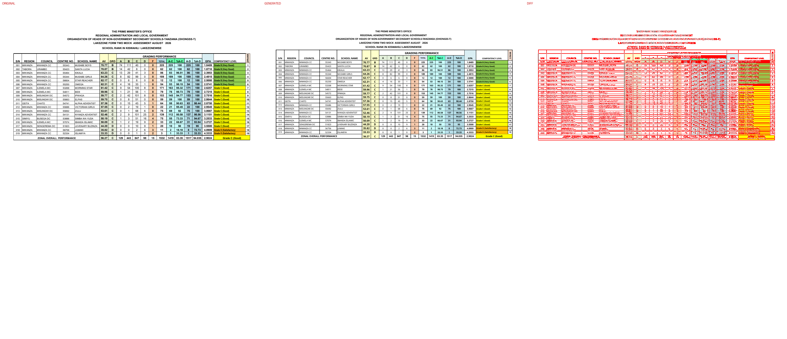

## Page 5

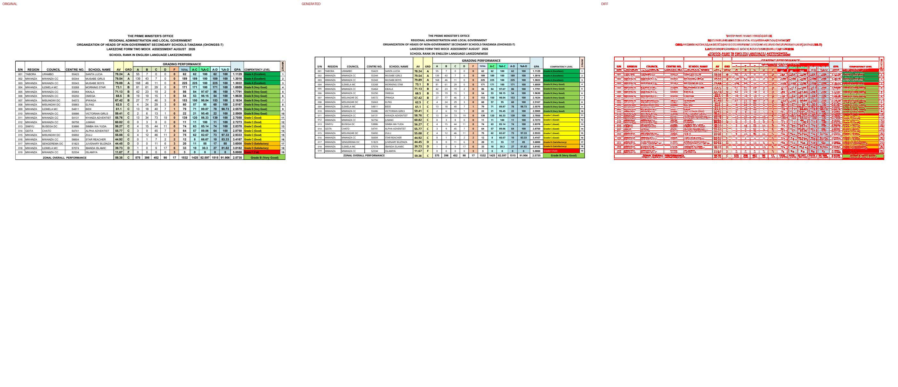

## Page 6

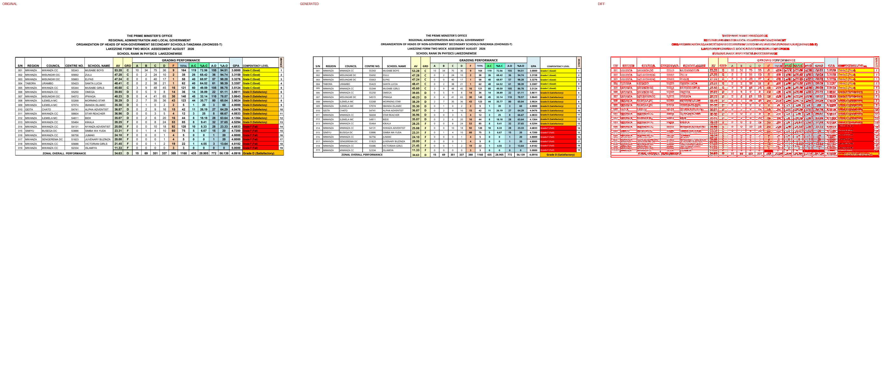

## Page 7

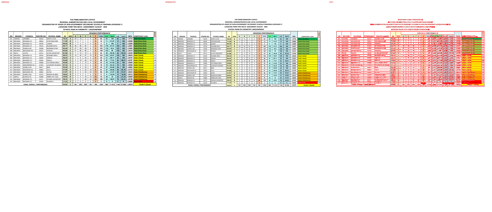

## Page 8

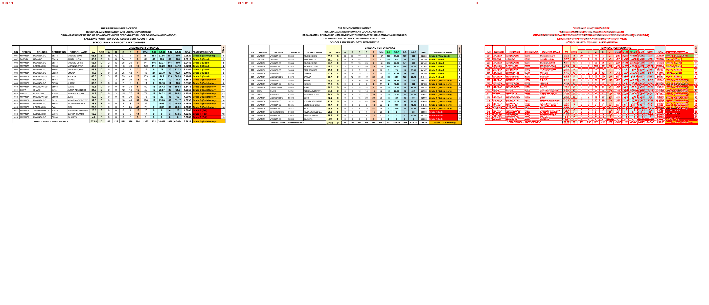

## Page 9

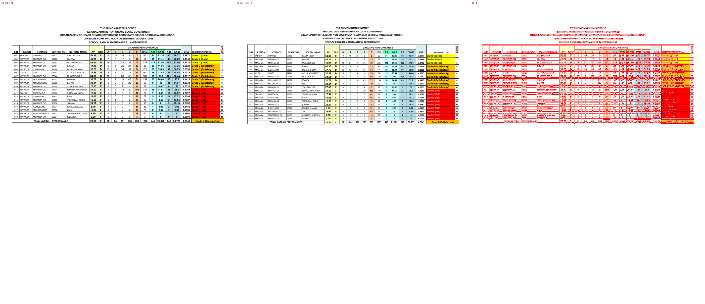

## Page 10

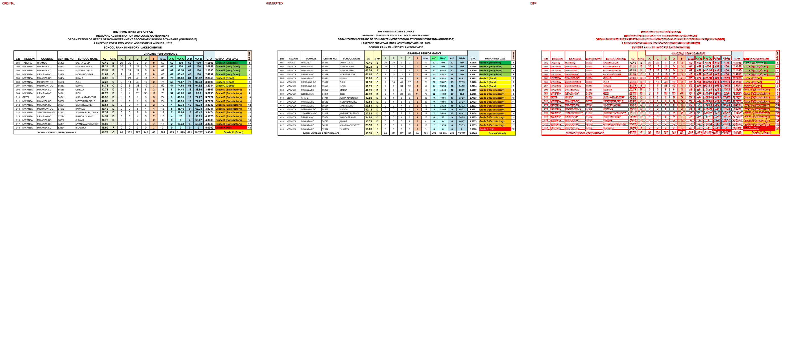

## Page 11

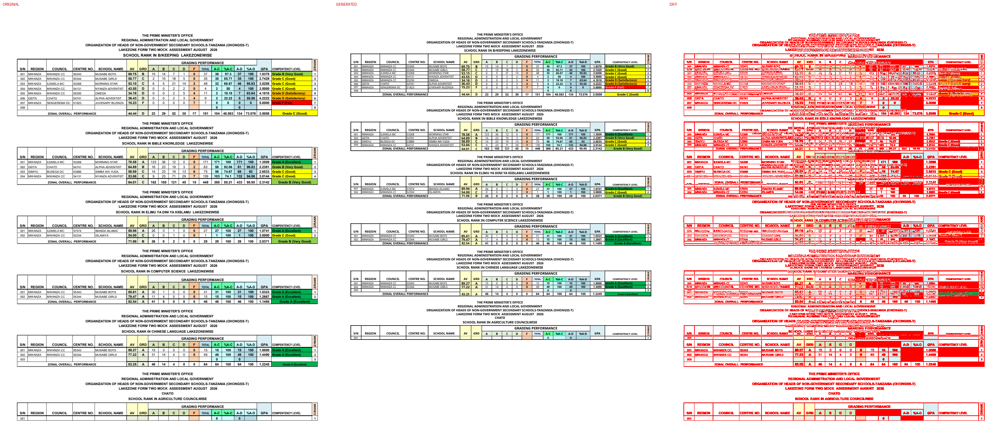

