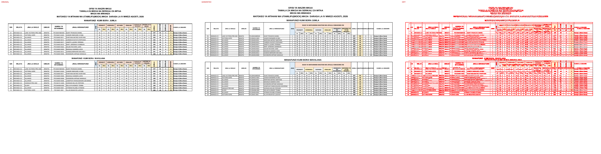
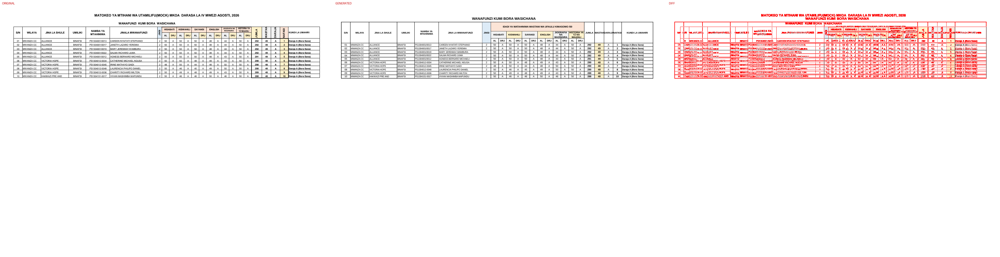
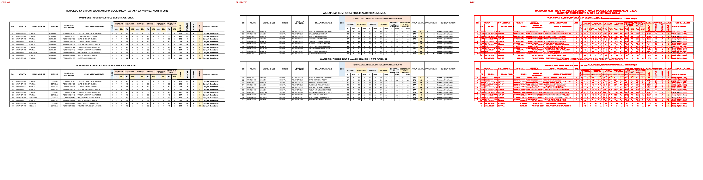
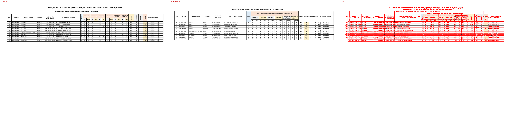

# Original vs generated

Columns: **original | generated | diff** (pink = sub-pixel differences, red = real differences).

Pixel diff = share of pixels that differ at 110 dpi; tolerant = still different when a 1px shift is allowed (ignores sub-pixel anti-aliasing).

**Verdict** is the stricter >=96%-match bar (position-by-position across colours, borders, data and cell sizes): a page **PASS**es when tolerant diff <= 4% (>=96% pixel match) AND there are zero fills-only diffs both ways AND zero words missing/extra; otherwise **FAIL** with the failing dimension(s) named.

| page | pixel diff | tolerant diff | words missing | words extra | fills only in original | fills only in generated | verdict (>=96%) |
|---|---|---|---|---|---|---|---|
| 1 | 16.59% | 12.07% | 199 | 70 | - | - | ❌ FAIL (pixels 12.07%>4%, words 199miss/70extra) |
| 2 | 7.75% | 5.58% | 109 | 32 | - | - | ❌ FAIL (pixels 5.58%>4%, words 109miss/32extra) |
| 3 | 15.93% | 11.77% | 206 | 67 | - | - | ❌ FAIL (pixels 11.77%>4%, words 206miss/67extra) |
| 4 | 7.86% | 5.79% | 110 | 33 | - | - | ❌ FAIL (pixels 5.79%>4%, words 110miss/33extra) |

**Verdict summary: 0/4 pages meet the >=96% bar** (tolerant diff <= 4% AND zero fill diffs AND zero word diffs).

## Page 1
missing: `{'A': 40, 'J': 18, 'I': 16, 'L': 16, 'D': 16, 'R': 16, 'S': 8, 'H': 7, 'M': 6, 'IS': 5}`
extra: `{'AL': 12, 'DRJ': 12, 'YA': 4, 'WA': 2, 'LA': 2, 'JUMLA': 2, 'IDADI': 2, 'WATAHINIWA': 2, 'WASTANI': 2, 'UFAULU': 2}`

## Page 2
missing: `{'A': 20, 'J': 9, 'I': 8, 'L': 8, 'D': 8, 'R': 8, 'H': 4, 'S': 4, 'M': 3, 'IS': 3}`
extra: `{'AL': 6, 'DRJ': 6, 'IDADI': 1, 'YA': 1, 'WATAHINIWA': 1, 'WASTANI': 1, 'UFAULU': 1, 'KIMASOMO': 1, '/50': 1, 'JINA': 1}`

## Page 3
missing: `{'A': 39, 'J': 17, 'I': 16, 'L': 16, 'D': 16, 'R': 16, 'S': 8, 'M': 6, 'H': 6, 'N': 4}`
extra: `{'AL': 12, 'DRJ': 12, 'YA': 3, 'JUMLA': 2, 'IDADI': 2, 'WATAHINIWA': 2, 'WASTANI': 2, 'UFAULU': 2, 'KIMASOMO': 2, '/50': 2}`

## Page 4
missing: `{'A': 19, 'I': 8, 'L': 8, 'D': 8, 'R': 8, 'J': 8, 'H': 4, 'S': 4, 'M': 3, 'IS': 3}`
extra: `{'AL': 6, 'DRJ': 6, 'SERIKALI': 1, 'IDADI': 1, 'YA': 1, 'WATAHINIWA': 1, 'WASTANI': 1, 'UFAULU': 1, 'KIMASOMO': 1, '/50': 1}`

