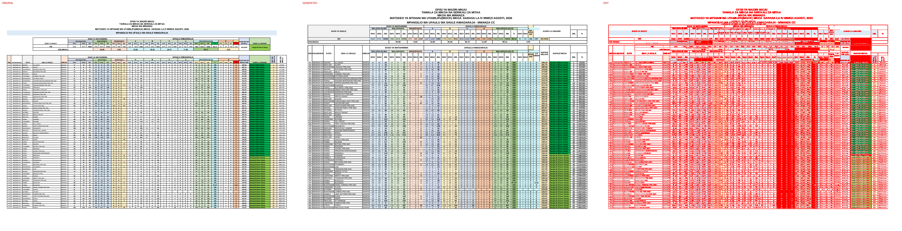
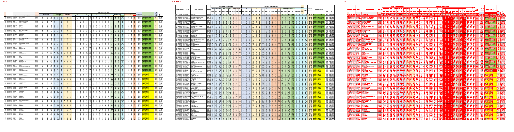
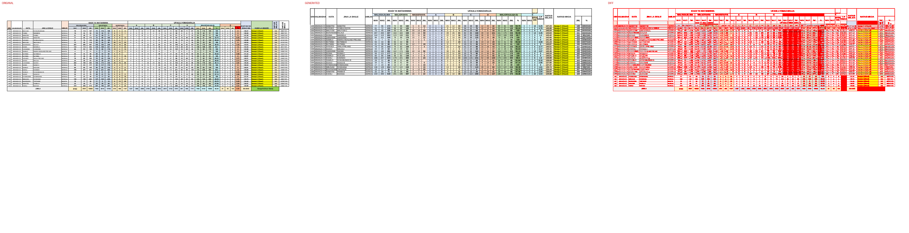

# Original vs generated

Columns: **original | generated | diff** (pink = sub-pixel differences, red = real differences).

Pixel diff = share of pixels that differ at 110 dpi; tolerant = still different when a 1px shift is allowed (ignores sub-pixel anti-aliasing).

**Verdict** is the stricter >=96%-match bar (position-by-position across colours, borders, data and cell sizes): a page **PASS**es when tolerant diff <= 4% (>=96% pixel match) AND there are zero fills-only diffs both ways AND zero words missing/extra; otherwise **FAIL** with the failing dimension(s) named.

| page | pixel diff | tolerant diff | words missing | words extra | fills only in original | fills only in generated | verdict (>=96%) |
|---|---|---|---|---|---|---|---|
| 1 | 40.03% | 26.00% | 191 | 142 | #ff0000 #ffe699 | - | ❌ FAIL (pixels 26.00%>4%, fills 2orig/0gen, words 191miss/142extra) |
| 2 | 38.64% | 25.82% | 349 | 257 | #ff0000 | - | ❌ FAIL (pixels 25.82%>4%, fills 1orig/0gen, words 349miss/257extra) |
| 3 | 13.65% | 9.88% | 303 | 81 | #92d050 #f4b084 #ff0000 | - | ❌ FAIL (pixels 9.88%>4%, fills 3orig/0gen, words 303miss/81extra) |

**Verdict summary: 0/3 pages meet the >=96% bar** (tolerant diff <= 4% AND zero fill diffs AND zero word diffs).

## Page 1
missing: `{'CC': 63, 'BUHONGWA': 11, 'MKOLANI': 9, 'MAHINA': 8, 'LWANHIMA': 8, 'KISHILI': 7, 'IGOMA': 6, 'WAV': 4, 'PAMBA': 4, 'LUCHELELE': 3}`
extra: `{'0': 11, 'CCMKOLANI': 9, 'CCMAHINA': 8, 'CCLWANHIMA': 8, 'CCKISHILI': 7, 'CCIGOMA': 6, 'CCPAMBA': 4, 'S': 3, '1': 3, '4': 3}`

## Page 2
missing: `{'CC': 80, 'MWANZA': 46, 'BUHONGWA': 15, 'IGOMA': 10, 'MHANDU': 9, 'SERIKALI': 8, 'KISHILI': 6, 'ISAMILO': 6, 'MKOLANI': 5, 'NYEGEZI': 5}`
extra: `{'0': 17, 'CCIGOMA': 10, 'CCMHANDU': 9, 'CCKISHILI': 6, 'CCISAMILO': 6, 'CCMKOLANI': 5, 'CCNYEGEZI': 5, 'CCIGOGO': 4, 'CCBUTIMBA': 4, 'CCMAHINA': 4}`

## Page 3
missing: `{'MWANZA': 25, 'CC': 25, '0': 22, 'SERIKALI': 9, 'WAV': 4, 'Daraja': 4, 'C': 3, '3': 3, '6': 3, '4': 3}`
extra: `{'CCISAMILO': 3, 'V': 2, 'S': 2, 'WA': 2, 'Y': 2, 'CCMABATINI': 2, 'CCNYEGEZI': 2, 'CCIGOMA': 2, 'CCLWANHIMA': 2, 'CCBUTIMBA': 2}`

