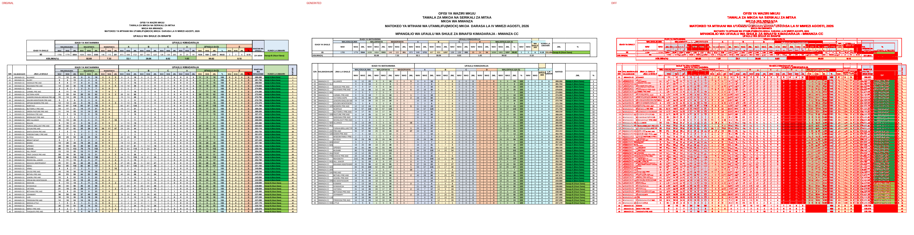
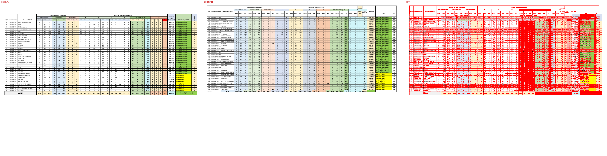

# Original vs generated

Columns: **original | generated | diff** (pink = sub-pixel differences, red = real differences).

Pixel diff = share of pixels that differ at 110 dpi; tolerant = still different when a 1px shift is allowed (ignores sub-pixel anti-aliasing).

**Verdict** is the stricter >=96%-match bar (position-by-position across colours, borders, data and cell sizes): a page **PASS**es when tolerant diff <= 4% (>=96% pixel match) AND there are zero fills-only diffs both ways AND zero words missing/extra; otherwise **FAIL** with the failing dimension(s) named.

| page | pixel diff | tolerant diff | words missing | words extra | fills only in original | fills only in generated | verdict (>=96%) |
|---|---|---|---|---|---|---|---|
| 1 | 32.50% | 24.39% | 187 | 121 | #ff0000 | - | ❌ FAIL (pixels 24.39%>4%, fills 1orig/0gen, words 187miss/121extra) |
| 2 | 26.15% | 19.64% | 50 | 208 | #f2f2f2 #f4b084 #ff0000 | - | ❌ FAIL (pixels 19.64%>4%, fills 3orig/0gen, words 50miss/208extra) |

**Verdict summary: 0/2 pages meet the >=96% bar** (tolerant diff <= 4% AND zero fill diffs AND zero word diffs).

## Page 1
missing: `{'0': 31, '1': 9, 'WAS': 8, '2': 8, 'PRE': 5, 'AND': 5, 'JML': 4, '6': 4, 'Daraja': 4, '16': 4}`
extra: `{'W': 14, 'A': 12, 'U': 6, 'L': 6, 'AS': 6, 'S': 5, 'I': 4, 'M': 3, 'V': 3, 'IO': 3}`

## Page 2
missing: `{'WAS': 8, 'JML': 4, 'WAV': 3, 'UFAULU': 1, 'WALIOSAJILIWA': 1, 'WALIOFANYA': 1, 'WASIOFANYA': 1, '(A-D)': 1, 'ST': 1, 'NI': 1}`
extra: `{'0': 35, 'W': 13, 'A': 9, '1': 9, '2': 7, 'AS': 6, 'S': 5, 'L': 5, '3': 4, '16': 4}`

