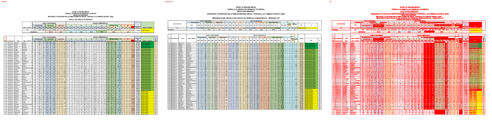
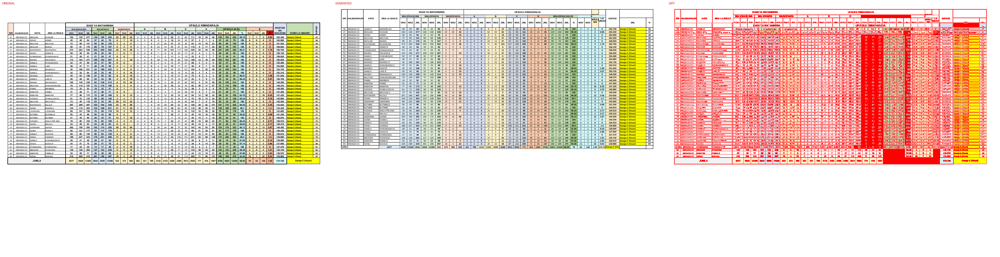

# Original vs generated

Columns: **original | generated | diff** (pink = sub-pixel differences, red = real differences).

Pixel diff = share of pixels that differ at 110 dpi; tolerant = still different when a 1px shift is allowed (ignores sub-pixel anti-aliasing).

**Verdict** is the stricter >=96%-match bar (position-by-position across colours, borders, data and cell sizes): a page **PASS**es when tolerant diff <= 4% (>=96% pixel match) AND there are zero fills-only diffs both ways AND zero words missing/extra; otherwise **FAIL** with the failing dimension(s) named.

| page | pixel diff | tolerant diff | words missing | words extra | fills only in original | fills only in generated | verdict (>=96%) |
|---|---|---|---|---|---|---|---|
| 1 | 32.86% | 23.32% | 71 | 115 | #ff0000 | - | ❌ FAIL (pixels 23.32%>4%, fills 1orig/0gen, words 71miss/115extra) |
| 2 | 27.22% | 19.73% | 28 | 127 | #f2f2f2 #f4b084 #ff0000 | - | ❌ FAIL (pixels 19.73%>4%, fills 3orig/0gen, words 28miss/127extra) |

**Verdict summary: 0/2 pages meet the >=96% bar** (tolerant diff <= 4% AND zero fill diffs AND zero word diffs).

## Page 1
missing: `{'WAS': 8, '0': 5, 'WAV': 4, 'JML': 4, 'UFAULU': 3, 'LA': 2, 'WASTANI': 2, 'KUNDI': 2, 'UMAHIRI': 2, 'Daraja': 2}`
extra: `{'W': 17, 'A': 15, 'U': 7, 'S': 7, 'L': 6, 'I': 5, 'AS': 5, 'M': 4, 'V': 4, 'J': 4}`

## Page 2
missing: `{'WAS': 8, 'WAV': 4, 'JML': 4, 'UFAULU': 1, 'WALIOSAJILIWA': 1, 'WALIOFANYA': 1, 'WASIOFANYA': 1, 'ST': 1, 'NI': 1, 'IS': 1}`
extra: `{'W': 15, 'A': 10, '0': 9, 'S': 7, 'L': 5, 'AS': 5, 'V': 4, 'J': 4, 'U': 4, 'M': 3}`

