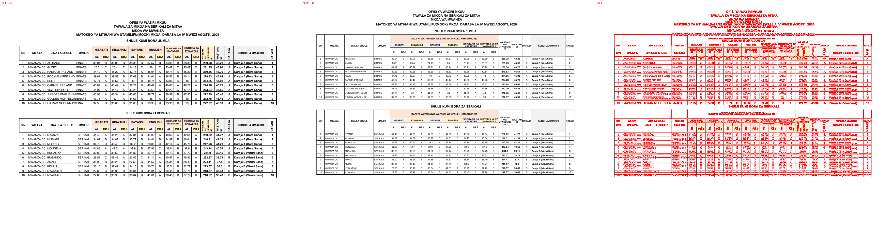
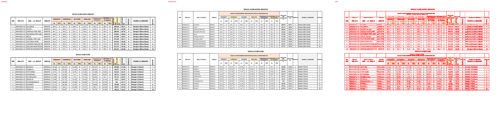

# Original vs generated

Columns: **original | generated | diff** (pink = sub-pixel differences, red = real differences).

Pixel diff = share of pixels that differ at 110 dpi; tolerant = still different when a 1px shift is allowed (ignores sub-pixel anti-aliasing).

**Verdict** is the stricter >=96%-match bar (position-by-position across colours, borders, data and cell sizes): a page **PASS**es when tolerant diff <= 4% (>=96% pixel match) AND there are zero fills-only diffs both ways AND zero words missing/extra; otherwise **FAIL** with the failing dimension(s) named.

| page | pixel diff | tolerant diff | words missing | words extra | fills only in original | fills only in generated | verdict (>=96%) |
|---|---|---|---|---|---|---|---|
| 1 | 17.54% | 12.43% | 187 | 81 | - | - | ❌ FAIL (pixels 12.43%>4%, words 187miss/81extra) |
| 2 | 15.74% | 10.50% | 136 | 65 | - | - | ❌ FAIL (pixels 10.50%>4%, words 136miss/65extra) |

**Verdict summary: 0/2 pages meet the >=96% bar** (tolerant diff <= 4% AND zero fill diffs AND zero word diffs).

## Page 1
missing: `{'A': 38, 'L': 16, 'D': 14, 'R': 14, 'J': 14, 'I': 10, 'S': 10, 'H': 8, 'T': 8, 'IS': 6}`
extra: `{'AL': 12, 'DRJ': 12, 'YA': 4, 'WASTANI': 4, 'BINAFSI': 3, 'NA': 2, 'IDADI': 2, 'WATAHINIWA': 2, 'UFAULU': 2, 'KIMASOMO': 2}`

## Page 2
missing: `{'A': 29, 'L': 10, 'R': 8, 'T': 8, 'D': 8, 'J': 8, 'S': 7, 'I': 6, 'H': 5, 'IS': 5}`
extra: `{'AL': 6, 'DRJ': 6, 'YA': 4, 'WASTANI': 4, 'BINAFSI': 3, 'IDADI': 2, 'WATAHINIWA': 2, 'UFAULU': 2, 'KIMASOMO': 2, '/50': 2}`

