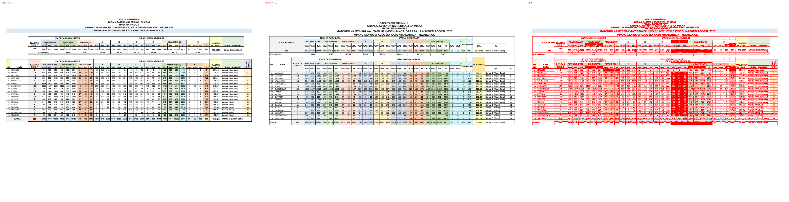

# Original vs generated

Columns: **original | generated | diff** (pink = sub-pixel differences, red = real differences).

Pixel diff = share of pixels that differ at 110 dpi; tolerant = still different when a 1px shift is allowed (ignores sub-pixel anti-aliasing).

**Verdict** is the stricter >=96%-match bar (position-by-position across colours, borders, data and cell sizes): a page **PASS**es when tolerant diff <= 4% (>=96% pixel match) AND there are zero fills-only diffs both ways AND zero words missing/extra; otherwise **FAIL** with the failing dimension(s) named.

| page | pixel diff | tolerant diff | words missing | words extra | fills only in original | fills only in generated | verdict (>=96%) |
|---|---|---|---|---|---|---|---|
| 1 | 18.42% | 11.82% | 129 | 34 | - | - | ❌ FAIL (pixels 11.82%>4%, words 129miss/34extra) |

**Verdict summary: 0/1 pages meet the >=96% bar** (tolerant diff <= 4% AND zero fill diffs AND zero word diffs).

## Page 1
missing: `{'A': 24, 'W': 20, 'S': 6, 'U': 6, 'L': 6, 'J': 6, 'F': 5, 'AS': 5, 'M': 4, 'I': 3}`
extra: `{'WAS': 9, 'JML': 6, 'WAV': 4, 'YA': 1, 'KIMADARAJA': 1, 'IDADI': 1, 'WATAHINIWA': 1, 'WALIOSAJILIWA': 1, 'WALIOFANYA': 1, 'WASIOFANYA': 1}`

