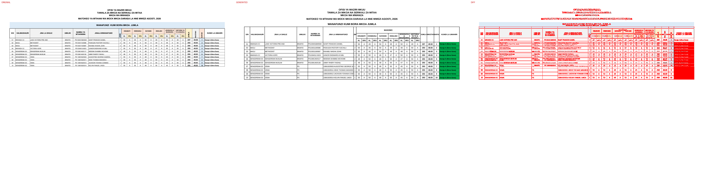
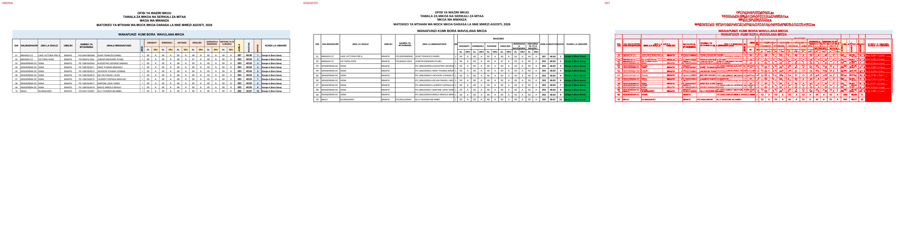
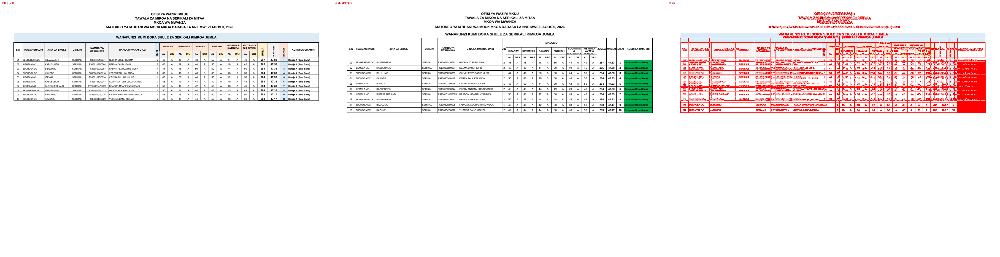
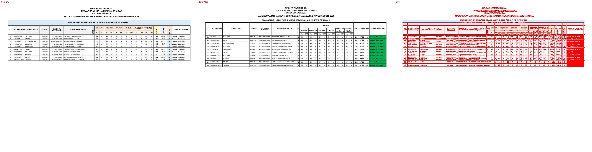
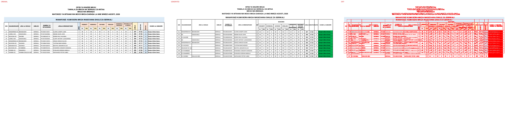

# Original vs generated

Columns: **original | generated | diff** (pink = sub-pixel differences, red = real differences).

Pixel diff = share of pixels that differ at 110 dpi; tolerant = still different when a 1px shift is allowed (ignores sub-pixel anti-aliasing).

**Verdict** is the stricter >=96%-match bar (position-by-position across colours, borders, data and cell sizes): a page **PASS**es when tolerant diff <= 4% (>=96% pixel match) AND there are zero fills-only diffs both ways AND zero words missing/extra; otherwise **FAIL** with the failing dimension(s) named.

| page | pixel diff | tolerant diff | words missing | words extra | fills only in original | fills only in generated | verdict (>=96%) |
|---|---|---|---|---|---|---|---|
| 1 | 9.62% | 7.68% | 22 | 33 | #ddebf7 #f2f2f2 #fce4d6 #fff2cc | #00b050 | ❌ FAIL (pixels 7.68%>4%, fills 4orig/1gen, words 22miss/33extra) |
| 2 | 10.65% | 8.53% | 29 | 38 | #ddebf7 #f2f2f2 #fce4d6 #fff2cc | #00b050 | ❌ FAIL (pixels 8.53%>4%, fills 4orig/1gen, words 29miss/38extra) |
| 3 | 10.77% | 8.60% | 14 | 31 | #ddebf7 #f2f2f2 #fce4d6 #fff2cc | #00b050 | ❌ FAIL (pixels 8.60%>4%, fills 4orig/1gen, words 14miss/31extra) |
| 4 | 10.32% | 8.14% | 11 | 30 | #ddebf7 #f2f2f2 #fce4d6 #fff2cc | #00b050 | ❌ FAIL (pixels 8.14%>4%, fills 4orig/1gen, words 11miss/30extra) |
| 5 | 10.83% | 8.62% | 11 | 30 | #ddebf7 #f2f2f2 #fce4d6 #fff2cc | #00b050 | ❌ FAIL (pixels 8.62%>4%, fills 4orig/1gen, words 11miss/30extra) |
| 6 | 10.85% | 8.73% | 21 | 32 | #ddebf7 #f2f2f2 #fce4d6 #fff2cc | #00b050 | ❌ FAIL (pixels 8.73%>4%, fills 4orig/1gen, words 21miss/32extra) |

**Verdict summary: 0/6 pages meet the >=96% bar** (tolerant diff <= 4% AND zero fill diffs AND zero word diffs).

## Page 1
missing: `{'BINAFSI': 4, '1': 3, '50': 1, 'SAMWEL': 1, 'MASHEKU': 1, 'COSMAS': 1, 'ISAFAN': 1, 'JIOGRAFIA': 1, 'HISTORIA': 1, 'YA': 1}`
extra: `{'A': 5, 'T': 3, 'M': 2, 'H': 2, 'LA': 1, 'MASOMO': 1, 'JINA': 1, 'N': 1, 'B': 1, 'IN': 1}`

## Page 2
missing: `{'1': 7, '50': 3, 'AND': 1, 'SAMWEL': 1, 'MASHEKU': 1, 'COSMAS': 1, 'LWIZA': 1, 'MANYASI': 1, 'YARED': 1, 'MIHIGO': 1}`
extra: `{'A': 6, 'T': 3, 'M': 2, 'H': 2, 'LA': 1, 'MASOMO': 1, 'JINA': 1, 'N': 1, 'B': 1, 'IN': 1}`

## Page 3
missing: `{'2': 1, '50': 1, 'HOKORORO': 1, 'ISAFAN': 1, 'JIOGRAFIA': 1, 'HISTORIA': 1, 'YA': 1, 'TZ': 1, 'ALMUJ': 1, 'INATSAW': 1}`
extra: `{'A': 5, 'T': 3, 'M': 2, 'H': 2, 'LA': 1, 'MASOMO': 1, 'JINA': 1, 'N': 1, 'B': 1, 'IN': 1}`

## Page 4
missing: `{'ISAFAN': 1, 'JIOGRAFIA': 1, 'HISTORIA': 1, 'YA': 1, 'TZ': 1, 'ALMUJ': 1, 'INATSAW': 1, 'NAMBA': 1, 'JINALA': 1, 'MTAHINIWA': 1}`
extra: `{'A': 5, 'T': 3, 'M': 2, 'H': 2, 'LA': 1, 'MASOMO': 1, 'JINA': 1, 'N': 1, 'B': 1, 'IN': 1}`

## Page 5
missing: `{'ISAFAN': 1, 'JIOGRAFIA': 1, 'HISTORIA': 1, 'YA': 1, 'TZ': 1, 'ALMUJ': 1, 'INATSAW': 1, 'NAMBA': 1, 'JINALA': 1, 'MTAHINIWA': 1}`
extra: `{'A': 5, 'T': 3, 'M': 2, 'H': 2, 'LA': 1, 'MASOMO': 1, 'JINA': 1, 'N': 1, 'B': 1, 'IN': 1}`

## Page 6
missing: `{'BUCHOSA': 3, 'ILEMELA': 2, 'KWIMBA': 2, 'MEDIUMS': 1, 'EPRRIEK': 1, 'AALNID': 1, 'ISAFAN': 1, 'JIOGRAFIA': 1, 'HISTORIA': 1, 'YA': 1}`
extra: `{'A': 5, 'T': 3, 'M': 2, 'H': 2, 'SERIKALI': 1, 'LA': 1, 'MASOMO': 1, 'JINA': 1, 'N': 1, 'B': 1}`

