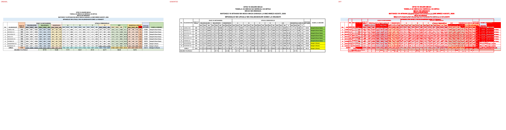
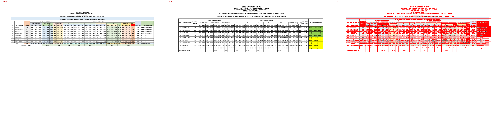
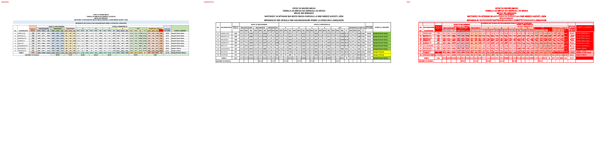
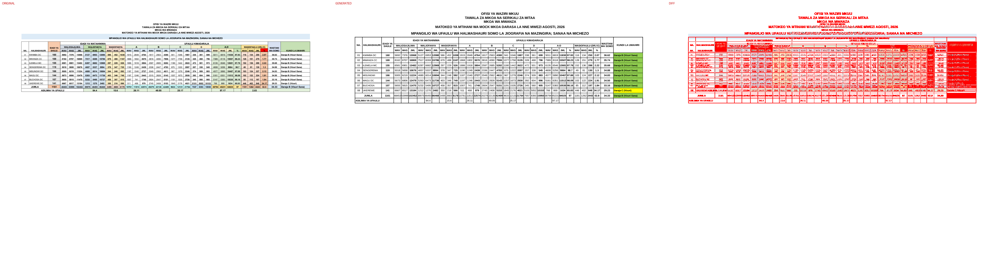

# Original vs generated

Columns: **original | generated | diff** (pink = sub-pixel differences, red = real differences).

Pixel diff = share of pixels that differ at 110 dpi; tolerant = still different when a 1px shift is allowed (ignores sub-pixel anti-aliasing).

**Verdict** is the stricter >=96%-match bar (position-by-position across colours, borders, data and cell sizes): a page **PASS**es when tolerant diff <= 4% (>=96% pixel match) AND there are zero fills-only diffs both ways AND zero words missing/extra; otherwise **FAIL** with the failing dimension(s) named.

| page | pixel diff | tolerant diff | words missing | words extra | fills only in original | fills only in generated | verdict (>=96%) |
|---|---|---|---|---|---|---|---|
| 1 | 11.86% | 8.95% | 57 | 37 | #c6e0b4 #ccecff #ccffff #d6dce4 #d9e1f2 #ddebf7 #e2efda #ededed #f8cbad #fce4d6 #ff0000 #ffe699 #fff2cc | #92d050 #ffff00 | ❌ FAIL (pixels 8.95%>4%, fills 13orig/2gen, words 57miss/37extra) |
| 2 | 10.91% | 8.08% | 62 | 37 | #c6e0b4 #ccecff #ccffff #d6dce4 #d9e1f2 #ddebf7 #e2efda #ededed #f8cbad #fce4d6 #ff0000 #ffe699 #fff2cc | #92d050 #ffff00 | ❌ FAIL (pixels 8.08%>4%, fills 13orig/2gen, words 62miss/37extra) |
| 3 | 10.79% | 7.98% | 69 | 42 | #c6e0b4 #ccecff #ccffff #d6dce4 #d9e1f2 #ddebf7 #e2efda #ededed #f8cbad #fce4d6 #ff0000 #ffe699 #fff2cc | #92d050 #ffff00 | ❌ FAIL (pixels 7.98%>4%, fills 13orig/2gen, words 69miss/42extra) |
| 4 | 11.27% | 8.48% | 64 | 39 | #c6e0b4 #ccecff #ccffff #d6dce4 #d9e1f2 #ddebf7 #e2efda #ededed #f8cbad #fce4d6 #ff0000 #ffe699 #fff2cc | #92d050 #ffff00 | ❌ FAIL (pixels 8.48%>4%, fills 13orig/2gen, words 64miss/39extra) |
| 5 | 11.29% | 8.51% | 60 | 37 | #c6e0b4 #ccecff #ccffff #d6dce4 #d9e1f2 #ddebf7 #e2efda #ededed #f8cbad #fce4d6 #ff0000 #ffe699 #fff2cc | #92d050 #ffff00 | ❌ FAIL (pixels 8.51%>4%, fills 13orig/2gen, words 60miss/37extra) |
| 6 | 11.26% | 8.48% | 60 | 37 | #c6e0b4 #ccecff #ccffff #d6dce4 #d9e1f2 #ddebf7 #e2efda #ededed #f8cbad #fce4d6 #ff0000 #ffe699 #fff2cc | #92d050 #ffff00 | ❌ FAIL (pixels 8.48%>4%, fills 13orig/2gen, words 60miss/37extra) |

**Verdict summary: 0/6 pages meet the >=96% bar** (tolerant diff <= 4% AND zero fill diffs AND zero word diffs).

## Page 1
missing: `{'1249': 2, '89.30': 2, 'YA': 1, 'WA': 1, 'SOMO': 1, 'IDADI': 1, 'WASTANI': 1, 'SHULE': 1, '1530': 1, '1584': 1}`
extra: `{'A': 5, 'S': 3, 'I': 2, 'W': 2, 'O': 2, 'ID': 1, 'H': 1, 'D': 1, 'U': 1, 'L': 1}`

## Page 2
missing: `{'DC': 4, 'YA': 1, 'WA': 1, 'SOMO': 1, 'IDADI': 1, 'WASTANI': 1, 'SHULE': 1, '6574': 1, '12719': 1, '98.06': 1}`
extra: `{'A': 5, 'S': 3, 'I': 2, 'W': 2, 'O': 2, 'ID': 1, 'H': 1, 'D': 1, 'U': 1, 'L': 1}`

## Page 3
missing: `{'DC': 4, 'YA': 1, 'WA': 1, 'SOMO': 1, 'IDADI': 1, 'WASTANI': 1, 'SHULE': 1, '11664': 1, '96.68': 1, '1240': 1}`
extra: `{'A': 5, 'S': 3, 'I': 2, 'W': 2, 'O': 2, 'ID': 1, 'H': 1, 'D': 1, 'U': 1, 'L': 1}`

## Page 4
missing: `{'DC': 4, '1387': 2, 'YA': 1, 'WA': 1, 'SOMO': 1, 'IDADI': 1, 'WASTANI': 1, 'SHULE': 1, '11838': 1, '91.31': 1}`
extra: `{'A': 5, 'S': 3, 'I': 2, 'W': 2, 'O': 2, 'ID': 1, 'H': 1, 'D': 1, 'U': 1, 'L': 1}`

## Page 5
missing: `{'DC': 4, 'YA': 1, 'WA': 1, 'SOMO': 1, 'IDADI': 1, 'WASTANI': 1, 'SHULE': 1, '11830': 1, '97.93': 1, '1377': 1}`
extra: `{'A': 5, 'S': 3, 'I': 2, 'W': 2, 'O': 2, 'ID': 1, 'H': 1, 'D': 1, 'U': 1, 'L': 1}`

## Page 6
missing: `{'DC': 4, '1368': 2, 'YA': 1, 'WA': 1, 'SOMO': 1, 'IDADI': 1, 'WASTANI': 1, 'SHULE': 1, '5919': 1, '10553': 1}`
extra: `{'A': 5, 'S': 3, 'I': 2, 'W': 2, 'O': 2, 'ID': 1, 'H': 1, 'D': 1, 'U': 1, 'L': 1}`

