# Original vs generated

Columns: **original | generated | diff** (pink = sub-pixel differences, red = real differences).

Pixel diff = share of pixels that differ at 110 dpi; tolerant = still different when a 1px shift is allowed (ignores sub-pixel anti-aliasing).

**Verdict** is the stricter >=96%-match bar (position-by-position across colours, borders, data and cell sizes): a page **PASS**es when tolerant diff <= 4% (>=96% pixel match) AND there are zero fills-only diffs both ways AND zero words missing/extra; otherwise **FAIL** with the failing dimension(s) named.

| page | pixel diff | tolerant diff | words missing | words extra | fills only in original | fills only in generated | verdict (>=96%) |
|---|---|---|---|---|---|---|---|
| 1 | 35.33% | 25.15% | 32 | 83 | #c6e0b4 #d6dce4 #d9e1f2 #ddebf7 #e2efda #f8cbad #fce4d6 #ff0000 #ffe699 #fff2cc | #00b050 | ❌ FAIL (pixels 25.15%>4%, fills 10orig/1gen, words 32miss/83extra) |
| 2 | 37.13% | 25.05% | 56 | 67 | #c6e0b4 #d6dce4 #d9e1f2 #ddebf7 #f8cbad #fce4d6 #ff0000 #ffe699 #fff2cc | #00b050 #92d050 | ❌ FAIL (pixels 25.05%>4%, fills 9orig/2gen, words 56miss/67extra) |
| 3 | 37.07% | 24.92% | 54 | 68 | #c6e0b4 #d6dce4 #d9e1f2 #ddebf7 #f8cbad #fce4d6 #ff0000 #ffe699 #fff2cc | #92d050 | ❌ FAIL (pixels 24.92%>4%, fills 9orig/1gen, words 54miss/68extra) |
| 4 | 37.02% | 24.87% | 62 | 73 | #c6e0b4 #d6dce4 #d9e1f2 #ddebf7 #f8cbad #fce4d6 #ff0000 #ffe699 #fff2cc | #92d050 | ❌ FAIL (pixels 24.87%>4%, fills 9orig/1gen, words 62miss/73extra) |
| 5 | 36.98% | 24.89% | 59 | 69 | #c6e0b4 #d6dce4 #d9e1f2 #ddebf7 #f8cbad #fce4d6 #ff0000 #ffe699 #fff2cc | #92d050 | ❌ FAIL (pixels 24.89%>4%, fills 9orig/1gen, words 59miss/69extra) |
| 6 | 37.21% | 24.98% | 53 | 67 | #c6e0b4 #d6dce4 #d9e1f2 #ddebf7 #f8cbad #fce4d6 #ff0000 #ffe699 #fff2cc | #92d050 | ❌ FAIL (pixels 24.98%>4%, fills 9orig/1gen, words 53miss/67extra) |
| 7 | 37.10% | 24.95% | 61 | 69 | #c6e0b4 #d6dce4 #d9e1f2 #ddebf7 #f8cbad #fce4d6 #ff0000 #ffe699 #fff2cc | #92d050 | ❌ FAIL (pixels 24.95%>4%, fills 9orig/1gen, words 61miss/69extra) |
| 8 | 37.12% | 24.88% | 47 | 61 | #c6e0b4 #d6dce4 #d9e1f2 #ddebf7 #f8cbad #fce4d6 #ff0000 #ffe699 #fff2cc | #92d050 | ❌ FAIL (pixels 24.88%>4%, fills 9orig/1gen, words 47miss/61extra) |
| 9 | 36.13% | 23.55% | 66 | 72 | #c6e0b4 #d6dce4 #d9e1f2 #ddebf7 #f8cbad #fce4d6 #ff0000 #ffe699 #fff2cc | #92d050 #ffff00 | ❌ FAIL (pixels 23.55%>4%, fills 9orig/2gen, words 66miss/72extra) |
| 10 | 35.07% | 21.96% | 51 | 65 | #c6e0b4 #d6dce4 #d9e1f2 #ddebf7 #f8cbad #fce4d6 #ff0000 #ffe699 #fff2cc | #ffff00 | ❌ FAIL (pixels 21.96%>4%, fills 9orig/1gen, words 51miss/65extra) |
| 11 | 35.10% | 21.94% | 53 | 68 | #c6e0b4 #d6dce4 #d9e1f2 #ddebf7 #f8cbad #fce4d6 #ff0000 #ffe699 #fff2cc | #ffff00 | ❌ FAIL (pixels 21.94%>4%, fills 9orig/1gen, words 53miss/68extra) |
| 12 | 35.06% | 22.00% | 52 | 68 | #c6e0b4 #d6dce4 #d9e1f2 #ddebf7 #f8cbad #fce4d6 #ff0000 #ffe699 #fff2cc | #ffff00 | ❌ FAIL (pixels 22.00%>4%, fills 9orig/1gen, words 52miss/68extra) |
| 13 | 35.27% | 21.94% | 45 | 65 | #c6e0b4 #d6dce4 #d9e1f2 #ddebf7 #f8cbad #fce4d6 #ff0000 #ffe699 #fff2cc | #ffff00 | ❌ FAIL (pixels 21.94%>4%, fills 9orig/1gen, words 45miss/65extra) |
| 14 | 35.51% | 22.26% | 44 | 61 | #c6e0b4 #d6dce4 #d9e1f2 #ddebf7 #f8cbad #fce4d6 #ff0000 #ffe699 #fff2cc | #ffc000 #ffff00 | ❌ FAIL (pixels 22.26%>4%, fills 9orig/2gen, words 44miss/61extra) |
| 15 | 20.10% | 14.33% | 118 | 33 | #c6e0b4 #d6dce4 #d9e1f2 #ddebf7 #e2efda #f2f2f2 #f4b084 #f8cbad #fce4d6 #ff0000 #ffe699 #fff2cc | #ffc000 | ❌ FAIL (pixels 14.33%>4%, fills 12orig/1gen, words 118miss/33extra) |

**Verdict summary: 0/15 pages meet the >=96% bar** (tolerant diff <= 4% AND zero fill diffs AND zero word diffs).

## Page 1
missing: `{'DC': 5, 'WASIOFAULU': 2, '(DRJ': 2, 'E)': 2, 'KUNDI': 2, 'WA': 2, 'A-D': 2, 'LA': 1, 'UMAHIRI': 1, 'IYOGELO': 1}`
extra: `{'A': 8, '0': 6, 'I': 5, 'U': 3, 'K': 3, '51': 3, 'WALIOFAULU(A-D)': 2, 'LE': 2, '300': 2, 'S': 2}`

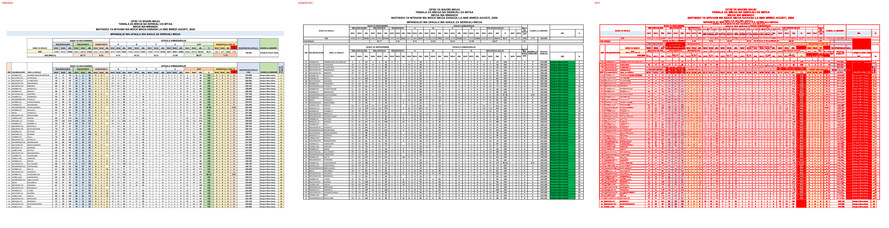

## Page 2
missing: `{'DC': 10, '51': 3, '52': 2, '46': 2, '98': 2, '3': 2, 'WASIOFAULU': 1, '(DRJ': 1, 'E)': 1, 'KUNDI': 1}`
extra: `{'A': 5, 'I': 5, 'K': 3, 'S': 2, 'U': 2, 'N': 2, '37': 2, '63': 2, '26': 2, '116': 2}`

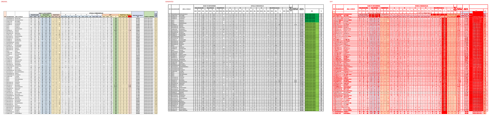

## Page 3
missing: `{'DC': 8, '116': 2, '26': 2, '37': 2, '63': 2, '5': 2, '13': 2, '1': 2, 'WASIOFAULU': 1, '(DRJ': 1}`
extra: `{'A': 6, 'I': 5, 'K': 3, 'S': 2, 'U': 2, 'N': 2, '0': 2, '176': 2, '181': 2, '211': 2}`

## Page 4
missing: `{'DC': 9, '0': 5, '181': 2, '176': 2, '211': 2, '387': 2, 'WASIOFAULU': 1, '(DRJ': 1, 'E)': 1, 'KUNDI': 1}`
extra: `{'A': 6, 'I': 5, 'K': 3, 'S': 2, 'U': 2, 'N': 2, '1': 2, '12': 2, '46': 2, '246': 2}`

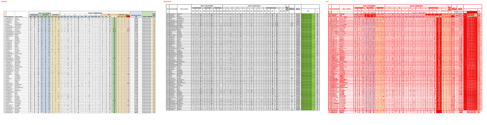

## Page 5
missing: `{'DC': 11, '246': 2, '46': 2, '17': 2, '1': 2, 'WASIOFAULU': 1, '(DRJ': 1, 'E)': 1, 'KUNDI': 1, 'LA': 1}`
extra: `{'A': 6, 'I': 5, 'K': 3, 'S': 2, 'U': 2, 'N': 2, '39': 2, '11': 2, '311': 2, 'D': 1}`

## Page 6
missing: `{'DC': 7, '311': 2, '39': 2, '7': 2, '11': 2, '2': 2, 'WASIOFAULU': 1, '(DRJ': 1, 'E)': 1, 'KUNDI': 1}`
extra: `{'0': 9, 'A': 6, 'I': 5, 'K': 3, 'S': 2, 'U': 2, 'N': 2, '17': 2, '32': 2, '15': 2}`

## Page 7
missing: `{'DC': 13, '0': 5, '376': 2, '18': 2, '17': 2, '32': 2, '12': 2, 'WASIOFAULU': 1, '(DRJ': 1, 'E)': 1}`
extra: `{'A': 6, 'I': 5, 'K': 3, '105': 3, 'S': 2, 'U': 2, 'N': 2, '441': 2, '113': 2, '218': 2}`

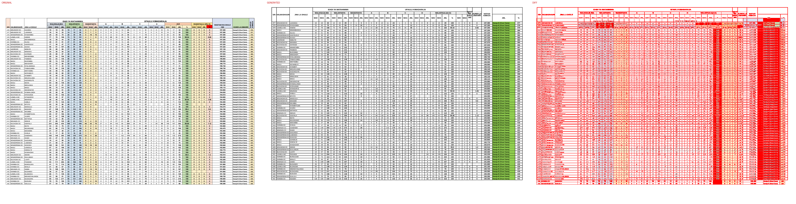

## Page 8
missing: `{'DC': 7, '105': 3, '441': 2, '113': 2, '218': 2, '15': 2, 'WASIOFAULU': 1, '(DRJ': 1, 'E)': 1, 'KUNDI': 1}`
extra: `{'A': 6, 'I': 5, 'K': 3, '0': 3, '28': 3, 'S': 2, 'U': 2, 'N': 2, '53': 2, '25': 2}`

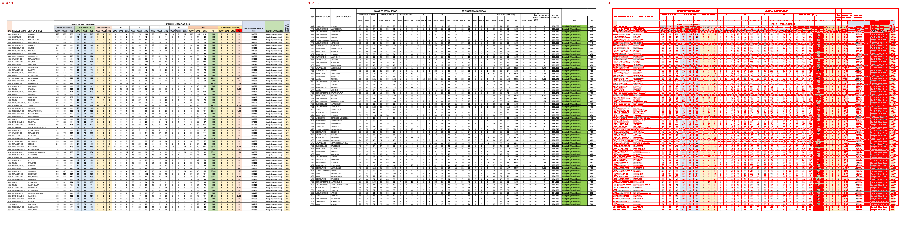

## Page 9
missing: `{'DC': 13, '28': 3, '506': 2, '25': 2, '53': 2, '13': 2, '1': 2, 'WASIOFAULU': 1, '(DRJ': 1, 'E)': 1}`
extra: `{'A': 6, 'I': 5, 'K': 3, '45': 3, '29': 3, '74': 3, 'S': 2, 'U': 2, 'N': 2, '571': 2}`

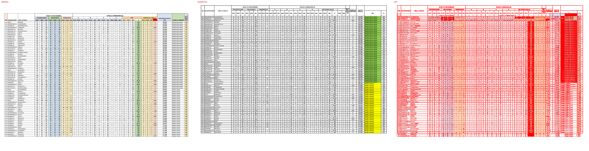

## Page 10
missing: `{'DC': 8, '0': 4, '29': 3, '45': 3, '74': 3, '571': 2, 'WASIOFAULU': 1, '(DRJ': 1, 'E)': 1, 'KUNDI': 1}`
extra: `{'A': 6, 'I': 5, '1': 4, 'K': 3, 'S': 2, 'U': 2, 'N': 2, '2': 2, '37': 2, '21': 2}`

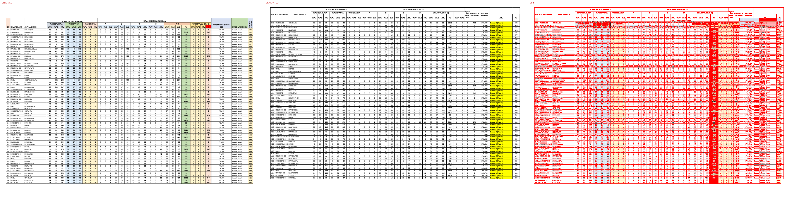

## Page 11
missing: `{'DC': 7, '1': 4, '0': 3, '636': 2, '16': 2, '21': 2, '37': 2, 'WASIOFAULU': 1, '(DRJ': 1, 'E)': 1}`
extra: `{'A': 6, 'I': 5, 'K': 3, 'S': 2, 'U': 2, 'N': 2, '3': 2, '701': 2, '115': 2, 'D': 1}`

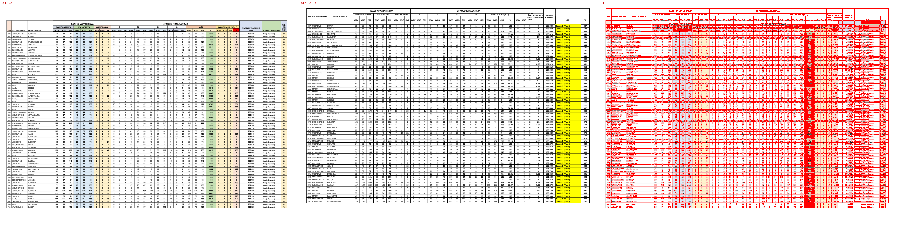

## Page 12
missing: `{'DC': 5, '701': 2, '115': 2, '2': 2, '3': 2, 'WASIOFAULU': 1, '(DRJ': 1, 'E)': 1, 'KUNDI': 1, 'LA': 1}`
extra: `{'A': 6, 'I': 5, '0': 5, 'K': 3, 'S': 2, 'U': 2, 'N': 2, '9': 2, '120': 2, '94': 2}`

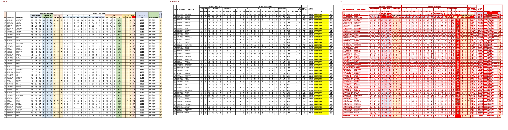

## Page 13
missing: `{'0': 5, '766': 2, '94': 2, '120': 2, '214': 2, '9': 2, 'DC': 2, 'WASIOFAULU': 1, '(DRJ': 1, 'E)': 1}`
extra: `{'A': 6, 'I': 5, '1': 5, 'K': 3, 'S': 2, 'U': 2, 'N': 2, '14': 2, '41': 2, '831': 2}`

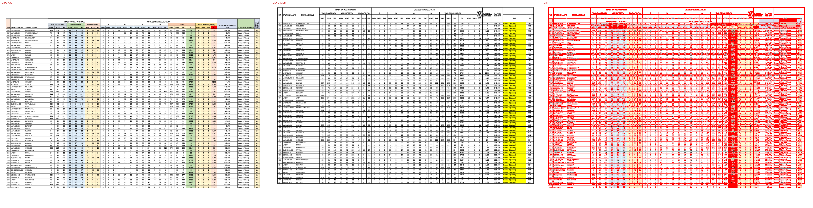

## Page 14
missing: `{'1': 4, '831': 2, '41': 2, '14': 2, 'DC': 2, 'WASIOFAULU': 1, '(DRJ': 1, 'E)': 1, 'KUNDI': 1, 'LA': 1}`
extra: `{'A': 6, 'I': 5, '0': 4, 'K': 3, 'D': 2, 'S': 2, 'U': 2, 'N': 2, '43': 2, '896': 2}`

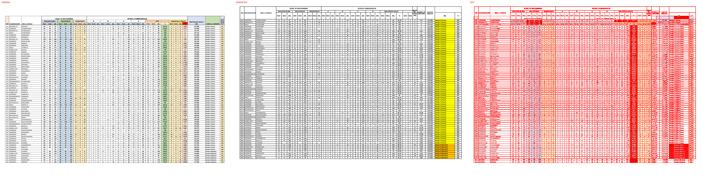

## Page 15
missing: `{'0': 10, '7': 3, '896': 2, 'DC': 2, '43': 2, '40': 2, '4': 2, '20': 2, 'Daraja': 2, '(Wastani)': 2}`
extra: `{'A': 6, 'I': 5, 'K': 3, 'S': 2, 'U': 2, 'N': 2, 'WALIOFAULU(A-D)': 1, 'EW': 1, 'HU': 1, 'LE': 1}`

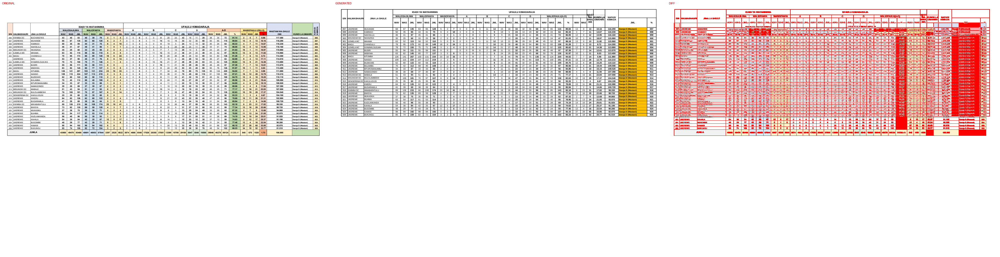

