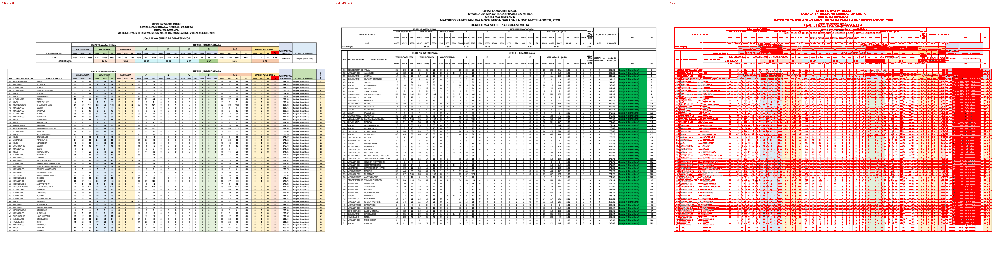
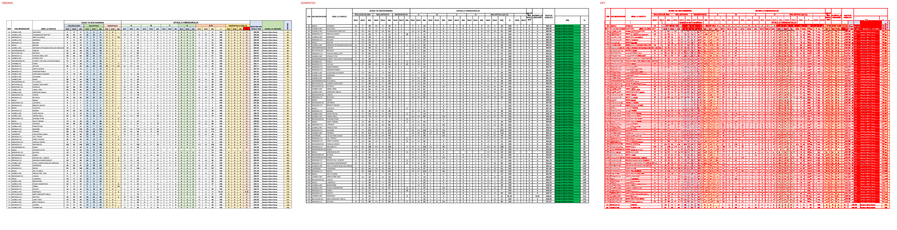
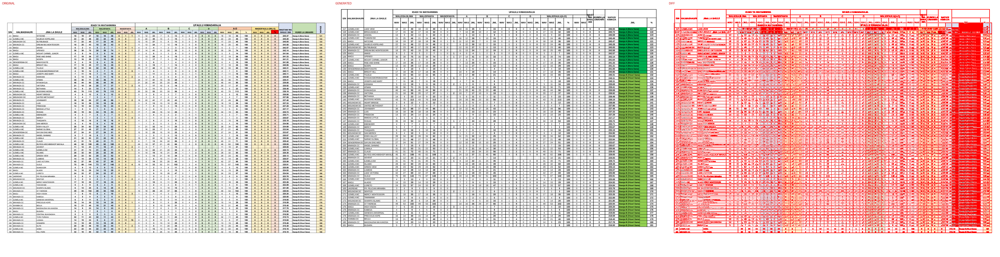
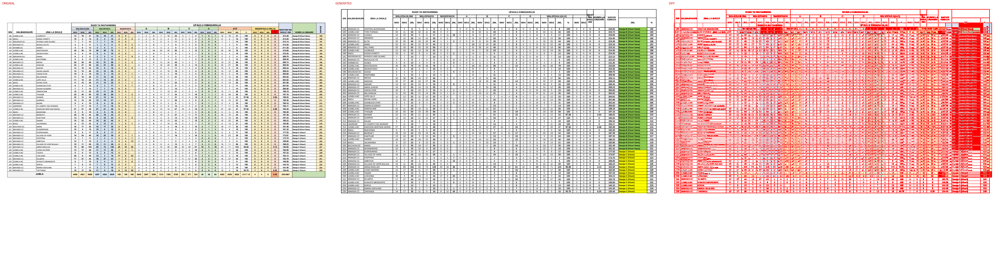

# Original vs generated

Columns: **original | generated | diff** (pink = sub-pixel differences, red = real differences).

Pixel diff = share of pixels that differ at 110 dpi; tolerant = still different when a 1px shift is allowed (ignores sub-pixel anti-aliasing).

**Verdict** is the stricter >=96%-match bar (position-by-position across colours, borders, data and cell sizes): a page **PASS**es when tolerant diff <= 4% (>=96% pixel match) AND there are zero fills-only diffs both ways AND zero words missing/extra; otherwise **FAIL** with the failing dimension(s) named.

| page | pixel diff | tolerant diff | words missing | words extra | fills only in original | fills only in generated | verdict (>=96%) |
|---|---|---|---|---|---|---|---|
| 1 | 34.97% | 25.89% | 65 | 44 | #a9d08e #c6e0b4 #d1f5f9 #d6dce4 #d9e1f2 #ddebf7 #e2efda #f8cbad #fce4d6 #ff0000 #ffe699 #fff2cc | #00b050 | ❌ FAIL (pixels 25.89%>4%, fills 12orig/1gen, words 65miss/44extra) |
| 2 | 38.66% | 28.03% | 150 | 46 | #c6e0b4 #d6dce4 #d9e1f2 #ddebf7 #e2efda #f8cbad #fce4d6 #ff0000 #ffe699 #fff2cc | #00b050 | ❌ FAIL (pixels 28.03%>4%, fills 10orig/1gen, words 150miss/46extra) |
| 3 | 38.14% | 27.51% | 178 | 83 | #c6e0b4 #d6dce4 #d9e1f2 #ddebf7 #e2efda #f8cbad #fce4d6 #ff0000 #ffe699 #fff2cc | #00b050 #92d050 | ❌ FAIL (pixels 27.51%>4%, fills 10orig/2gen, words 178miss/83extra) |
| 4 | 30.09% | 21.82% | 40 | 302 | #c6e0b4 #d6dce4 #d9e1f2 #ddebf7 #e2efda #f2f2f2 #f4b084 #f8cbad #fce4d6 #ff0000 #ffe699 #fff2cc | #92d050 #ffff00 | ❌ FAIL (pixels 21.82%>4%, fills 12orig/2gen, words 40miss/302extra) |

**Verdict summary: 0/4 pages meet the >=96% bar** (tolerant diff <= 4% AND zero fill diffs AND zero word diffs).

## Page 1
missing: `{'0': 13, '9': 5, 'DC': 3, '10': 3, '19': 3, 'WASIOFAULU': 2, '(DRJ': 2, 'E)': 2, 'KUNDI': 2, 'Daraja': 2}`
extra: `{'A': 6, 'I': 5, 'U': 3, 'K': 3, 'WALIOFAULU(A-D)': 2, 'LE': 2, '300': 2, 'S': 2, 'N': 2, 'D': 1}`

## Page 2
missing: `{'0': 32, '22': 6, '15': 6, '13': 5, 'DC': 5, 'ILEMELA': 3, 'MC': 3, '100': 3, 'Daraja': 3, '(Bora': 3}`
extra: `{'I': 5, 'A': 3, 'K': 3, '19': 3, 'S': 2, 'U': 2, 'N': 2, '52': 2, 'D': 1, 'WALIOFAULU(A-D)': 1}`

## Page 3
missing: `{'0': 34, '5': 10, '3': 9, 'B': 7, '8': 7, '(Vizuri': 7, '11': 6, '44': 5, 'MWANZA': 4, 'CC': 4}`
extra: `{'A': 10, 'I': 5, '(Bora': 4, 'K': 3, '15': 3, '21': 3, 'S': 2, 'U': 2, 'N': 2, '117': 2}`

## Page 4
missing: `{'WASIOFAULU': 1, '(DRJ': 1, 'E)': 1, 'KUNDI': 1, 'LA': 1, 'UMAHIRI': 1, 'ISAFAN': 1, 'A-D': 1, 'WA': 1, 'SHULE': 1}`
extra: `{'0': 79, '5': 11, '3': 10, 'B': 7, '8': 7, '100': 7, 'Daraja': 7, '(Vizuri': 7, 'Sana)': 7, '32': 7}`

