# Original vs generated

Columns: **original | generated | diff** (pink = sub-pixel differences, red = real differences).

Pixel diff = share of pixels that differ at 110 dpi; tolerant = still different when a 1px shift is allowed (ignores sub-pixel anti-aliasing).

**Verdict** is the stricter >=96%-match bar (position-by-position across colours, borders, data and cell sizes): a page **PASS**es when tolerant diff <= 4% (>=96% pixel match) AND there are zero fills-only diffs both ways AND zero words missing/extra; otherwise **FAIL** with the failing dimension(s) named.

| page | pixel diff | tolerant diff | words missing | words extra | fills only in original | fills only in generated | verdict (>=96%) |
|---|---|---|---|---|---|---|---|
| 1 | 38.67% | 28.97% | 263 | 169 | #d1f5f9 #ff0000 | #00b050 | ❌ FAIL (pixels 28.97%>4%, fills 2orig/1gen, words 263miss/169extra) |
| 2 | 42.47% | 30.55% | 352 | 234 | #a9d08e #f2f2f2 #ff0000 | #00b050 | ❌ FAIL (pixels 30.55%>4%, fills 3orig/1gen, words 352miss/234extra) |
| 3 | 42.58% | 30.43% | 452 | 300 | #a9d08e #f2f2f2 #ff0000 | #00b050 #92d050 | ❌ FAIL (pixels 30.43%>4%, fills 3orig/2gen, words 452miss/300extra) |
| 4 | 42.34% | 30.00% | 460 | 305 | #a9d08e #f2f2f2 #ff0000 | #92d050 | ❌ FAIL (pixels 30.00%>4%, fills 3orig/1gen, words 460miss/305extra) |
| 5 | 42.32% | 30.04% | 500 | 340 | #a9d08e #f2f2f2 #ff0000 | #92d050 | ❌ FAIL (pixels 30.04%>4%, fills 3orig/1gen, words 500miss/340extra) |
| 6 | 42.12% | 29.93% | 500 | 358 | #a9d08e #f2f2f2 #ff0000 | #92d050 | ❌ FAIL (pixels 29.93%>4%, fills 3orig/1gen, words 500miss/358extra) |
| 7 | 42.18% | 29.86% | 506 | 357 | #a9d08e #f2f2f2 #ff0000 | #92d050 | ❌ FAIL (pixels 29.86%>4%, fills 3orig/1gen, words 506miss/357extra) |
| 8 | 42.46% | 30.03% | 547 | 393 | #a9d08e #f2f2f2 #ff0000 | #92d050 | ❌ FAIL (pixels 30.03%>4%, fills 3orig/1gen, words 547miss/393extra) |
| 9 | 42.53% | 30.12% | 568 | 409 | #a9d08e #f2f2f2 #ff0000 | #92d050 | ❌ FAIL (pixels 30.12%>4%, fills 3orig/1gen, words 568miss/409extra) |
| 10 | 42.49% | 29.97% | 601 | 446 | #a9d08e #f2f2f2 #ff0000 | #92d050 | ❌ FAIL (pixels 29.97%>4%, fills 3orig/1gen, words 601miss/446extra) |
| 11 | 42.07% | 28.62% | 663 | 535 | #a9d08e #f2f2f2 #ff0000 | #92d050 #ffff00 | ❌ FAIL (pixels 28.62%>4%, fills 3orig/2gen, words 663miss/535extra) |
| 12 | 41.93% | 28.14% | 620 | 468 | #a9d08e #f2f2f2 #ff0000 | #ffff00 | ❌ FAIL (pixels 28.14%>4%, fills 3orig/1gen, words 620miss/468extra) |
| 13 | 42.01% | 28.05% | 650 | 488 | #a9d08e #f2f2f2 #ff0000 | #ffff00 | ❌ FAIL (pixels 28.05%>4%, fills 3orig/1gen, words 650miss/488extra) |
| 14 | 42.25% | 28.26% | 546 | 479 | #a9d08e #f2f2f2 #ff0000 | - | ❌ FAIL (pixels 28.26%>4%, fills 3orig/0gen, words 546miss/479extra) |
| 15 | 41.76% | 28.21% | 604 | 556 | #a9d08e #f2f2f2 #ff0000 | #ffff00 | ❌ FAIL (pixels 28.21%>4%, fills 3orig/1gen, words 604miss/556extra) |
| 16 | 19.15% | 17.58% | 76 | 1271 | #a9d08e #f2f2f2 #f4b084 #ff0000 | #ffc000 | ❌ FAIL (pixels 17.58%>4%, fills 4orig/1gen, words 76miss/1271extra) |

**Verdict summary: 0/16 pages meet the >=96% bar** (tolerant diff <= 4% AND zero fill diffs AND zero word diffs).

## Page 1
missing: `{'0': 22, 'CC': 17, 'MC': 16, 'DC': 12, 'WAS': 9, 'WAV': 6, '1': 6, '31': 5, 'JML': 4, 'MAHINA': 4}`
extra: `{'A': 19, 'W': 17, 'S': 10, 'L': 6, 'V': 4, 'J': 4, 'M': 4, 'AS': 4, 'CCMAHINA': 4, 'F': 3}`

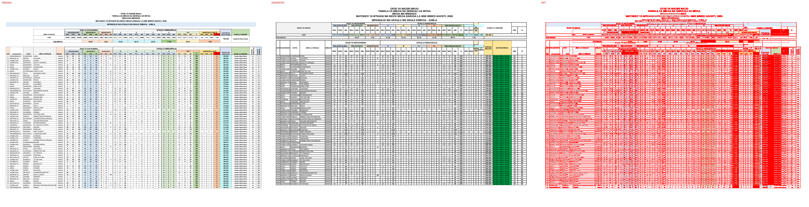

## Page 2
missing: `{'DC': 24, 'CC': 20, 'MC': 16, '0': 13, 'MWANZA': 10, 'WAS': 9, 'MISUNGWI': 9, 'WAV': 6, 'ILEMELA': 6, 'KWIMBA': 6}`
extra: `{'A': 18, 'W': 16, 'S': 9, 'L': 6, '31': 5, 'CCMKOLANI': 5, 'MCBUSWELU': 5, 'V': 4, 'J': 4, 'M': 4}`

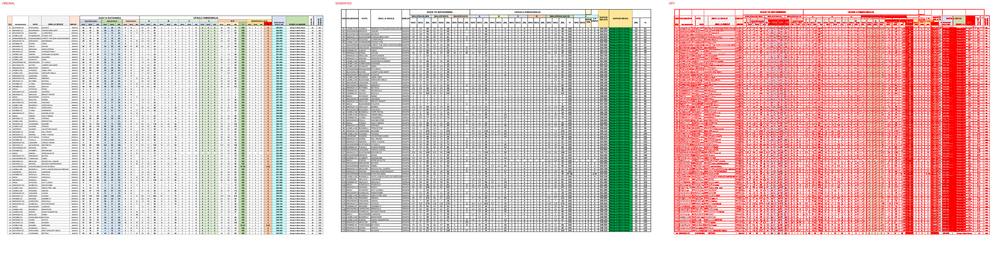

## Page 3
missing: `{'DC': 27, '0': 21, 'MISUNGWI': 19, 'ILEMELA': 17, 'MC': 16, 'MAGU': 13, 'MWANZA': 11, 'CC': 11, 'KWIMBA': 11, 'WAS': 9}`
extra: `{'A': 24, 'W': 16, 'S': 9, 'L': 6, 'V': 4, 'J': 4, 'M': 4, 'AS': 4, 'MCKAHAMA': 4, '(Bora': 4}`

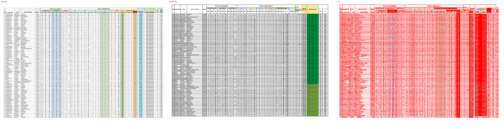

## Page 4
missing: `{'DC': 33, 'KWIMBA': 17, 'ILEMELA': 16, 'MC': 13, 'MISUNGWI': 13, 'SENGEREMA': 11, 'WAS': 9, 'MWANZA': 9, 'CC': 9, 'MAGU': 9}`
extra: `{'A': 20, 'W': 16, 'S': 9, 'L': 6, 'V': 4, 'J': 4, 'M': 4, 'AS': 4, '17': 4, 'F': 3}`

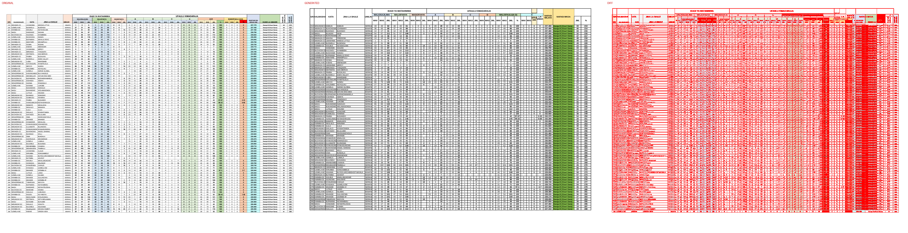

## Page 5
missing: `{'DC': 31, 'KWIMBA': 16, 'BUCHOSA': 13, 'MISUNGWI': 12, 'MWANZA': 11, 'CC': 11, '1': 10, '2': 10, 'MAGU': 10, 'WAS': 9}`
extra: `{'A': 20, 'W': 16, 'S': 9, 'L': 6, '18': 5, 'V': 4, 'J': 4, 'M': 4, 'AS': 4, '46': 4}`

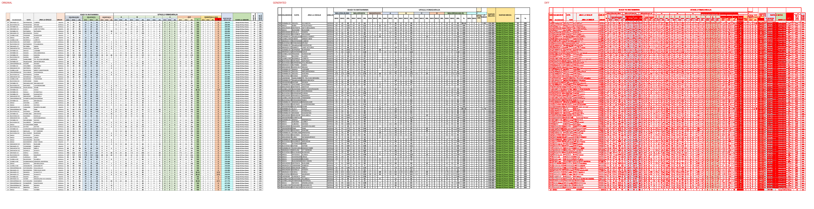

## Page 6
missing: `{'0': 30, 'DC': 27, 'KWIMBA': 22, 'MISUNGWI': 13, 'MAGU': 11, 'ILEMELA': 10, 'WAS': 9, 'MC': 9, 'MWANZA': 8, 'CC': 8}`
extra: `{'A': 20, 'W': 16, '14': 10, 'S': 9, 'L': 6, '16': 5, '21': 5, 'V': 4, 'J': 4, 'M': 4}`

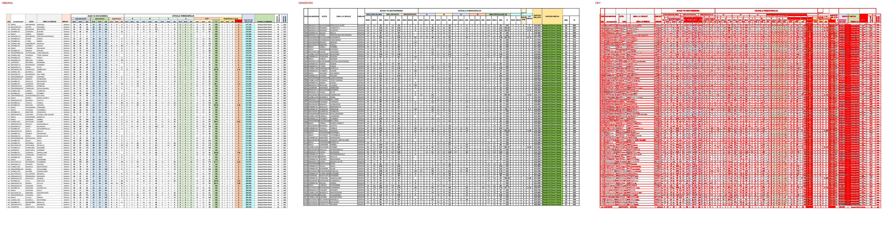

## Page 7
missing: `{'DC': 37, 'KWIMBA': 18, 'MISUNGWI': 16, 'SENGEREMA': 12, 'BUCHOSA': 10, 'WAS': 9, 'MAGU': 8, 'MWANZA': 7, 'CC': 7, '42': 7}`
extra: `{'A': 20, 'W': 16, 'S': 9, 'L': 6, '31': 6, '17': 5, '2': 5, 'V': 4, 'J': 4, 'M': 4}`

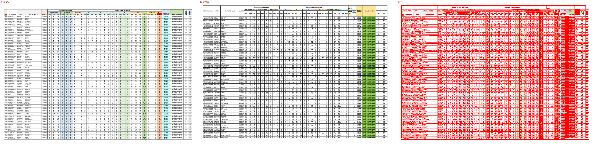

## Page 8
missing: `{'DC': 35, '0': 19, 'MISUNGWI': 17, 'MAGU': 13, 'BUCHOSA': 11, 'KWIMBA': 11, 'WAS': 9, '1': 9, '2': 9, 'SENGEREMA': 9}`
extra: `{'A': 20, 'W': 16, 'S': 9, '42': 7, 'L': 6, '23': 6, '7': 6, '40': 5, 'V': 4, 'J': 4}`

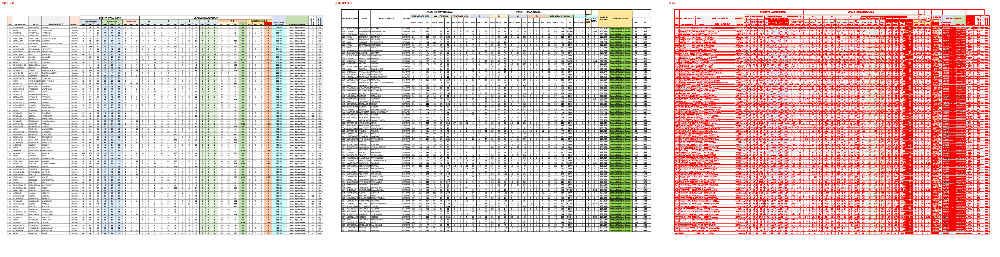

## Page 9
missing: `{'DC': 31, 'MAGU': 16, 'MISUNGWI': 15, 'SENGEREMA': 11, 'KWIMBA': 11, 'MWANZA': 10, 'CC': 10, 'WAS': 9, '28': 8, '23': 8}`
extra: `{'A': 20, 'W': 16, 'S': 9, '0': 9, '58': 7, '22': 7, 'L': 6, '3': 6, '54': 5, 'V': 4}`

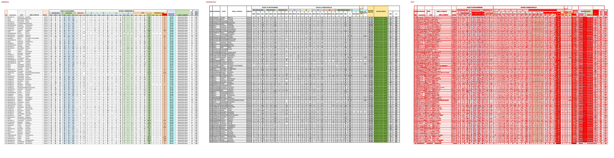

## Page 10
missing: `{'DC': 36, 'BUCHOSA': 14, 'KWIMBA': 13, '4': 12, 'MISUNGWI': 12, '36': 11, 'SENGEREMA': 11, '17': 10, 'ILEMELA': 10, '11': 10}`
extra: `{'A': 20, 'W': 16, 'S': 9, '23': 7, '2': 7, 'L': 6, '5': 6, '16': 6, '33': 6, '43': 6}`

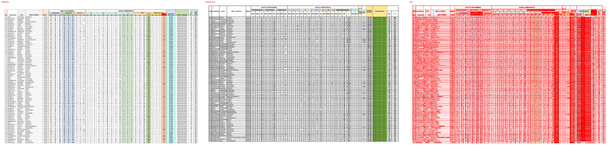

## Page 11
missing: `{'DC': 32, 'C': 22, '(Vizuri)': 22, 'MISUNGWI': 14, 'SENGEREMA': 13, 'KWIMBA': 12, 'UKEREWE': 11, 'MWANZA': 11, 'CC': 11, 'WAS': 9}`
extra: `{'B': 22, 'A': 20, '(Vizuri': 20, 'Sana)': 20, 'W': 16, '17': 10, '8': 10, 'S': 9, '14': 8, '52': 8}`

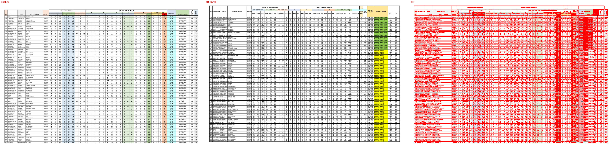

## Page 12
missing: `{'DC': 23, 'UKEREWE': 15, '29': 13, 'MWANZA': 13, 'CC': 13, '8': 12, '0': 11, 'BUCHOSA': 11, 'ILEMELA': 11, 'MAGU': 10}`
extra: `{'A': 20, 'W': 16, 'S': 9, '1': 9, '39': 8, '60': 8, '46': 7, 'L': 6, '23': 6, '94': 6}`

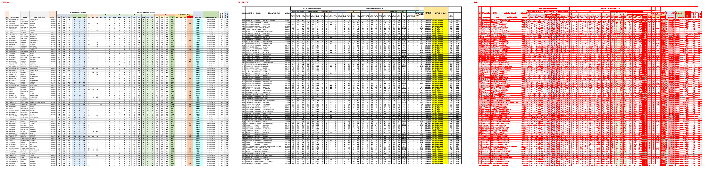

## Page 13
missing: `{'DC': 20, 'ILEMELA': 18, 'MC': 15, 'UKEREWE': 15, 'MWANZA': 14, 'CC': 14, 'SERIKALI': 12, 'WAS': 9, 'MISUNGWI': 9, 'MAGU': 9}`
extra: `{'A': 20, 'W': 16, '0': 16, '29': 11, 'S': 9, '22': 7, '8': 7, '28': 7, 'L': 6, '79': 6}`

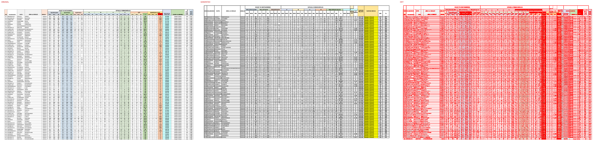

## Page 14
missing: `{'0': 24, 'CC': 21, 'SERIKALI': 15, '1': 14, 'MC': 11, '5': 10, 'DC': 10, 'WAS': 9, '28': 9, '33': 7}`
extra: `{'A': 20, 'W': 16, '32': 11, 'S': 9, '11': 8, '16': 8, 'L': 6, '27': 6, '85': 5, '37': 5}`

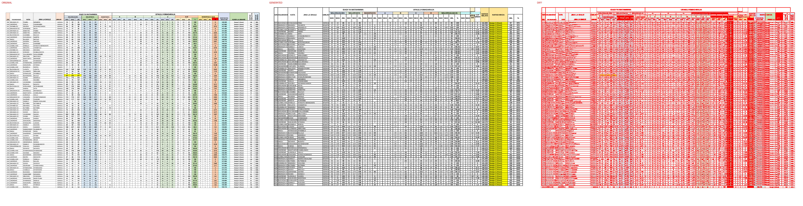

## Page 15
missing: `{'D': 30, '(Wastani)': 30, 'DC': 14, '60': 10, 'WAS': 9, 'SERIKALI': 9, '11': 9, '5': 9, '7': 9, 'KAGUNGULI': 8}`
extra: `{'0': 46, 'C': 28, '(Vizuri)': 28, '1': 26, 'A': 20, 'W': 16, '100': 11, '17': 10, 'S': 9, '28': 9}`

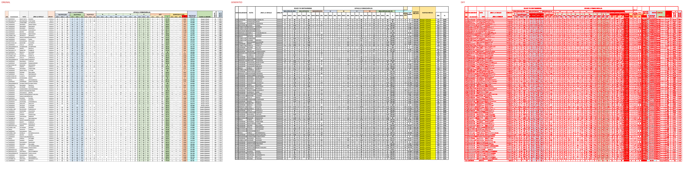

## Page 16
missing: `{'WAS': 9, 'WAV': 6, 'JML': 4, 'ISAFAN': 2, 'MUKITUNTU': 2, 'AOKMIK': 1, 'WALIOSAJILIWA': 1, 'WALIOFANYA': 1, 'WASIOFANYA': 1, 'A-D': 1}`
extra: `{'0': 112, '2': 31, 'D': 30, 'Daraja': 30, '(Wastani)': 30, '3': 29, '5': 29, 'SERIKALI': 28, '7': 22, '1': 22}`

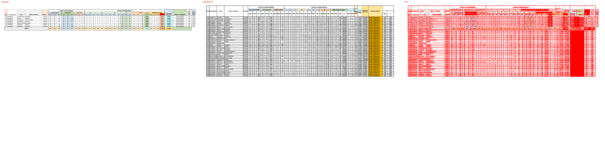

