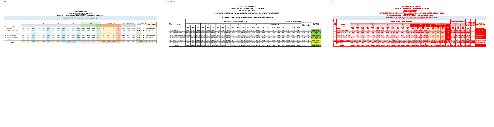

# Original vs generated

Columns: **original | generated | diff** (pink = sub-pixel differences, red = real differences).

Pixel diff = share of pixels that differ at 110 dpi; tolerant = still different when a 1px shift is allowed (ignores sub-pixel anti-aliasing).

**Verdict** is the stricter >=96%-match bar (position-by-position across colours, borders, data and cell sizes): a page **PASS**es when tolerant diff <= 4% (>=96% pixel match) AND there are zero fills-only diffs both ways AND zero words missing/extra; otherwise **FAIL** with the failing dimension(s) named.

| page | pixel diff | tolerant diff | words missing | words extra | fills only in original | fills only in generated | verdict (>=96%) |
|---|---|---|---|---|---|---|---|
| 1 | 8.74% | 6.97% | 11 | 25 | #a9d08e #bdd7ee #c6e0b4 #d6dce4 #dbf3f9 #ddebf7 #e2efda #e7e6e6 #f4b084 #f8cbad #fce4d6 #fff2cc | #92d050 #ffff00 | ❌ FAIL (pixels 6.97%>4%, fills 12orig/2gen, words 11miss/25extra) |

**Verdict summary: 0/1 pages meet the >=96% bar** (tolerant diff <= 4% AND zero fill diffs AND zero word diffs).

## Page 1
missing: `{'NA': 2, 'LA': 1, 'KUNDI': 1, 'UMAHIRI': 1, 'MAADILI': 1, '13877': 1, 'MAZINGIRA': 1, '10761': 1, 'TEKNOLOJIA': 1, '7522': 1}`
extra: `{'A': 3, 'U': 2, 'TATHIMINI': 1, 'UFAULU': 1, 'KIMADARAJA': 1, 'S': 1, 'O': 1, '/N': 1, 'MO': 1, 'D': 1}`

