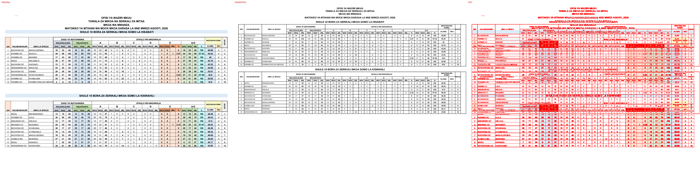
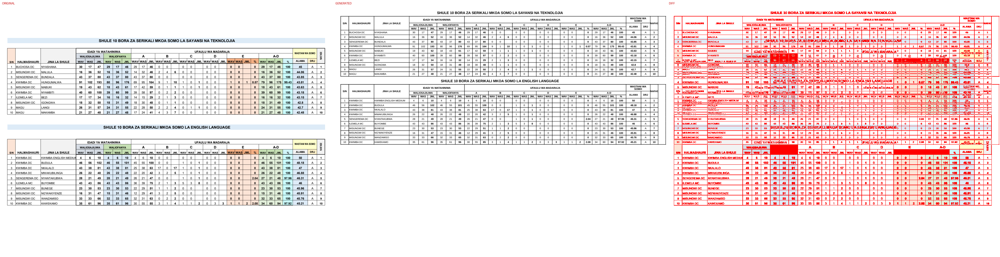
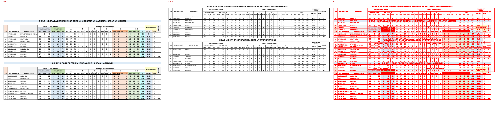

# Original vs generated

Columns: **original | generated | diff** (pink = sub-pixel differences, red = real differences).

Pixel diff = share of pixels that differ at 110 dpi; tolerant = still different when a 1px shift is allowed (ignores sub-pixel anti-aliasing).

**Verdict** is the stricter >=96%-match bar (position-by-position across colours, borders, data and cell sizes): a page **PASS**es when tolerant diff <= 4% (>=96% pixel match) AND there are zero fills-only diffs both ways AND zero words missing/extra; otherwise **FAIL** with the failing dimension(s) named.

| page | pixel diff | tolerant diff | words missing | words extra | fills only in original | fills only in generated | verdict (>=96%) |
|---|---|---|---|---|---|---|---|
| 1 | 19.93% | 16.95% | 18 | 42 | #c6e0b4 #ccffff #d1f5f9 #d6dce4 #ddebf7 #e2efda #f2f2f2 #f4b084 #fce4d6 #fff2cc #ffffcc | - | ❌ FAIL (pixels 16.95%>4%, fills 11orig/0gen, words 18miss/42extra) |
| 2 | 19.98% | 17.73% | 14 | 34 | #c6e0b4 #ccffff #d1f5f9 #d6dce4 #ddebf7 #e2efda #f2f2f2 #f4b084 #fce4d6 #fff2cc #ffffcc | - | ❌ FAIL (pixels 17.73%>4%, fills 11orig/0gen, words 14miss/34extra) |
| 3 | 19.66% | 17.03% | 8 | 22 | #c6e0b4 #ccffff #d1f5f9 #d6dce4 #ddebf7 #e2efda #f2f2f2 #f4b084 #fce4d6 #fff2cc #ffffcc | - | ❌ FAIL (pixels 17.03%>4%, fills 11orig/0gen, words 8miss/22extra) |

**Verdict summary: 0/3 pages meet the >=96% bar** (tolerant diff <= 4% AND zero fill diffs AND zero word diffs).

## Page 1
missing: `{'WAVWAS': 10, 'WASTANI': 2, 'SOMO': 2, 'ISAFAN': 2, 'PR4E': 1, 'AND6': 1}`
extra: `{'WAS': 12, 'WAV': 10, 'O': 4, 'S': 2, 'T': 2, 'A': 2, 'M': 2, 'N': 2, 'I': 2, 'NAFASI': 2}`

## Page 2
missing: `{'WAVWAS': 6, 'WASTANI': 2, 'SOMO': 2, 'ISAFAN': 2, 'PR4E': 1, 'AND6': 1}`
extra: `{'WAS': 8, 'WAV': 6, 'O': 4, 'S': 2, 'T': 2, 'A': 2, 'M': 2, 'N': 2, 'I': 2, 'NAFASI': 2}`

## Page 3
missing: `{'WASTANI': 2, 'SOMO': 2, 'ISAFAN': 2, 'PR4E': 1, 'AND6': 1}`
extra: `{'O': 4, 'WAS': 2, 'S': 2, 'T': 2, 'A': 2, 'M': 2, 'N': 2, 'I': 2, 'NAFASI': 2, '4': 1}`

