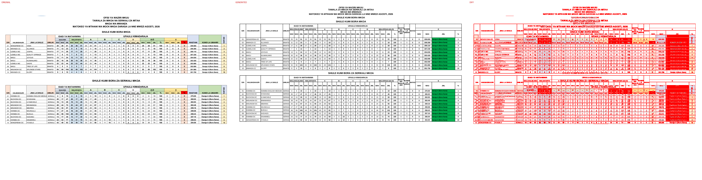
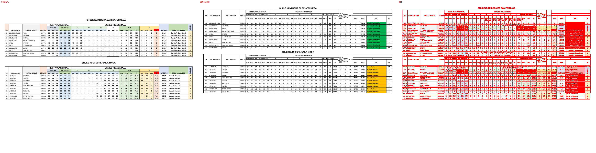
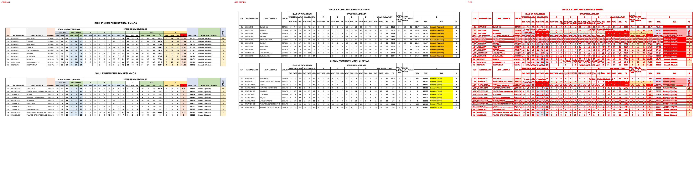
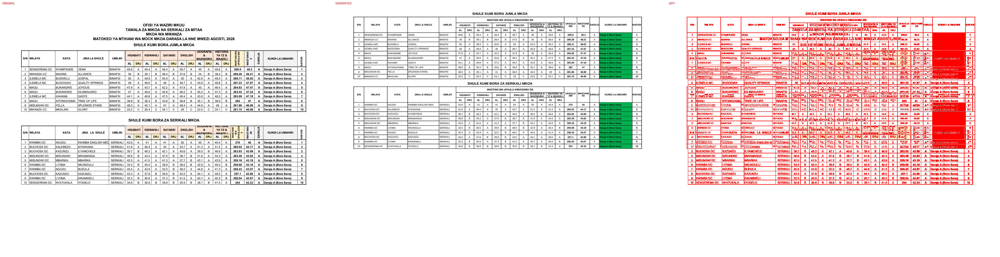
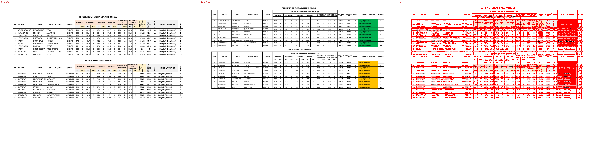

# Original vs generated

Columns: **original | generated | diff** (pink = sub-pixel differences, red = real differences).

Pixel diff = share of pixels that differ at 110 dpi; tolerant = still different when a 1px shift is allowed (ignores sub-pixel anti-aliasing).

**Verdict** is the stricter >=96%-match bar (position-by-position across colours, borders, data and cell sizes): a page **PASS**es when tolerant diff <= 4% (>=96% pixel match) AND there are zero fills-only diffs both ways AND zero words missing/extra; otherwise **FAIL** with the failing dimension(s) named.

| page | pixel diff | tolerant diff | words missing | words extra | fills only in original | fills only in generated | verdict (>=96%) |
|---|---|---|---|---|---|---|---|
| 1 | 20.98% | 16.45% | 59 | 183 | #c6e0b4 #d6dce4 #d9e1f2 #ddebf7 #e2efda #f2f2f2 #fce4d6 #ff0000 #ffe699 #fff2cc | #00b050 | ❌ FAIL (pixels 16.45%>4%, fills 10orig/1gen, words 59miss/183extra) |
| 2 | 20.33% | 15.90% | 60 | 180 | #c6e0b4 #d6dce4 #d9e1f2 #ddebf7 #e2efda #f2f2f2 #fce4d6 #ff0000 #ffe699 #fff2cc | #00b050 #ffc000 | ❌ FAIL (pixels 15.90%>4%, fills 10orig/2gen, words 60miss/180extra) |
| 3 | 19.61% | 14.75% | 64 | 183 | #c6e0b4 #d6dce4 #d9e1f2 #ddebf7 #e2efda #f2f2f2 #fce4d6 #ff0000 #ffe699 #fff2cc | #ffc000 #ffff00 | ❌ FAIL (pixels 14.75%>4%, fills 10orig/2gen, words 64miss/183extra) |
| 4 | 20.05% | 17.13% | 52 | 96 | #f2f2f2 #fce4d6 #fff2cc | #00b050 | ❌ FAIL (pixels 17.13%>4%, fills 3orig/1gen, words 52miss/96extra) |
| 5 | 18.85% | 15.16% | 26 | 96 | #f2f2f2 #fce4d6 #fff2cc | #00b050 #ffc000 | ❌ FAIL (pixels 15.16%>4%, fills 3orig/2gen, words 26miss/96extra) |

**Verdict summary: 0/5 pages meet the >=96% bar** (tolerant diff <= 4% AND zero fill diffs AND zero word diffs).

## Page 1
missing: `{'WAS': 14, 'SERIKALI': 8, 'JML': 6, 'WAV': 4, 'A-D': 2, 'WASTANI': 2, 'KUNDI': 2, 'LA': 2, 'UMAHIRI': 2, 'ISAFAN': 2}`
extra: `{'W': 26, 'A': 26, 'L': 12, 'S': 10, 'AS': 8, 'U': 8, 'I': 8, 'J': 6, 'M': 6, 'N': 6}`

## Page 2
missing: `{'WAS': 14, 'SERIKALI': 10, 'JML': 6, 'WAV': 4, 'A-D': 2, 'WASTANI': 2, 'KUNDI': 2, 'LA': 2, 'UMAHIRI': 2, 'ISAFAN': 2}`
extra: `{'W': 26, 'A': 26, 'L': 12, 'S': 10, 'AS': 8, 'U': 8, 'I': 8, 'J': 6, 'M': 6, 'N': 6}`

## Page 3
missing: `{'WAS': 14, 'SERIKALI': 10, 'JML': 6, 'WAV': 4, 'A-D': 2, 'WASTANI': 2, 'KUNDI': 2, 'LA': 2, 'UMAHIRI': 2, 'ISAFAN': 2}`
extra: `{'W': 26, 'A': 26, 'L': 12, 'S': 10, 'AS': 8, 'U': 8, 'I': 8, 'J': 6, 'M': 6, 'N': 6}`

## Page 4
missing: `{'YA': 4, 'INATSAW': 2, 'AW': 2, 'AJARAD': 2, 'ISAFAN': 2, 'JIOGRAFIA': 2, 'HISTORIA': 2, 'TZ': 2, 'MAZINGIRA': 2, 'MAADILI': 2}`
extra: `{'A': 16, 'I': 8, 'R': 6, 'T': 6, 'M': 4, 'G': 4, 'Z': 4, 'WASTANI': 2, 'UFAULU': 2, 'KIMASOMO': 2}`

## Page 5
missing: `{'INATSAW': 2, 'AW': 2, '03/ULUAFU': 2, '/INATSAW': 2, '05': 2, 'AJARAD': 2, 'ISAFAN': 2, 'HISTORIA': 2, 'YA': 2, 'JIOGRAFIA': 2}`
extra: `{'A': 16, 'I': 8, 'R': 6, 'T': 6, 'M': 4, 'G': 4, 'Z': 4, 'WASTANI': 2, 'WA': 2, 'UFAULU': 2}`

