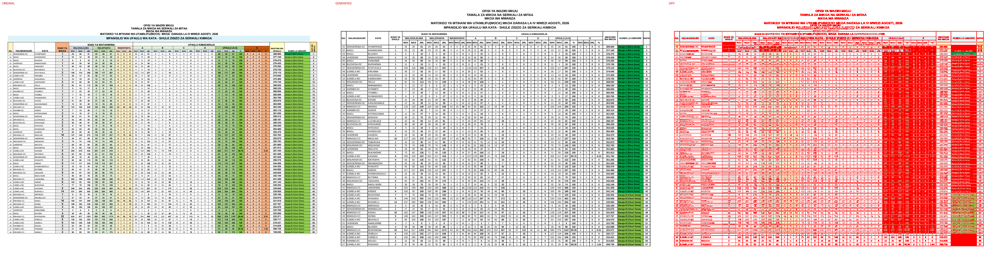
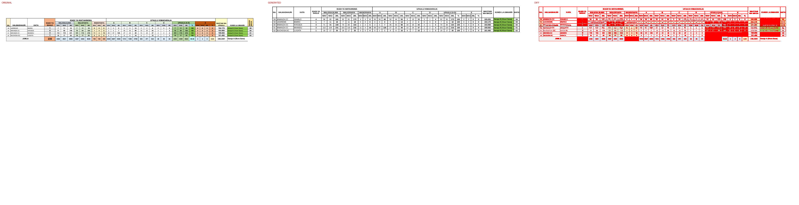

# Original vs generated

Columns: **original | generated | diff** (pink = sub-pixel differences, red = real differences).

Pixel diff = share of pixels that differ at 110 dpi; tolerant = still different when a 1px shift is allowed (ignores sub-pixel anti-aliasing).

**Verdict** is the stricter >=96%-match bar (position-by-position across colours, borders, data and cell sizes): a page **PASS**es when tolerant diff <= 4% (>=96% pixel match) AND there are zero fills-only diffs both ways AND zero words missing/extra; otherwise **FAIL** with the failing dimension(s) named.

| page | pixel diff | tolerant diff | words missing | words extra | fills only in original | fills only in generated | verdict (>=96%) |
|---|---|---|---|---|---|---|---|
| 1 | 39.40% | 28.31% | 56 | 27 | #a4e9f0 #a9d08e #c65911 #c6e0b4 #d6dce4 #d9e1f2 #dbf3f9 #ddebf7 #e2efda #ededed #f4b084 #f8cbad #fce4d6 #ffe699 #fff2cc #ffffcc | - | ❌ FAIL (pixels 28.31%>4%, fills 16orig/0gen, words 56miss/27extra) |
| 2 | 6.07% | 5.28% | 46 | 61 | #a4e9f0 #a9d08e #c65911 #c6e0b4 #ccffff #d6dce4 #d9e1f2 #ddebf7 #e2efda #ededed #f2f2f2 #f4b084 #f8cbad #fce4d6 #ffe699 #fff2cc #ffffcc | - | ❌ FAIL (pixels 5.28%>4%, fills 17orig/0gen, words 46miss/61extra) |

**Verdict summary: 0/2 pages meet the >=96% bar** (tolerant diff <= 4% AND zero fill diffs AND zero word diffs).

## Page 1
missing: `{'0': 4, '4': 4, 'WAV': 3, 'WAS': 3, 'JML': 2, '58': 2, '81': 2, '92': 2, '173': 2, 'YA': 1}`
extra: `{'A': 6, 'S': 2, 'I': 2, 'W': 2, 'ID': 1, 'H': 1, 'D': 1, 'U': 1, 'L': 1, 'Y': 1}`

## Page 2
missing: `{'WAV': 3, 'WAS': 3, 'JML': 2, 'IDADI': 1, 'YA': 1, 'SHULE': 1, 'ISAFAN': 1, 'AOKM': 1, 'UFAULU': 1, 'WASTANI': 1}`
extra: `{'A': 5, '0': 4, 'S': 2, 'I': 2, 'W': 2, '58': 2, '4': 2, '92': 2, '81': 2, '173': 2}`

