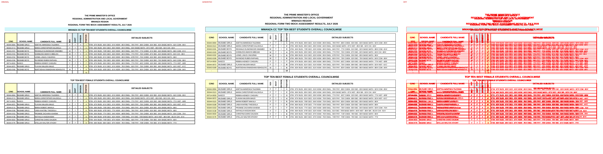
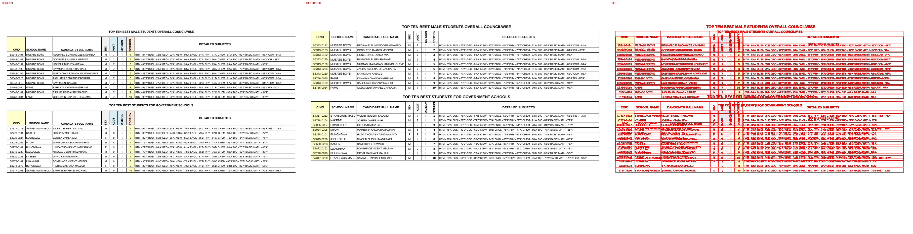
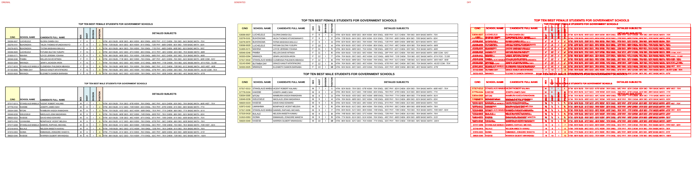
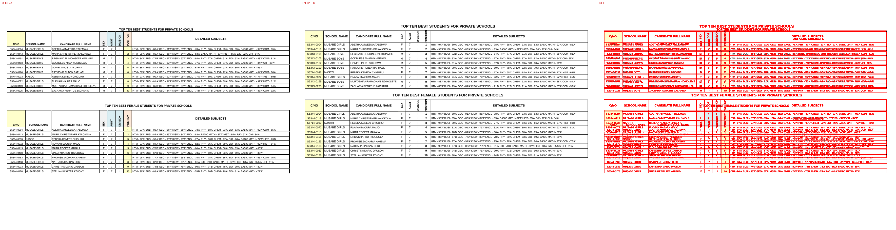
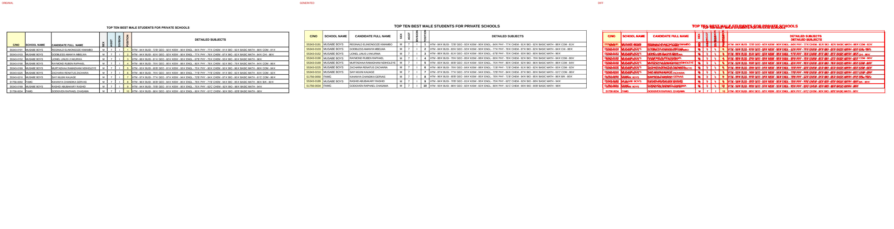

# Original vs generated

Columns: **original | generated | diff** (red = pixels that differ).

| page | pixel diff | words missing | words extra | fills only in original | fills only in generated |
|---|---|---|---|---|---|
| 1 | 20.58% | 36 | 8 | #d2f6fa #daeef3 #f2f2f2 #fde9d9 | #d2f6f9 |
| 2 | 19.52% | 40 | 10 | #daeef3 #f2f2f2 #fde9d9 | - |
| 3 | 18.94% | 42 | 11 | #daeef3 #f2f2f2 #fde9d9 | - |
| 4 | 20.03% | 36 | 8 | #daeef3 #f2f2f2 #fde9d9 | - |
| 5 | 8.65% | 18 | 4 | #daeef3 #f2f2f2 #fde9d9 | - |

## Page 1
missing: `{'O': 6, 'G': 4, 'N': 4, 'IS': 4, 'X': 2, 'E': 2, 'S': 2, 'T': 2, 'A': 2, 'IV': 2}`
extra: `{'XES': 2, 'TGGA': 2, 'NOISIVID': 2, 'NOITISOP': 2}`

## Page 2
missing: `{'O': 6, 'G': 4, 'N': 4, 'IS': 4, 'X': 2, 'E': 2, 'S': 2, 'T': 2, 'A': 2, 'IV': 2}`
extra: `{'XES': 2, 'TGGA': 2, 'NOISIVID': 2, 'NOITISOP': 2, 'MABULVAICENT': 1, 'MABULSAAMWEL': 1}`

## Page 3
missing: `{'O': 6, 'G': 4, 'N': 4, 'IS': 4, 'MABULA': 3, 'X': 2, 'E': 2, 'S': 2, 'T': 2, 'A': 2}`
extra: `{'XES': 2, 'TGGA': 2, 'NOISIVID': 2, 'NOITISOP': 2, 'MABULCALEMENSIA': 1, 'MABULVAICENT': 1, 'MABULSAAMWEL': 1}`

## Page 4
missing: `{'O': 6, 'G': 4, 'N': 4, 'IS': 4, 'X': 2, 'E': 2, 'S': 2, 'T': 2, 'A': 2, 'IV': 2}`
extra: `{'XES': 2, 'TGGA': 2, 'NOISIVID': 2, 'NOITISOP': 2}`

## Page 5
missing: `{'O': 3, 'G': 2, 'N': 2, 'IS': 2, 'X': 1, 'E': 1, 'S': 1, 'T': 1, 'A': 1, 'IV': 1}`
extra: `{'XES': 1, 'TGGA': 1, 'NOISIVID': 1, 'NOITISOP': 1}`

