# Original vs generated

Columns: **original | generated | diff** (pink = sub-pixel differences, red = real differences).

Pixel diff = share of pixels that differ at 110 dpi; tolerant = still different when a 1px shift is allowed (ignores sub-pixel anti-aliasing).

| page | pixel diff | tolerant diff | words missing | words extra | fills only in original | fills only in generated |
|---|---|---|---|---|---|---|
| 1 | 10.49% | 6.39% | 19 | 4 | - | - |
| 2 | 9.16% | 7.11% | 19 | 4 | - | - |
| 3 | 9.14% | 7.07% | 19 | 4 | - | - |
| 4 | 9.06% | 7.04% | 19 | 4 | - | - |
| 5 | 10.30% | 8.76% | 19 | 4 | - | - |
| 6 | 9.25% | 7.12% | 22 | 7 | - | - |
| 7 | 10.02% | 8.30% | 21 | 8 | - | - |
| 8 | 9.69% | 7.51% | 19 | 4 | - | - |
| 9 | 10.12% | 8.43% | 19 | 4 | - | - |
| 10 | 9.69% | 7.97% | 20 | 6 | - | - |
| 11 | 9.52% | 7.41% | 21 | 5 | - | - |
| 12 | 9.40% | 7.27% | 19 | 4 | - | - |
| 13 | 9.27% | 7.14% | 19 | 4 | - | - |
| 14 | 10.03% | 7.86% | 29 | 24 | - | - |
| 15 | 9.19% | 7.09% | 19 | 4 | - | - |
| 16 | 9.19% | 7.19% | 19 | 4 | - | - |
| 17 | 10.22% | 8.37% | 19 | 4 | - | - |
| 18 | 8.75% | 6.78% | 19 | 4 | - | - |
| 19 | 8.97% | 6.89% | 19 | 4 | - | - |
| 20 | 8.87% | 6.87% | 19 | 4 | - | - |
| 21 | 0.00% | 0.00% | 0 | 0 | - | - |
| 22 | 0.00% | 0.00% | 0 | 0 | - | - |
| 23 | 0.00% | 0.00% | 0 | 0 | - | - |
| 24 | 0.00% | 0.00% | 0 | 0 | - | - |
| 25 | 0.00% | 0.00% | 0 | 0 | - | - |
| 26 | 0.00% | 0.00% | 0 | 0 | - | - |
| 27 | 0.00% | 0.00% | 0 | 0 | - | - |
| 28 | 0.00% | 0.00% | 0 | 0 | - | - |
| 29 | 0.00% | 0.00% | 0 | 0 | - | - |
| 30 | 0.00% | 0.00% | 0 | 0 | - | - |

## Page 1
missing: `{'O': 2, 'S': 2, 'E': 2, 'R': 2, 'A': 2, 'N': 1, 'K': 1, 'D': 1, 'IT': 1, 'X': 1}`
extra: `{'XES': 1, 'SKRAM': 1, 'EDARG': 1, 'NOITISOP': 1}`

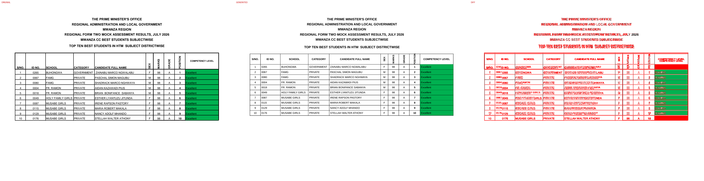

## Page 2
missing: `{'O': 2, 'S': 2, 'E': 2, 'R': 2, 'A': 2, 'N': 1, 'K': 1, 'D': 1, 'IT': 1, 'X': 1}`
extra: `{'XES': 1, 'SKRAM': 1, 'EDARG': 1, 'NOITISOP': 1}`

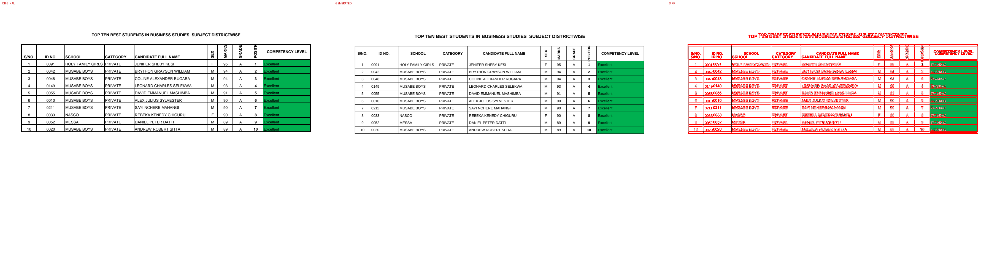

## Page 3
missing: `{'O': 2, 'S': 2, 'E': 2, 'R': 2, 'A': 2, 'N': 1, 'K': 1, 'D': 1, 'IT': 1, 'X': 1}`
extra: `{'XES': 1, 'SKRAM': 1, 'EDARG': 1, 'NOITISOP': 1}`

## Page 4
missing: `{'O': 2, 'S': 2, 'E': 2, 'R': 2, 'A': 2, 'N': 1, 'K': 1, 'D': 1, 'IT': 1, 'X': 1}`
extra: `{'XES': 1, 'SKRAM': 1, 'EDARG': 1, 'NOITISOP': 1}`

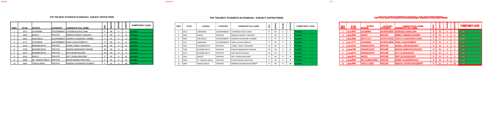

## Page 5
missing: `{'O': 2, 'S': 2, 'E': 2, 'R': 2, 'A': 2, 'N': 1, 'K': 1, 'D': 1, 'IT': 1, 'X': 1}`
extra: `{'XES': 1, 'SKRAM': 1, 'EDARG': 1, 'NOITISOP': 1}`

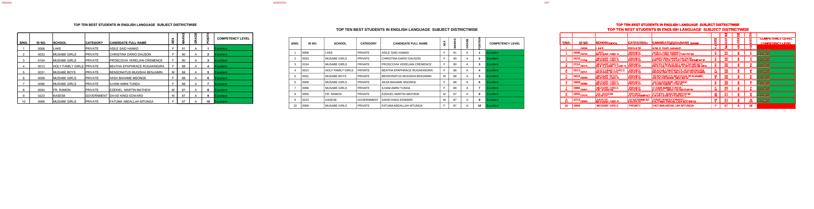

## Page 6
missing: `{'O': 2, 'S': 2, 'E': 2, 'R': 2, 'A': 2, 'N': 1, 'K': 1, 'D': 1, 'IT': 1, 'X': 1}`
extra: `{'XES': 1, 'SKRAM': 1, 'EDARG': 1, 'NOITISOP': 1, 'PRIVATE': 1, 'ARMPRIVATE': 1, 'ISLAMIC': 1}`

## Page 7
missing: `{'O': 2, 'S': 2, 'E': 2, 'R': 2, 'A': 2, 'ISLAMICPRIVATE': 2, 'N': 1, 'K': 1, 'D': 1, 'IT': 1}`
extra: `{'PRIVATE': 2, 'ISLAMIC': 2, 'XES': 1, 'SKRAM': 1, 'EDARG': 1, 'NOITISOP': 1}`

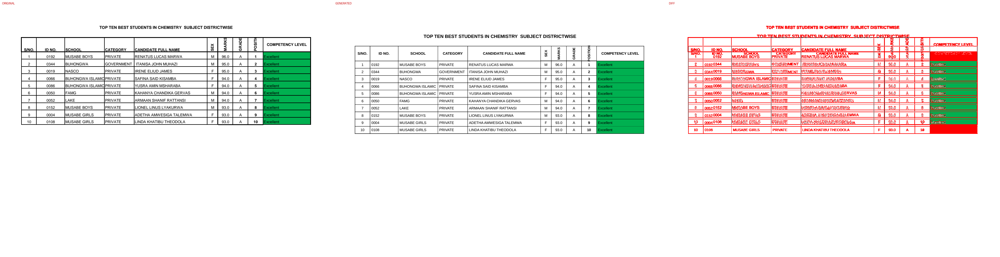

## Page 8
missing: `{'O': 2, 'S': 2, 'E': 2, 'R': 2, 'A': 2, 'N': 1, 'K': 1, 'D': 1, 'IT': 1, 'X': 1}`
extra: `{'XES': 1, 'SKRAM': 1, 'EDARG': 1, 'NOITISOP': 1}`

## Page 9
missing: `{'O': 2, 'S': 2, 'E': 2, 'R': 2, 'A': 2, 'N': 1, 'K': 1, 'D': 1, 'IT': 1, 'X': 1}`
extra: `{'XES': 1, 'SKRAM': 1, 'EDARG': 1, 'NOITISOP': 1}`

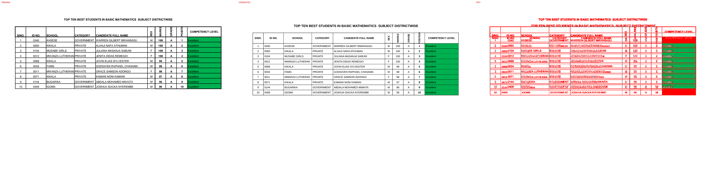

## Page 10
missing: `{'O': 2, 'S': 2, 'E': 2, 'R': 2, 'A': 2, 'N': 1, 'K': 1, 'D': 1, 'IT': 1, 'X': 1}`
extra: `{'XES': 1, 'SKRAM': 1, 'EDARG': 1, 'NOITISOP': 1, 'MABULA': 1, 'GOVERNMENT': 1}`

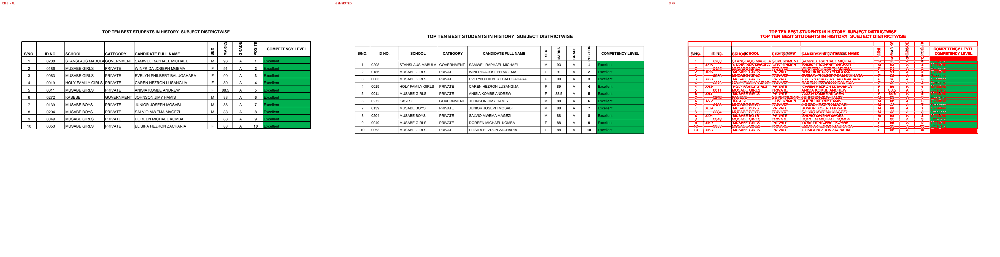

## Page 11
missing: `{'O': 2, 'S': 2, 'E': 2, 'R': 2, 'A': 2, 'N': 1, 'K': 1, 'D': 1, 'IT': 1, 'X': 1}`
extra: `{'XES': 1, 'SKRAM': 1, 'EDARG': 1, 'NOITISOP': 1, 'ARMPRIVATE': 1}`

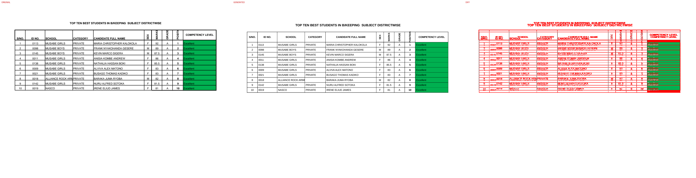

## Page 12
missing: `{'O': 2, 'S': 2, 'E': 2, 'R': 2, 'A': 2, 'N': 1, 'K': 1, 'D': 1, 'IT': 1, 'X': 1}`
extra: `{'XES': 1, 'SKRAM': 1, 'EDARG': 1, 'NOITISOP': 1}`

## Page 13
missing: `{'O': 2, 'S': 2, 'E': 2, 'R': 2, 'A': 2, 'N': 1, 'K': 1, 'D': 1, 'IT': 1, 'X': 1}`
extra: `{'XES': 1, 'SKRAM': 1, 'EDARG': 1, 'NOITISOP': 1}`

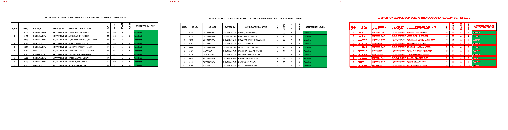

## Page 14
missing: `{'ISLAMICPRIVATE': 10, 'O': 2, 'S': 2, 'E': 2, 'R': 2, 'A': 2, 'N': 1, 'K': 1, 'D': 1, 'IT': 1}`
extra: `{'ISLAMIC': 10, 'PRIVATE': 10, 'XES': 1, 'SKRAM': 1, 'EDARG': 1, 'NOITISOP': 1}`

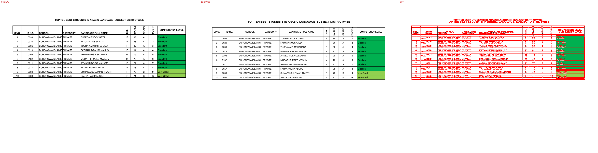

## Page 15
missing: `{'O': 2, 'S': 2, 'E': 2, 'R': 2, 'A': 2, 'N': 1, 'K': 1, 'D': 1, 'IT': 1, 'X': 1}`
extra: `{'XES': 1, 'SKRAM': 1, 'EDARG': 1, 'NOITISOP': 1}`

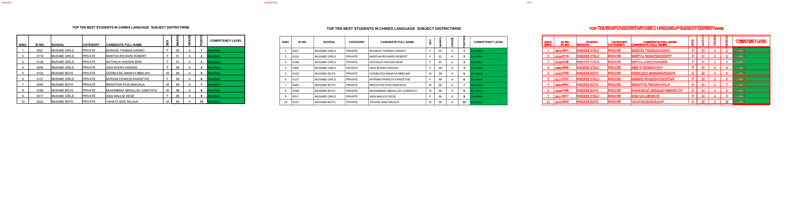

## Page 16
missing: `{'O': 2, 'S': 2, 'E': 2, 'R': 2, 'A': 2, 'N': 1, 'K': 1, 'D': 1, 'IT': 1, 'X': 1}`
extra: `{'XES': 1, 'SKRAM': 1, 'EDARG': 1, 'NOITISOP': 1}`

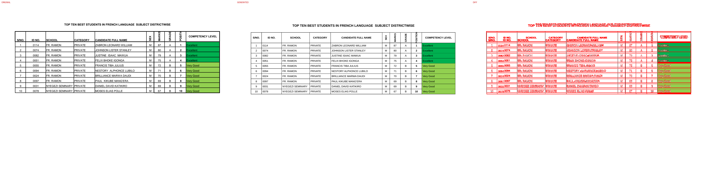

## Page 17
missing: `{'O': 2, 'S': 2, 'E': 2, 'R': 2, 'A': 2, 'N': 1, 'K': 1, 'D': 1, 'IT': 1, 'X': 1}`
extra: `{'XES': 1, 'SKRAM': 1, 'EDARG': 1, 'NOITISOP': 1}`

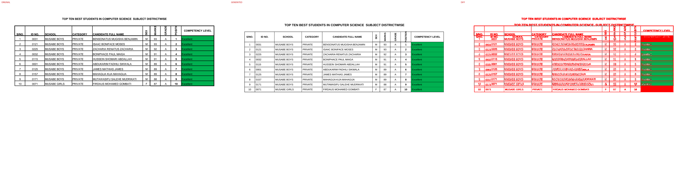

## Page 18
missing: `{'S': 2, 'E': 2, 'O': 2, 'R': 2, 'A': 2, 'N': 1, 'K': 1, 'D': 1, 'IT': 1, 'X': 1}`
extra: `{'XES': 1, 'SKRAM': 1, 'EDARG': 1, 'NOITISOP': 1}`

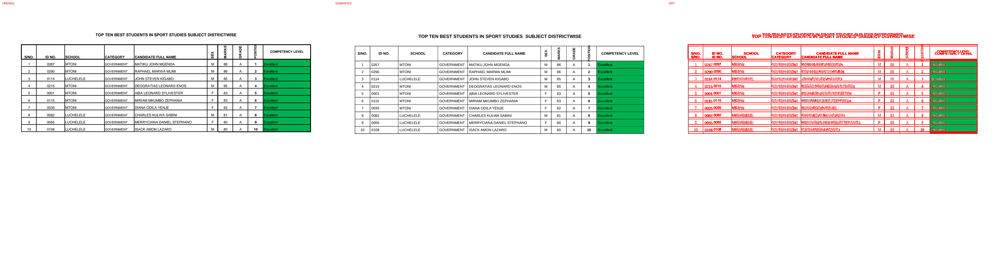

## Page 19
missing: `{'S': 2, 'E': 2, 'O': 2, 'R': 2, 'A': 2, 'N': 1, 'K': 1, 'D': 1, 'IT': 1, 'X': 1}`
extra: `{'XES': 1, 'SKRAM': 1, 'EDARG': 1, 'NOITISOP': 1}`

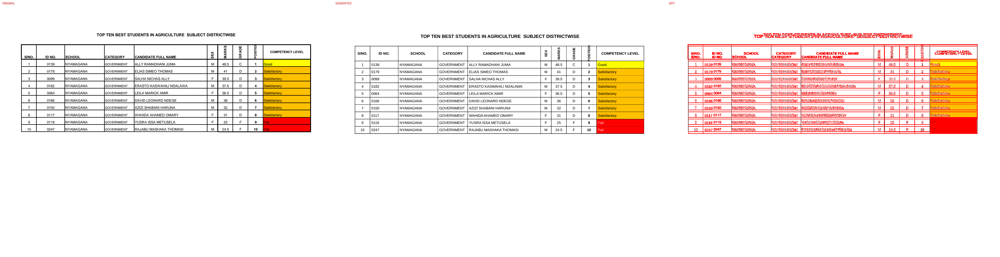

## Page 20
missing: `{'S': 2, 'E': 2, 'O': 2, 'R': 2, 'A': 2, 'N': 1, 'K': 1, 'D': 1, 'IT': 1, 'X': 1}`
extra: `{'XES': 1, 'SKRAM': 1, 'EDARG': 1, 'NOITISOP': 1}`

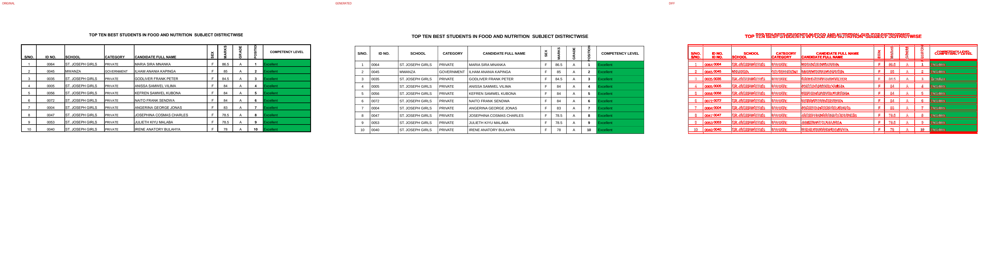

## Page 21

## Page 22

## Page 23

## Page 24

## Page 25

## Page 26

## Page 27

## Page 28

## Page 29

## Page 30

