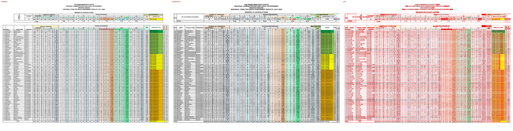

# Original vs generated

Columns: **original | generated | diff** (pink = sub-pixel differences, red = real differences).

Pixel diff = share of pixels that differ at 110 dpi; tolerant = still different when a 1px shift is allowed (ignores sub-pixel anti-aliasing).

| page | pixel diff | tolerant diff | words missing | words extra | fills only in original | fills only in generated |
|---|---|---|---|---|---|---|
| 1 | 30.83% | 8.67% | 209 | 64 | #ccffff #da9694 #eeece1 #f2dcdb #ffffcc | - |

## Page 1
missing: `{'E': 8, '5': 8, 'O': 7, 'C': 7, '6': 7, '1': 7, 'I': 6, 'N': 6, 'A': 6, '2': 5}`
extra: `{'PERFORMANCE': 4, 'GPA': 3, 'NUMBER': 2, 'OF': 2, 'CANDIDATES': 2, 'REGISTERED': 2, 'SAT': 2, 'SCHOOLS': 1, 'DIVISION': 1, 'III': 1}`

