# Original vs generated

Columns: **original | generated | diff** (red = pixels that differ).

| page | pixel diff | words missing | words extra | fills only in original | fills only in generated |
|---|---|---|---|---|---|
| 1 | 22.70% | 5 | 1 | #65ffab #d2fce6 #d8e4bc #dce6f1 #fabf8f #fcd5b4 #fde9d9 | #66ff99 #66ffcc #daeef3 #ddebf7 #e2efda #f8cbad #fce4d6 |
| 2 | 3.76% | 0 | 0 | #d2fce6 #daeef3 #f2dcdb #fcd5b4 | #f8cbad |
| 3 | 24.77% | 5 | 21 | #65ffab #d8e4bc #fabf8f #fcd5b4 #fde9d9 | #66ff99 #66ffcc #ddebf7 #e2efda #f8cbad #fce4d6 |
| 4 | 4.35% | 17 | 0 | #fcd5b4 | #f8cbad |
| 5 | 20.93% | 5 | 4 | #65ffab #d8e4bc #fabf8f #fcd5b4 #fde9d9 | #66ff99 #66ffcc #ddebf7 #e2efda #f8cbad #fce4d6 |
| 6 | 3.63% | 0 | 0 | #fcd5b4 | #f8cbad |
| 7 | 25.43% | 5 | 21 | #65ffab #d8e4bc #fabf8f #fcd5b4 #fde9d9 | #66ff99 #66ffcc #ddebf7 #e2efda #f8cbad #fce4d6 |
| 8 | 4.31% | 17 | 0 | #fcd5b4 | #f8cbad |
| 9 | 24.48% | 5 | 4 | #65ffab #d8e4bc #fabf8f #fcd5b4 #fde9d9 | #66ff99 #66ffcc #ddebf7 #e2efda #f8cbad #fce4d6 |
| 10 | 3.85% | 0 | 0 | #fcd5b4 | #f8cbad |
| 11 | 23.69% | 5 | 4 | #65ffab #d8e4bc #fabf8f #fcd5b4 #fde9d9 | #66ff99 #66ffcc #ddebf7 #e2efda #f8cbad #fce4d6 |
| 12 | 3.48% | 0 | 0 | #fcd5b4 | #f8cbad |
| 13 | 24.33% | 5 | 4 | #65ffab #d8e4bc #fabf8f #fcd5b4 #fde9d9 | #66ff99 #66ffcc #ddebf7 #e2efda #f8cbad #fce4d6 |
| 14 | 3.59% | 0 | 0 | #fcd5b4 | #f8cbad |
| 15 | 23.86% | 5 | 4 | #65ffab #d8e4bc #fabf8f #fcd5b4 #fde9d9 | #66ff99 #66ffcc #ddebf7 #e2efda #f8cbad #fce4d6 |
| 16 | 3.58% | 0 | 0 | #fcd5b4 | #f8cbad |
| 17 | 23.94% | 5 | 4 | #65ffab #d8e4bc #fabf8f #fcd5b4 #fde9d9 | #66ff99 #66ffcc #ddebf7 #e2efda #f8cbad #fce4d6 |
| 18 | 3.70% | 0 | 0 | #fcd5b4 | #f8cbad |
| 19 | 23.45% | 5 | 4 | #65ffab #d8e4bc #fabf8f #fcd5b4 #fde9d9 | #66ff99 #66ffcc #ddebf7 #e2efda #f8cbad #fce4d6 |
| 20 | 3.45% | 0 | 0 | #fcd5b4 | #f8cbad |
| 21 | 24.09% | 42 | 12 | #00b050 #65ffab #d8e4bc #fabf8f #fcd5b4 #fde9d9 | #66ff99 #66ffcc #ddebf7 #e2efda #f8cbad #fce4d6 |
| 22 | 27.26% | 21 | 36 | #65ffab #d8e4bc #fabf8f #fcd5b4 #fde9d9 | #66ff99 #66ffcc #ddebf7 #e2efda #f8cbad #fce4d6 |
| 23 | 21.87% | 15 | 11 | #65ffab #d8e4bc #fabf8f #fcd5b4 #fde9d9 | #66ff99 #66ffcc #ddebf7 #e2efda #f8cbad #fce4d6 |
| 24 | 0.00% | 0 | 0 | - | - |

## Page 1
missing: `{'K': 1, 'N': 1, 'A': 1, 'R': 1, '/C': 1}`
extra: `{'C/RANK': 1}`

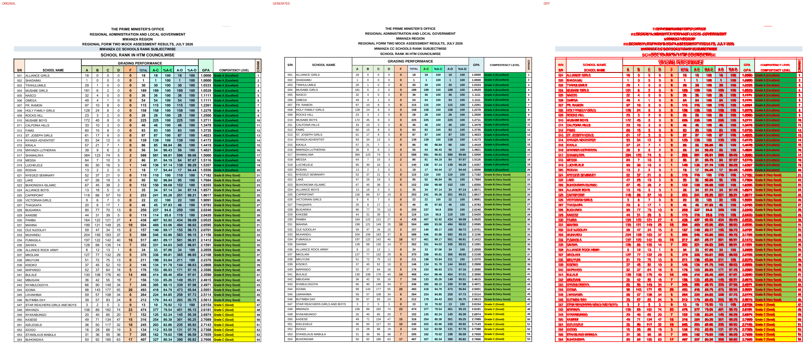

## Page 2

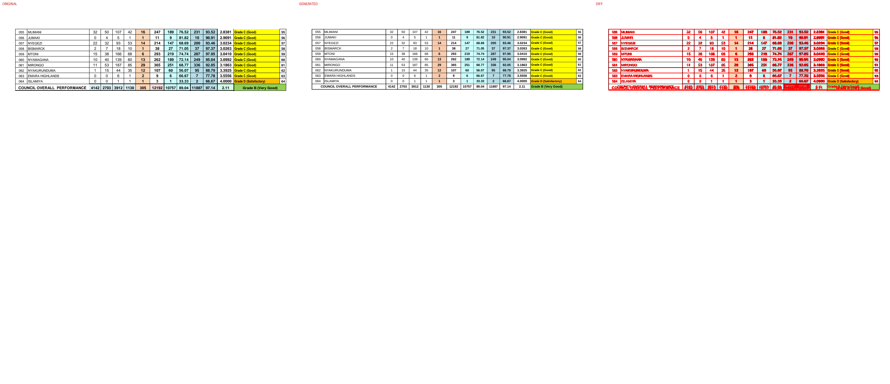

## Page 3
missing: `{'K': 1, 'N': 1, 'A': 1, 'R': 1, '/C': 1}`
extra: `{'SCHOOLS': 1, 'RANK': 1, 'SUBJECTWISE': 1, 'C/RANK': 1, 'F': 1, '15': 1, '1': 1, '0': 1, 'Grade': 1, '14': 1}`

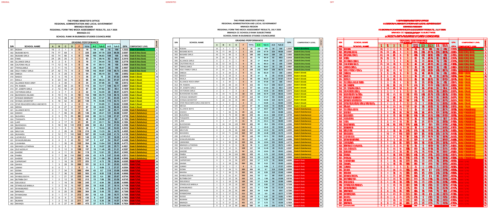

## Page 4
missing: `{'053': 1, 'SHAMALIWA': 1, '0': 1, '1': 1, '14': 1, '89': 1, '482': 1, '586': 1, '15': 1, '2.56': 1}`

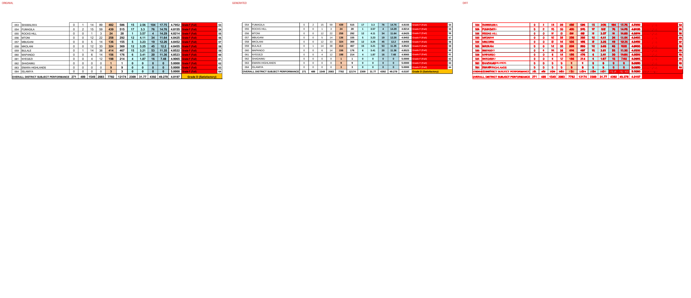

## Page 5
missing: `{'K': 1, 'N': 1, 'A': 1, 'R': 1, '/C': 1}`
extra: `{'SCHOOLS': 1, 'RANK': 1, 'SUBJECTWISE': 1, 'C/RANK': 1}`

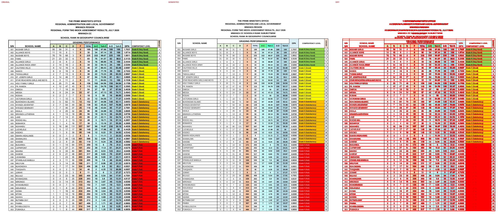

## Page 6

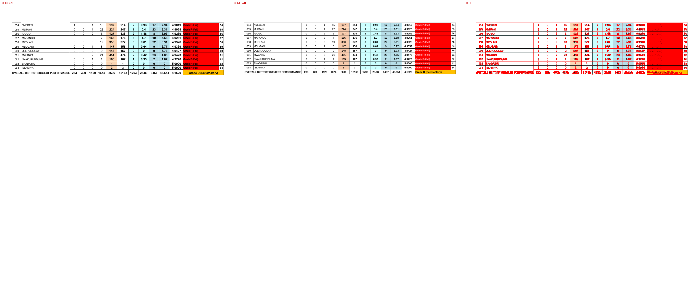

## Page 7
missing: `{'K': 1, 'N': 1, 'A': 1, 'R': 1, '/C': 1}`
extra: `{'SCHOOLS': 1, 'RANK': 1, 'SUBJECTWISE': 1, 'C/RANK': 1, 'C': 1, '2': 1, 'Grade': 1, '43': 1, '(Good)': 1, '23': 1}`

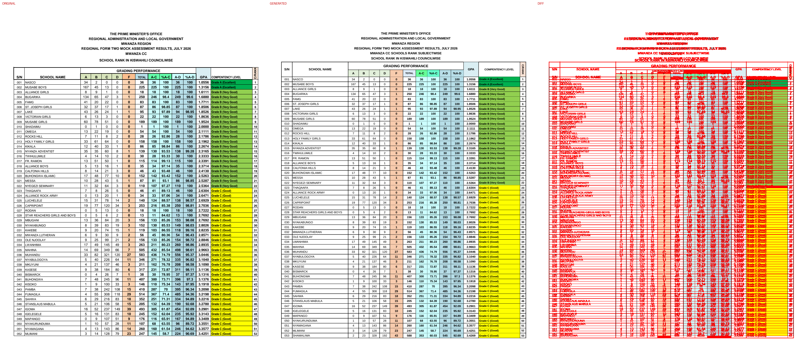

## Page 8
missing: `{'053': 1, 'SHAMALIWA': 1, '2': 1, '23': 1, '328': 1, '192': 1, '43': 1, '588': 1, '353': 1, '60.03': 1}`

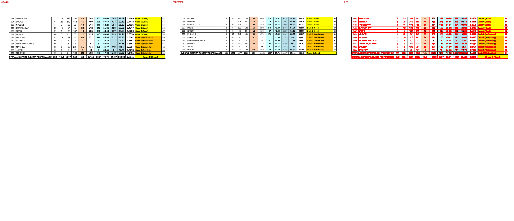

## Page 9
missing: `{'K': 1, 'N': 1, 'A': 1, 'R': 1, '/C': 1}`
extra: `{'SCHOOLS': 1, 'RANK': 1, 'SUBJECTWISE': 1, 'C/RANK': 1}`

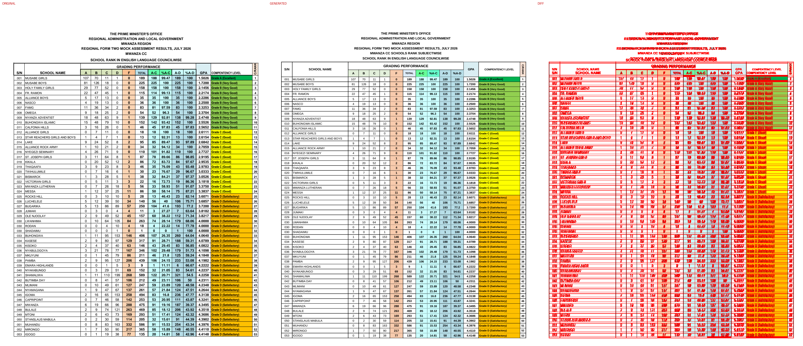

## Page 10

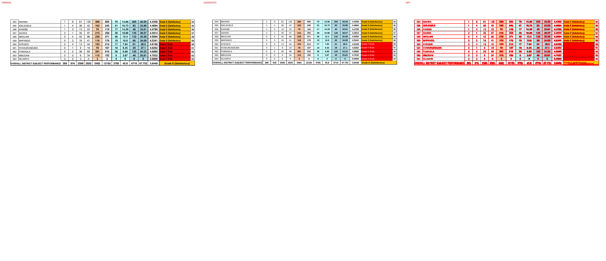

## Page 11
missing: `{'K': 1, 'N': 1, 'A': 1, 'R': 1, '/C': 1}`
extra: `{'SCHOOLS': 1, 'RANK': 1, 'SUBJECTWISE': 1, 'C/RANK': 1}`

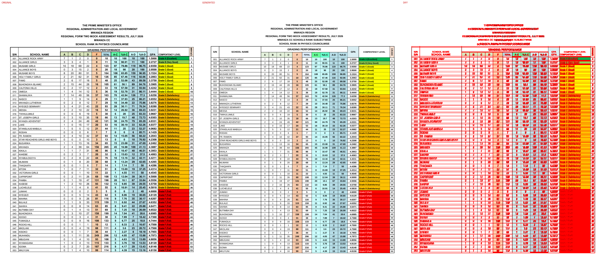

## Page 12

## Page 13
missing: `{'K': 1, 'N': 1, 'A': 1, 'R': 1, '/C': 1}`
extra: `{'SCHOOLS': 1, 'RANK': 1, 'SUBJECTWISE': 1, 'C/RANK': 1}`

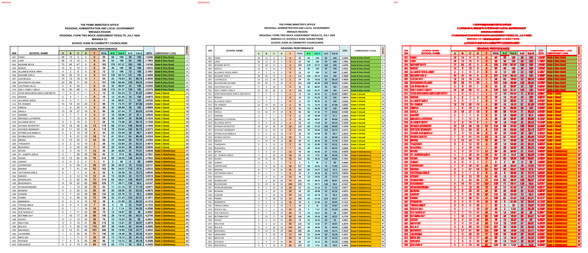

## Page 14

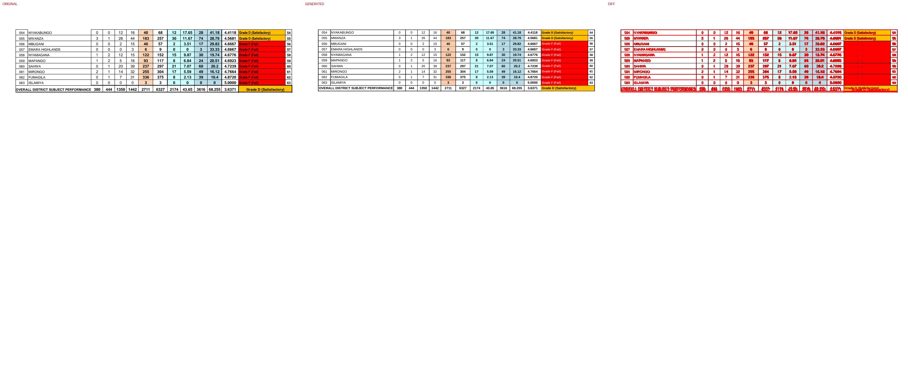

## Page 15
missing: `{'K': 1, 'N': 1, 'A': 1, 'R': 1, '/C': 1}`
extra: `{'SCHOOLS': 1, 'RANK': 1, 'SUBJECTWISE': 1, 'C/RANK': 1}`

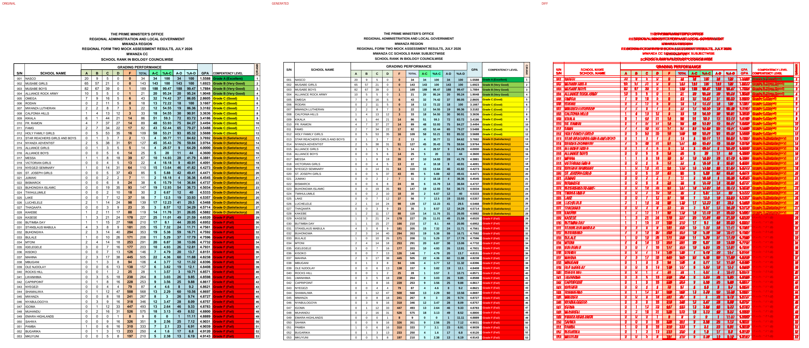

## Page 16

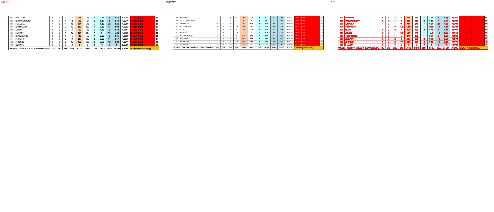

## Page 17
missing: `{'K': 1, 'N': 1, 'A': 1, 'R': 1, '/C': 1}`
extra: `{'SCHOOLS': 1, 'RANK': 1, 'SUBJECTWISE': 1, 'C/RANK': 1}`

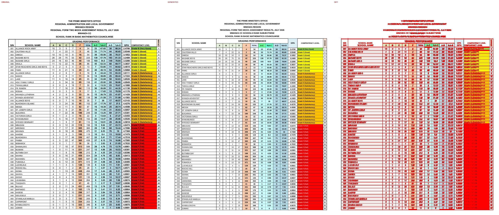

## Page 18

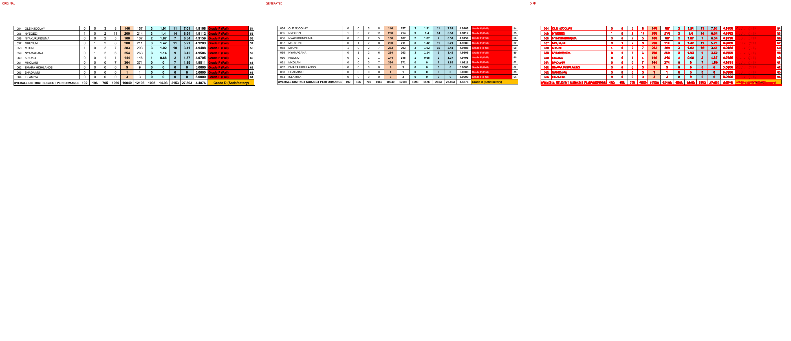

## Page 19
missing: `{'K': 1, 'N': 1, 'A': 1, 'R': 1, '/C': 1}`
extra: `{'SCHOOLS': 1, 'RANK': 1, 'SUBJECTWISE': 1, 'C/RANK': 1}`

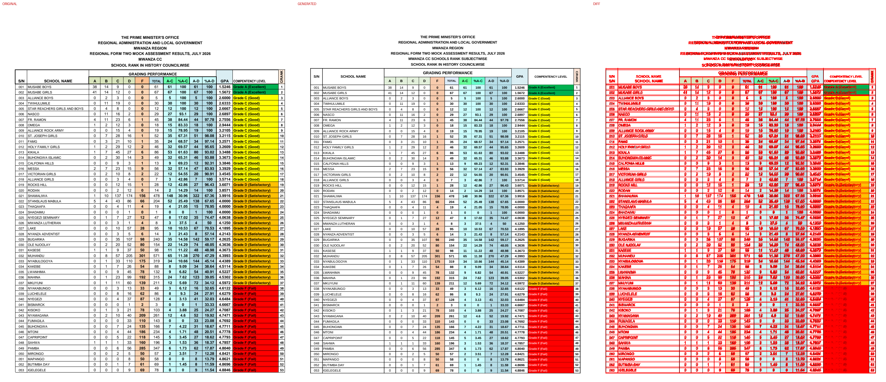

## Page 20

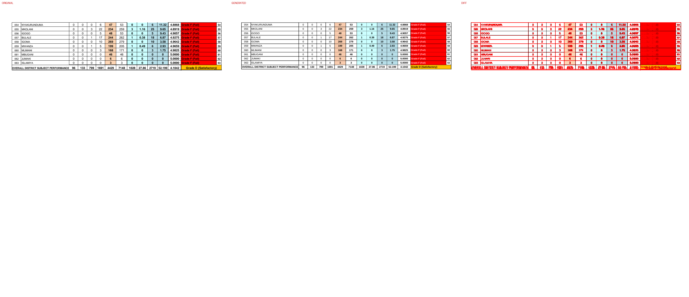

## Page 21
missing: `{'A': 5, '1': 5, '0': 4, 'K': 3, 'N': 3, 'R': 3, '/C': 3, '100': 2, 'B': 1, 'C': 1}`
extra: `{'SCHOOLS': 3, 'RANK': 3, 'SUBJECTWISE': 3, 'C/RANK': 3}`

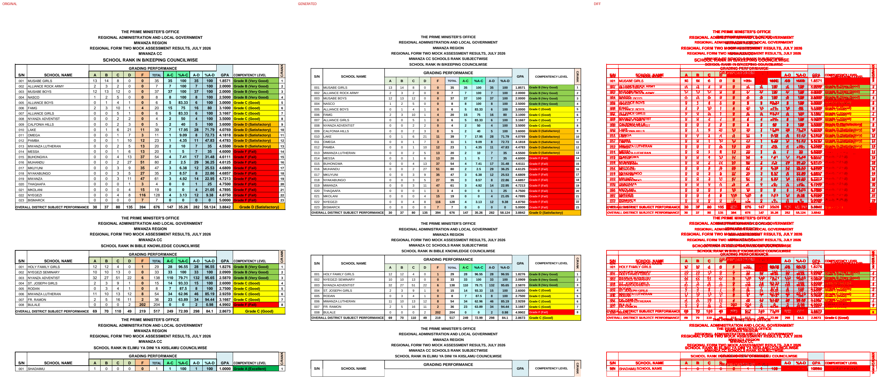

## Page 22
missing: `{'K': 3, 'N': 3, 'R': 3, '/C': 3, 'A': 1, 'PERFORMANCE': 1, 'SCHOOL': 1, 'GRADING': 1, 'S/N': 1, 'NAME': 1}`
extra: `{'1': 5, '0': 4, 'SCHOOLS': 3, 'RANK': 3, 'SUBJECTWISE': 3, '100': 2, 'C/RANK': 2, 'B': 1, 'C': 1, 'D': 1}`

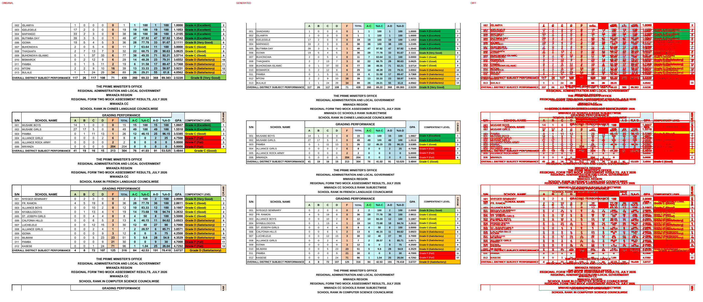

## Page 23
missing: `{'K': 3, 'N': 3, 'A': 3, 'R': 3, '/C': 3}`
extra: `{'C/RANK': 3, 'SCHOOLS': 2, 'RANK': 2, 'SUBJECTWISE': 2, 'GRADING': 1, 'PERFORMANCE': 1}`

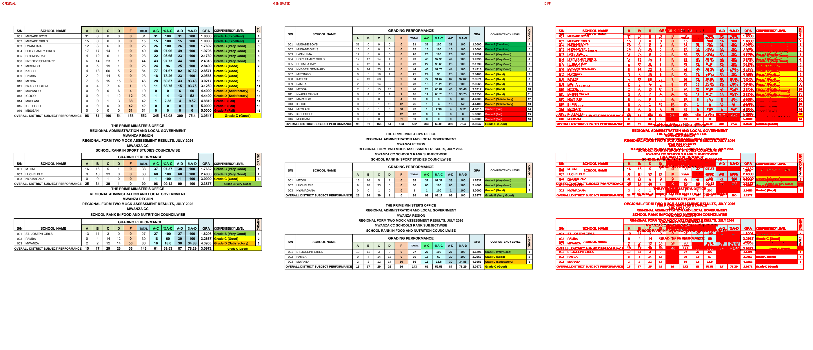

## Page 24

