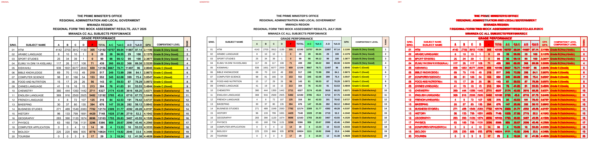
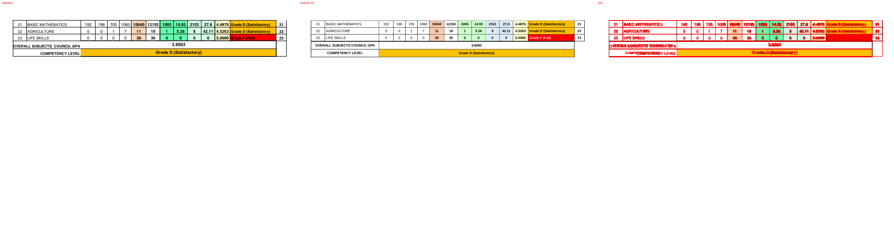

# Original vs generated

Columns: **original | generated | diff** (red = pixels that differ).

| page | pixel diff | words missing | words extra | fills only in original | fills only in generated |
|---|---|---|---|---|---|
| 1 | 18.87% | 4 | 1 | #65ffab #d2fce6 #d8e4bc #daeef3 #ebf1de #f2f2f2 #fcd5b4 #fde9d9 | #66ff99 #66ffcc #ccffcc #ddebf7 #e2efda #f8cbad #fce4d6 |
| 2 | 4.08% | 0 | 0 | #65ffab #d2fce6 #f2f2f2 #fcd5b4 | #ccffcc #ddebf7 #f8cbad |

## Page 1
missing: `{'K': 1, 'N': 1, 'A': 1, 'R': 1}`
extra: `{'KNAR': 1}`

## Page 2

