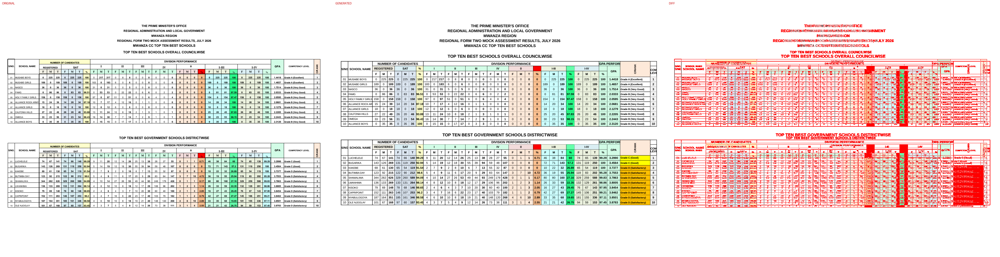
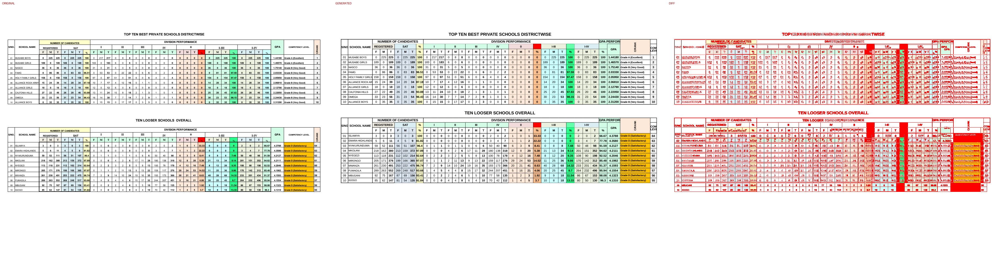
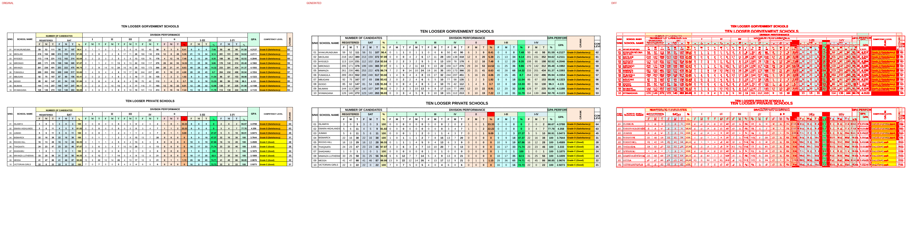

# Original vs generated

Columns: **original | generated | diff** (pink = sub-pixel differences, red = real differences).

Pixel diff = share of pixels that differ at 110 dpi; tolerant = still different when a 1px shift is allowed (ignores sub-pixel anti-aliasing).

| page | pixel diff | tolerant diff | words missing | words extra | fills only in original | fills only in generated |
|---|---|---|---|---|---|---|
| 1 | 19.72% | 14.77% | 16 | 11 | - | #ffc000 #ffff00 |
| 2 | 18.12% | 12.58% | 16 | 11 | #fcd5b4 | #dce6f1 #fabf8f |
| 3 | 18.25% | 13.98% | 14 | 10 | #fcd5b4 | #dce6f1 |

## Page 1
missing: `{'S/NO.': 2, 'SCHOOL': 2, 'K': 2, 'N': 2, 'A': 2, 'R': 2, '/C': 2, 'ARMY': 1, '15': 1}`
extra: `{'PERFORMANCE': 2, 'GPA': 2, 'S/NO.SCHOOL': 2, 'KNAR/C': 2, '%': 2, 'ARMY15': 1}`

## Page 2
missing: `{'S/NO.': 2, 'SCHOOL': 2, 'K': 2, 'N': 2, 'A': 2, 'R': 2, '/C': 2, 'ARMY': 1, '15': 1}`
extra: `{'PERFORMANCE': 2, 'GPA': 2, 'S/NO.SCHOOL': 2, 'KNAR/C': 2, '%': 2, 'ARMY15': 1}`

## Page 3
missing: `{'S/NO.': 2, 'SCHOOL': 2, 'K': 2, 'N': 2, 'A': 2, 'R': 2, '/C': 2}`
extra: `{'PERFORMANCE': 2, 'GPA': 2, 'S/NO.SCHOOL': 2, 'KNAR/C': 2, '%': 2}`

