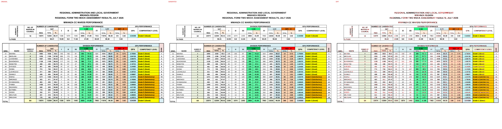

# Original vs generated

Columns: **original | generated | diff** (pink = sub-pixel differences, red = real differences).

Pixel diff = share of pixels that differ at 110 dpi; tolerant = still different when a 1px shift is allowed (ignores sub-pixel anti-aliasing).

**Verdict** is the stricter >=96%-match bar (position-by-position across colours, borders, data and cell sizes): a page **PASS**es when tolerant diff <= 4% (>=96% pixel match) AND there are zero fills-only diffs both ways AND zero words missing/extra; otherwise **FAIL** with the failing dimension(s) named.

| page | pixel diff | tolerant diff | words missing | words extra | fills only in original | fills only in generated | verdict (>=96%) |
|---|---|---|---|---|---|---|---|
| 1 | 2.84% | 0.11% | 31 | 7 | - | - | ❌ FAIL (words 31miss/7extra) |

**Verdict summary: 0/1 pages meet the >=96% bar** (tolerant diff <= 4% AND zero fill diffs AND zero word diffs).

## Page 1
missing: `{'N': 4, 'R': 3, 'A': 3, 'O': 3, 'E': 2, 'F': 2, 'Y': 1, 'C': 1, 'W': 1, '.': 1}`
extra: `{'WARDS': 1, 'OF': 1, 'YRAMMUS': 1, 'ECNAMROFREP': 1, 'NO.': 1, 'IN': 1, 'KNAR': 1}`

