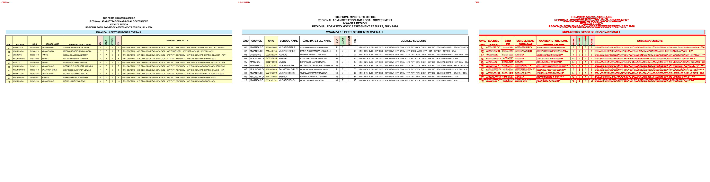
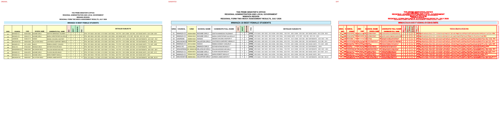
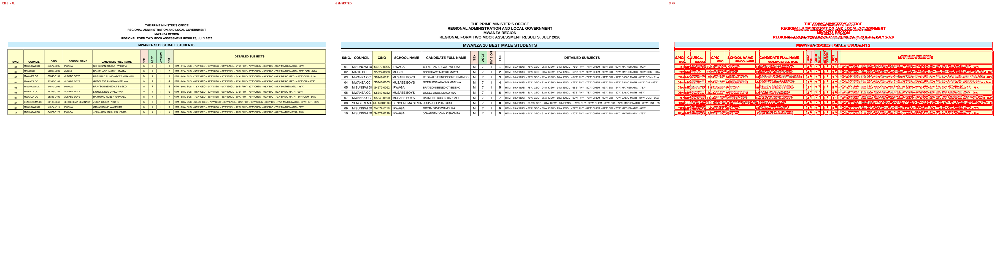
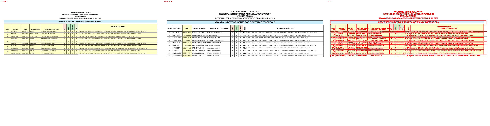
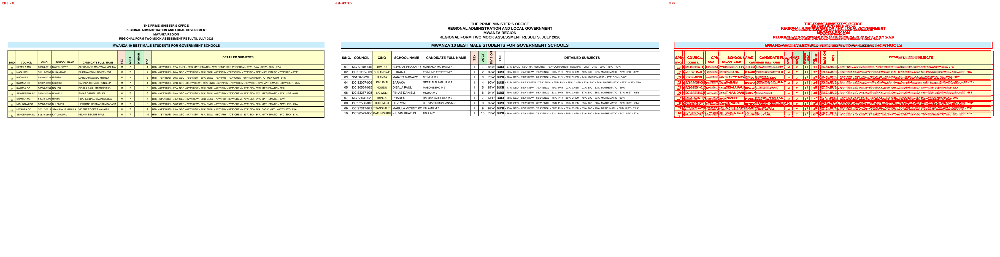
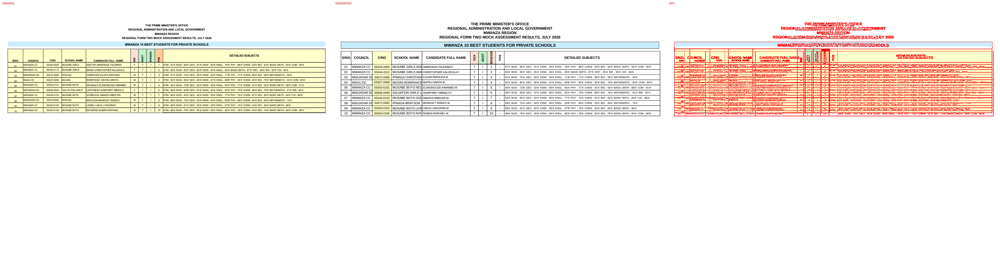
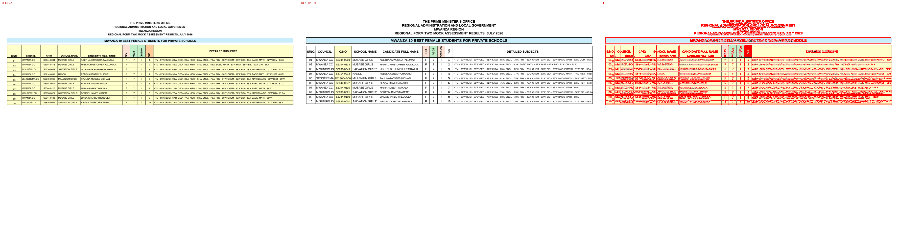
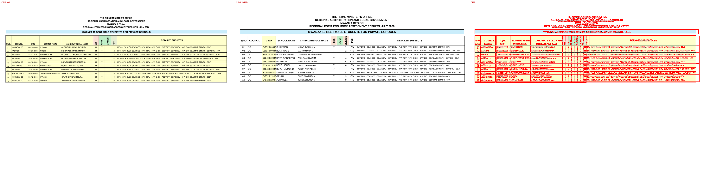

# Original vs generated

Columns: **original | generated | diff** (pink = sub-pixel differences, red = real differences).

Pixel diff = share of pixels that differ at 110 dpi; tolerant = still different when a 1px shift is allowed (ignores sub-pixel anti-aliasing).

**Verdict** is the stricter >=96%-match bar (position-by-position across colours, borders, data and cell sizes): a page **PASS**es when tolerant diff <= 4% (>=96% pixel match) AND there are zero fills-only diffs both ways AND zero words missing/extra; otherwise **FAIL** with the failing dimension(s) named.

| page | pixel diff | tolerant diff | words missing | words extra | fills only in original | fills only in generated | verdict (>=96%) |
|---|---|---|---|---|---|---|---|
| 1 | 10.62% | 7.23% | 6 | 3 | - | - | ❌ FAIL (pixels 7.23%>4%, words 6miss/3extra) |
| 2 | 10.90% | 7.71% | 16 | 3 | #e8efd3 | - | ❌ FAIL (pixels 7.71%>4%, fills 1orig/0gen, words 16miss/3extra) |
| 3 | 12.06% | 9.89% | 12 | 6 | #e8efd3 | - | ❌ FAIL (pixels 9.89%>4%, fills 1orig/0gen, words 12miss/6extra) |
| 4 | 10.86% | 7.87% | 30 | 5 | #e8efd3 | - | ❌ FAIL (pixels 7.87%>4%, fills 1orig/0gen, words 30miss/5extra) |
| 5 | 10.57% | 7.57% | 25 | 8 | #e8efd3 | - | ❌ FAIL (pixels 7.57%>4%, fills 1orig/0gen, words 25miss/8extra) |
| 6 | 10.82% | 7.90% | 58 | 23 | #e8efd3 | - | ❌ FAIL (pixels 7.90%>4%, fills 1orig/0gen, words 58miss/23extra) |
| 7 | 10.63% | 7.66% | 34 | 12 | #ffcc99 | - | ❌ FAIL (pixels 7.66%>4%, fills 1orig/0gen, words 34miss/12extra) |
| 8 | 10.96% | 7.62% | 8 | 4 | #ffcc99 | - | ❌ FAIL (pixels 7.62%>4%, fills 1orig/0gen, words 8miss/4extra) |
| 9 | 10.69% | 7.65% | 30 | 10 | #e8efd3 | - | ❌ FAIL (pixels 7.65%>4%, fills 1orig/0gen, words 30miss/10extra) |

**Verdict summary: 0/9 pages meet the >=96% bar** (tolerant diff <= 4% AND zero fill diffs AND zero word diffs).

## Page 1
missing: `{'DC': 3, 'S4572-0095': 1, 'S5836-0049': 1, 'S4572-0092': 1}`
extra: `{'DCS4572-0095': 1, 'DCS5836-0049': 1, 'DCS4572-0092': 1}`

## Page 2
missing: `{'DC': 2, '10': 1, '7': 1, '1': 1, '2': 1, '3': 1, 'S5836-0049': 1, '4': 1, '5': 1, '6': 1}`
extra: `{'DCS5836-0049': 1, 'S6040-0043MILLENIUM': 1, 'DCS5836-0021': 1}`

## Page 3
missing: `{'DC': 4, 'S4572-0095': 1, 'S4572-0092': 1, 'SENGEREMA': 1, 'S0185-0043': 1, 'SEMINARY': 1, 'JOSIA': 1, 'S4572-0119': 1, 'S4572-0129': 1}`
extra: `{'DCS4572-0095': 1, 'DCS4572-0092': 1, 'S0185-0043SENGEREMA': 1, 'SEMINAJORSYIA': 1, 'DCS4572-0119': 1, 'DCS4572-0129': 1}`

## Page 4
missing: `{'HTM': 10, '-': 10, 'DC': 1, 'ESTHER': 1, 'MTANI': 1, 'ALPHAXARD': 1, 'MANYAMA': 1, 'FARAJA': 1, 'REGINA': 1, 'ELIKANA': 1}`
extra: `{'ESTHMETARNI': 1, 'ALPHAMXAANRYDAMA': 1, 'FARARJEAGINA': 1, 'ELIKANAEDIMUND': 1, 'DSC3287-0259': 1}`

## Page 5
missing: `{'HTM': 10, 'ESTHER': 1, 'MTANI': 1, 'FARAJA': 1, 'REGINA': 1, 'NOELAH': 1, 'KILINUNE': 1, 'HAPPYNESS': 1, 'PHILBERT': 1, 'JACQUELINE': 1}`
extra: `{'ESTHMETARNI': 1, 'FARARJEAGINA': 1, 'NOEKLIALIHNUNE': 1, 'HAPPPHYINLBEESRST': 1, 'JACQJOUHENL': 1, 'IRNEEAGAN': 1, 'LSUHCUYKRANI': 1, 'CHRISTINAFABIAN': 1}`

## Page 6
missing: `{'-': 20, 'HTM': 10, 'BUSI': 10, 'ILEMELA': 2, 'KWIMBA': 2, 'SENGEREMA': 2, 'MWANZA': 1, 'S0104-0011BWIRU': 1, 'MAGU': 1, 'BUCHOSA': 1}`
extra: `{'BUSI-': 10, 'S0104-0011': 1, 'BWIRU': 1, 'S5156-0228': 1, 'IRENZA': 1, 'S2007-0091': 1, 'KIKUBIJI': 1, 'S0554-0154': 1, 'NGUDU': 1, 'S3287-0259': 1}`

## Page 7
missing: `{'HTM': 10, 'DC': 3, 'ADETHA': 1, 'AMWESIGA': 1, 'MARIA': 1, 'CHRISTOPHER': 1, 'S4572-0095': 1, 'CHRISTIAN': 1, 'KULWA': 1, 'BONIPHACE': 1}`
extra: `{'ADETAHMAWESIGA': 1, 'MARCIAHRISTOPHER': 1, 'DCS4572-0095': 1, 'CHRISTIANKULWA': 1, 'BONIPHACEMATIKU': 1, 'REGIENLAINLIDONGOZE': 1, 'DCS5836-0049': 1, 'LIGHUHMTPNHERSESY': 1, 'GODBALMEASNSYA': 1, 'DCS4572-0092': 1}`

## Page 8
missing: `{'DC': 3, 'S5836-0049': 1, 'S6040-0043': 1, 'MILLENIUM': 1, 'S5836-0021': 1, 'S5836-0001': 1}`
extra: `{'DCS5836-0049': 1, 'S6040-0043MILLENIUM': 1, 'DCS5836-0021': 1, 'DCS5836-0001': 1}`

## Page 9
missing: `{'MWANZA': 4, 'MISUNGWI': 4, 'IPWAGA': 4, 'MUSABE': 4, 'BOYS': 4, 'SENGEREMA': 2, 'CHRISTIAN': 1, 'MAGU': 1, 'MUGINI': 1, 'BONIPHACE': 1}`
extra: `{'MUBSOAYBSE': 4, 'IPWCHAGRAISTIAN': 1, 'MUBGOINNIIPHACE': 1, 'IPWBRAGAYASON': 1, 'SESNEGMEIRNEAMRAY': 1, 'IPWGARGYAAN': 1, 'IPWJOAHGAANSEN': 1}`

