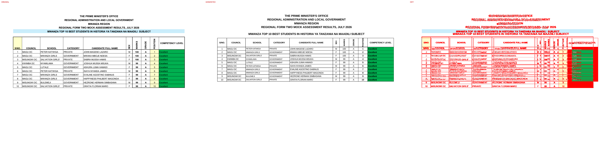
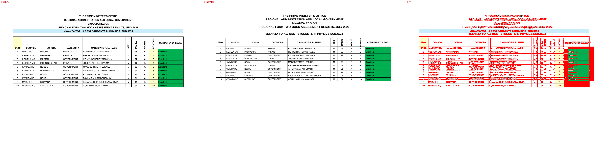
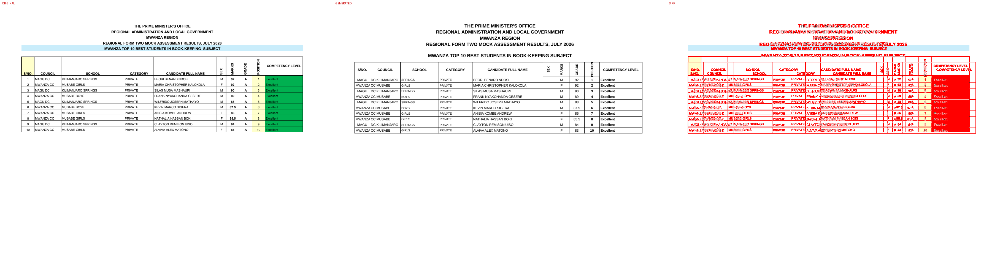
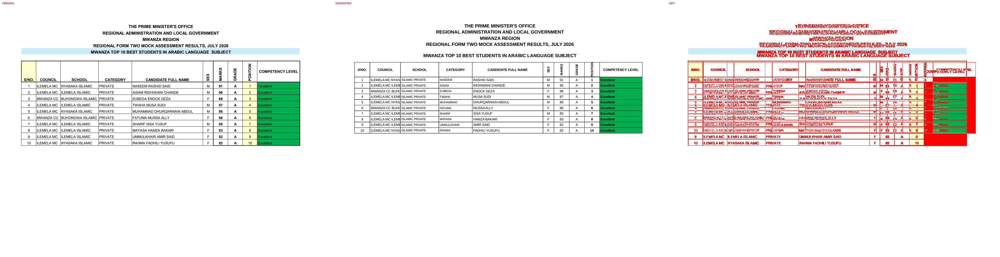
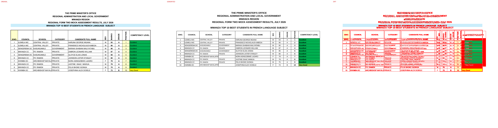
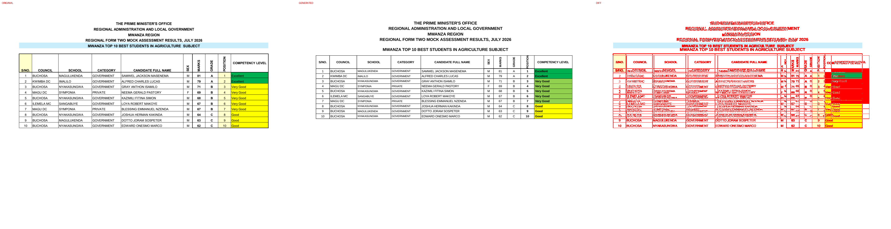
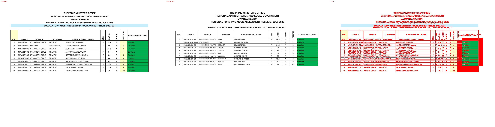
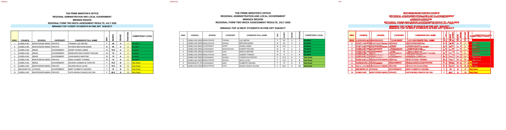
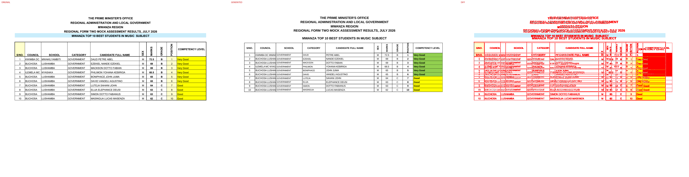

# Original vs generated

Columns: **original | generated | diff** (pink = sub-pixel differences, red = real differences).

Pixel diff = share of pixels that differ at 110 dpi; tolerant = still different when a 1px shift is allowed (ignores sub-pixel anti-aliasing).

| page | pixel diff | tolerant diff | words missing | words extra | fills only in original | fills only in generated |
|---|---|---|---|---|---|---|
| 1 | 11.28% | 9.02% | 0 | 0 | #caedfb #ffffcc | - |
| 2 | 11.16% | 8.87% | 0 | 0 | #caedfb #ffffcc | - |
| 3 | 10.99% | 8.75% | 0 | 0 | #caedfb #ffffcc | - |
| 4 | 10.90% | 8.67% | 0 | 0 | #caedfb #ffffcc | - |
| 5 | 11.14% | 9.09% | 16 | 8 | #caedfb #ffffcc | - |
| 6 | 10.98% | 8.79% | 0 | 0 | #caedfb #ffffcc | - |
| 7 | 10.84% | 8.63% | 0 | 0 | #caedfb #ffffcc | - |
| 8 | 10.94% | 8.68% | 0 | 0 | #caedfb #ffffcc | - |
| 9 | 11.04% | 8.75% | 0 | 0 | #caedfb #ffffcc | - |
| 10 | 11.03% | 8.83% | 1 | 1 | #caedfb #ffffcc | - |
| 11 | 11.18% | 9.18% | 32 | 6 | #00b050 #caedfb #ffffcc | - |
| 12 | 11.24% | 8.87% | 0 | 0 | #caedfb #ffffcc | - |
| 13 | 11.22% | 8.98% | 0 | 0 | #caedfb #ffffcc | - |
| 14 | 11.21% | 9.08% | 20 | 10 | #caedfb #ffffcc | - |
| 15 | 11.21% | 9.06% | 20 | 10 | #caedfb #ffffcc | - |
| 16 | 11.02% | 8.76% | 0 | 0 | #caedfb #ffff00 #ffffcc | #92d050 |
| 17 | 11.20% | 8.87% | 0 | 0 | #caedfb #ffffcc | - |
| 18 | 11.23% | 8.85% | 0 | 0 | #caedfb #ffffcc | - |
| 19 | 11.24% | 8.93% | 0 | 0 | #caedfb #ffffcc | #92d050 |
| 20 | 11.32% | 9.15% | 2 | 1 | #caedfb #ffffcc | - |
| 21 | 11.33% | 9.22% | 25 | 15 | #caedfb #ffff00 #ffffcc | #92d050 |
| 22 | 11.03% | 8.84% | 20 | 10 | #caedfb #ffffcc | #92d050 |
| 23 | 11.17% | 9.08% | 20 | 10 | #caedfb #ffffcc | #92d050 |

## Page 1

## Page 2

## Page 3

## Page 4

## Page 5
missing: `{'MUSABE': 4, 'GIRLS': 4, 'PRIVATE': 2, 'DIPLOMATI': 1, 'BUKUMBI': 1, 'CENTRAL': 1, 'VALLEY': 1, 'MORNING': 1, 'STAR': 1}`
extra: `{'MUSABGEIRLS': 4, 'DIPLPORMIVAATTIE': 1, 'BUKUPRMIVBAITE': 1, 'CENTRVAALLLEY': 1, 'MORNISNTGAR': 1}`

## Page 6

## Page 7

## Page 8

## Page 9

## Page 10
missing: `{'SEMINARPYRIVATE': 1}`
extra: `{'SEMINARPRIVATE': 1}`

## Page 11
missing: `{'A': 10, 'MWANZA': 6, 'CC': 6, '10': 1, '1': 1, '2': 1, '3': 1, '4': 1, '5': 1, '6': 1}`
extra: `{'MWANZACC': 6}`

## Page 12

## Page 13

## Page 14
missing: `{'ISLAMIC': 10, 'ILEMELA': 5, 'NYASAKA': 3, 'BUHONGWA': 2}`
extra: `{'ILEMELISALAMIC': 5, 'NYASAIKSLAAMIC': 3, 'BUHONISGLAWMAIC': 2}`

## Page 15
missing: `{'MUSABE': 10, 'GIRLS': 6, 'BOYS': 4}`
extra: `{'MUSABGEIRLS': 6, 'MUSABBEOYS': 4}`

## Page 16

## Page 17

## Page 18

## Page 19

## Page 20
missing: `{'GOVERNMENT': 1, 'MWANZA': 1}`
extra: `{'MWANGZOAVERNMENT': 1}`

## Page 21
missing: `{'GOVERNMENT': 5, 'MONTESSORI': 5, 'MARIA': 5, 'PRIVATE': 5, 'IBINZA': 4, 'JITIHADA': 1}`
extra: `{'MONTEMSASROIAR': 5, 'PIRIVATE': 5, 'IBINZAGOVERNMENT': 4, 'JITIHGAODVAERNMENT': 1}`

## Page 22
missing: `{'GOVERNMENT': 10, 'KAHANGARA': 10}`
extra: `{'KAHANGAGROAVERNMENT': 10}`

## Page 23
missing: `{'GOVERNMENT': 10, 'LUSHAMBA': 8, 'MWAKILYAMBITI': 1, 'NYASAKA': 1}`
extra: `{'LUSHAMGBAOVERNMENT': 8, 'MWAKIGLYOAVMEBRINTMIENT': 1, 'NYASAGKOAVERNMENT': 1}`

