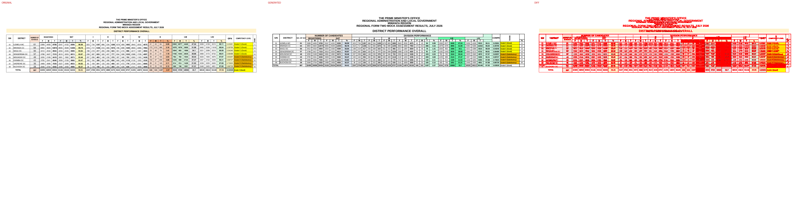
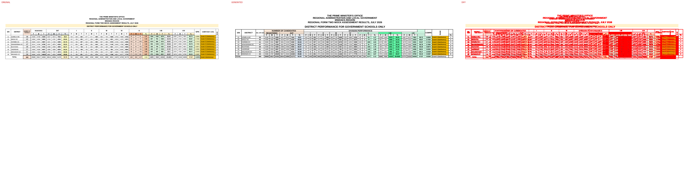
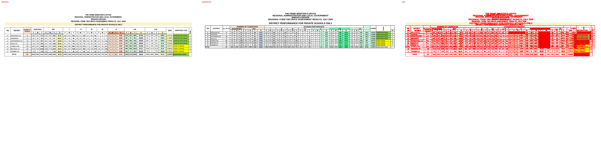
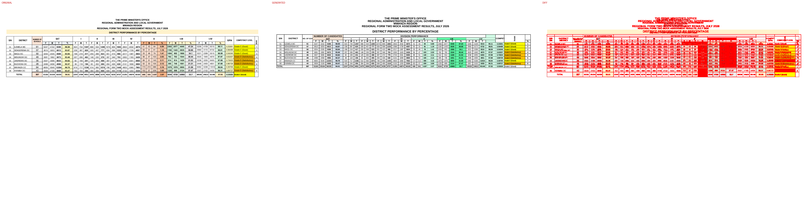
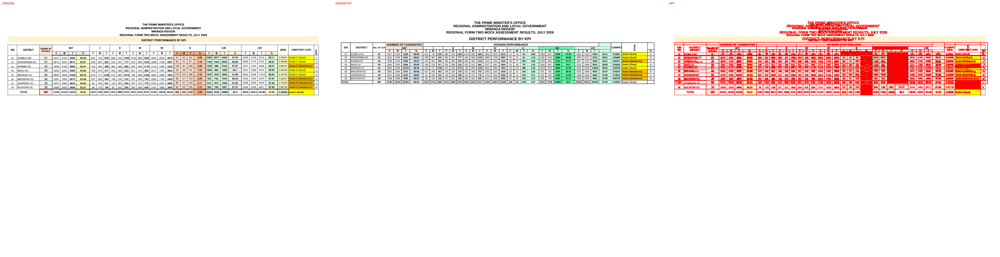

# Original vs generated

Columns: **original | generated | diff** (red = pixels that differ).

| page | pixel diff | words missing | words extra | fills only in original | fills only in generated |
|---|---|---|---|---|---|
| 1 | 9.11% | 1 | 7 | #e0f8e3 #e2efda #ebeef1 #ededed #eeb500 #f4b084 #f8cbad #fce4d6 #fff2cc #ffffcc | #64ffab #d2fbe6 #dce6f0 #fce9d9 #ffc000 |
| 2 | 9.20% | 0 | 5 | #e0f8e3 #e2efda #ebeef1 #ededed #eeb500 #f4b084 #f8cbad #fce4d6 #fff2cc #ffffcc | #64ffab #d2fbe6 #dce6f0 #fce9d9 #ffc000 |
| 3 | 9.63% | 0 | 5 | #e0f8e3 #e2efda #ebeef1 #ededed #f4b084 #fce4d6 #fff2cc #ffffcc | #64ffab #d2fbe6 #dce6f0 #fce9d9 |
| 4 | 9.61% | 0 | 5 | #e0f8e3 #e2efda #ebeef1 #ededed #eeb500 #f4b084 #f8cbad #fce4d6 #fff2cc #ffffcc | #64ffab #d2fbe6 #dce6f0 #fce9d9 #ffc000 |
| 5 | 9.63% | 0 | 5 | #e0f8e3 #e2efda #ebeef1 #ededed #eeb500 #f4b084 #f8cbad #fce4d6 #fff2cc #ffffcc | #64ffab #d2fbe6 #dce6f0 #fce9d9 #ffc000 |

## Page 1
missing: `{'3.53535Grade': 1}`
extra: `{'PERFORMANCE': 1, 'OF': 1, 'CANDIDATES': 1, 'DIVISION': 1, 'NO.': 1, 'Grade': 1, '3.53535': 1}`

## Page 2
extra: `{'PERFORMANCE': 1, 'OF': 1, 'CANDIDATES': 1, 'DIVISION': 1, 'NO.': 1}`

## Page 3
extra: `{'PERFORMANCE': 1, 'OF': 1, 'CANDIDATES': 1, 'DIVISION': 1, 'NO.': 1}`

## Page 4
extra: `{'PERFORMANCE': 1, 'OF': 1, 'CANDIDATES': 1, 'DIVISION': 1, 'NO.': 1}`

## Page 5
extra: `{'PERFORMANCE': 1, 'OF': 1, 'CANDIDATES': 1, 'DIVISION': 1, 'NO.': 1}`

