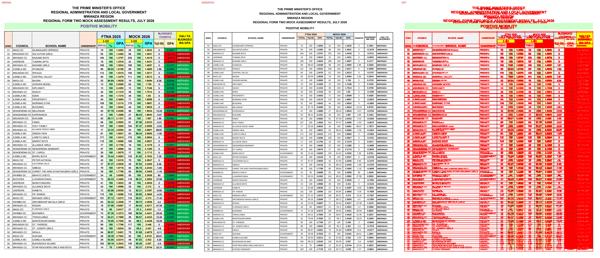
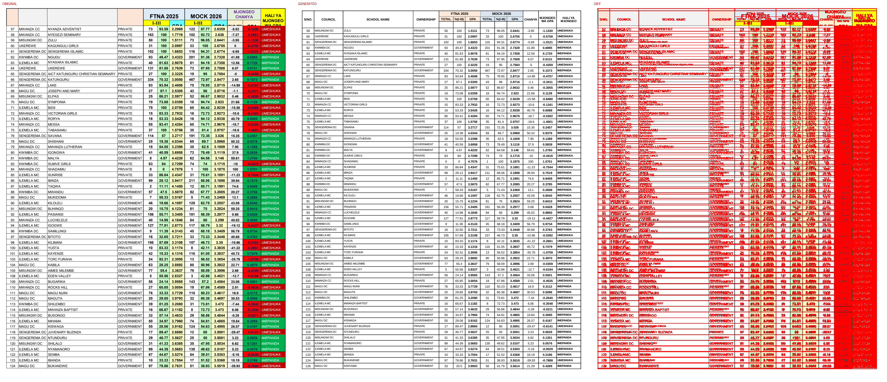
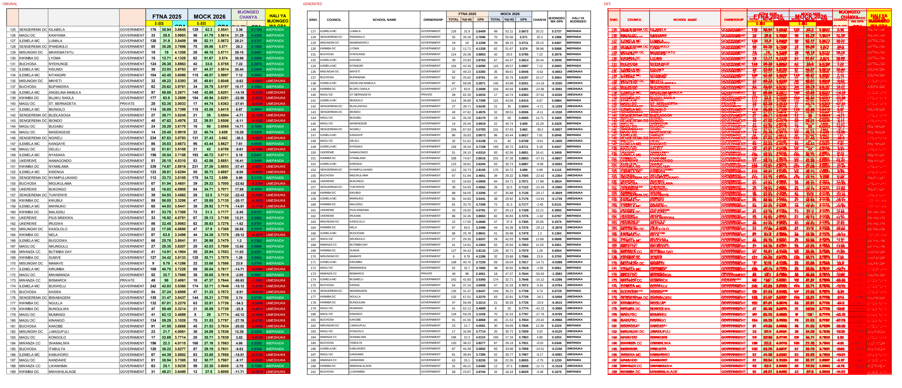
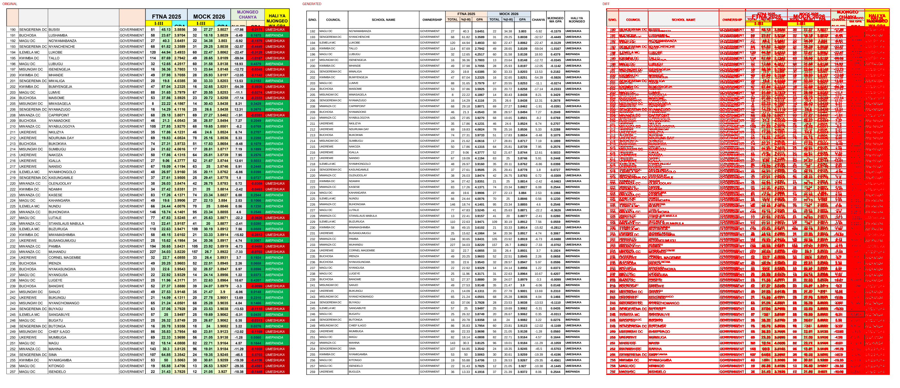
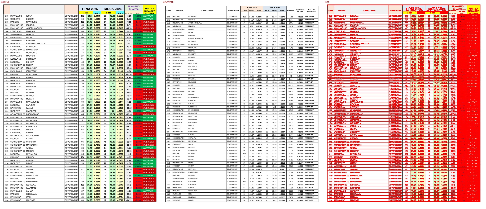
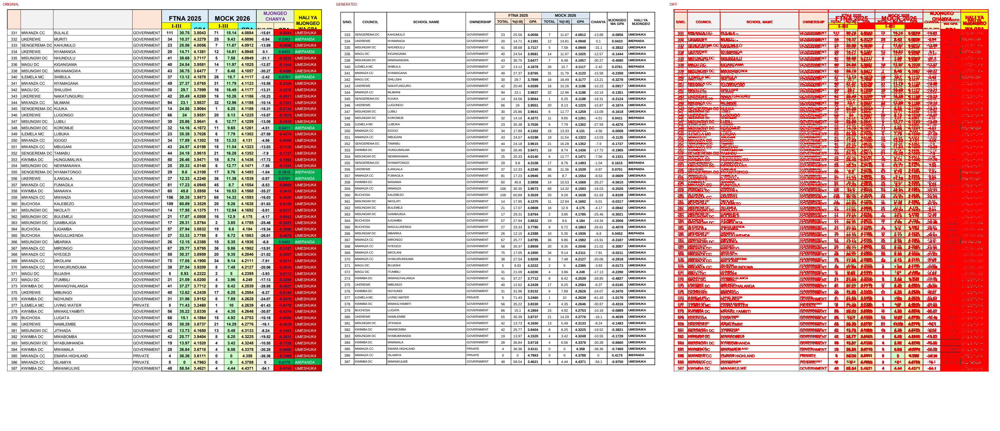

# Original vs generated

Columns: **original | generated | diff** (red = pixels that differ).

| page | pixel diff | words missing | words extra | fills only in original | fills only in generated |
|---|---|---|---|---|---|
| 1 | 35.82% | 5 | 16 | #00b050 #65ffab #66ffff #c00000 #ccffcc #ddebf7 #e2efda #f2f2f2 #fce4d6 #ff0000 #fff2cc #ffff00 #ffffcc | #dce6f0 #fce9d9 |
| 2 | 38.72% | 33 | 22 | #00b050 #66ffff #c00000 #ccffcc #ddebf7 #e2efda #f2f2f2 #fce4d6 #ff0000 #fff2cc #ffff00 #ffffcc | #dce6f0 #fce9d9 |
| 3 | 39.24% | 29 | 19 | #00b050 #66ffff #c00000 #ccffcc #ddebf7 #e2efda #f2f2f2 #fce4d6 #ff0000 #fff2cc #ffff00 #ffffcc | #dce6f0 #fce9d9 |
| 4 | 39.31% | 28 | 19 | #00b050 #66ffff #c00000 #ccffcc #ddebf7 #e2efda #f2f2f2 #fce4d6 #ff0000 #fff2cc #ffff00 #ffffcc | #dce6f0 #fce9d9 |
| 5 | 39.32% | 27 | 18 | #00b050 #66ffff #c00000 #ccffcc #ddebf7 #e2efda #f2f2f2 #fce4d6 #ff0000 #fff2cc #ffff00 #ffffcc | #dce6f0 #fce9d9 |
| 6 | 35.12% | 30 | 8 | #00b050 #66ffff #c00000 #ccffcc #ddebf7 #e2efda #f2f2f2 #fce4d6 #ff0000 #fff2cc #ffff00 #ffffcc | #dce6f0 #fce9d9 |

## Page 1
missing: `{'I-III': 2, '%': 2, 'GPA': 1}`
extra: `{'MWANZA': 1, '%(I-III)': 1, 'PRIVATE': 1, '100': 1, 'UMESHUKA': 1, 'CC': 1, 'SEMINARY': 1, '163': 1, '58': 1, 'NYEGEZI': 1}`

## Page 2
missing: `{'I-III': 2, 'MWANZA': 2, 'CC': 2, 'PRIVATE': 2, 'UMESHUKA': 2, 'GPA': 1, '57': 1, 'NYANZA': 1, 'ADVENTIST': 1, '73': 1}`
extra: `{'TOTAL': 2, 'S/NO.': 1, 'COUNCIL': 1, 'SCHOOL': 1, 'NAME': 1, 'OWNERSHIP': 1, '%(I-III)': 1, 'DC': 1, '33': 1, 'GOVERNMENT': 1}`

## Page 3
missing: `{'I-III': 2, 'DC': 2, 'GPA': 1, '125': 1, 'SENGEREMA': 1, 'KILABELA': 1, 'GOVERNMENT': 1, '176': 1, '38.94': 1, '3.6645': 1}`
extra: `{'TOTAL': 2, 'S/NO.': 1, 'COUNCIL': 1, 'SCHOOL': 1, 'NAME': 1, 'OWNERSHIP': 1, '%(I-III)': 1, 'BUCHOSA': 1, '32': 1, '191': 1}`

## Page 4
missing: `{'I-III': 2, 'GPA': 1, '190': 1, 'SENGEREMA': 1, 'DC': 1, 'BUSISI': 1, 'GOVERNMENT': 1, '51': 1, '45.13': 1, '3.5856': 1}`
extra: `{'TOTAL': 2, 'S/NO.': 1, 'COUNCIL': 1, 'SCHOOL': 1, 'NAME': 1, 'OWNERSHIP': 1, '%(I-III)': 1, 'UKEREWE': 1, '37': 1, '0.2544': 1}`

## Page 5
missing: `{'I-III': 2, 'GPA': 1, '258': 1, 'MWANZA': 1, 'CC': 1, 'IGOMA': 1, 'GOVERNMENT': 1, '173': 1, '24.2': 1, '3.9471': 1}`
extra: `{'TOTAL': 2, 'S/NO.': 1, 'COUNCIL': 1, 'SCHOOL': 1, 'NAME': 1, 'OWNERSHIP': 1, '%(I-III)': 1, '25': 1, '10.37': 1, '34': 1}`

## Page 6
missing: `{'I-III': 2, 'GOVERNMENT': 2, 'GPA': 1, '331': 1, 'MWANZA': 1, 'CC': 1, 'BULALE': 1, '111': 1, '30.75': 1, '3.8043': 1}`
extra: `{'TOTAL': 2, 'S/NO.': 1, 'COUNCIL': 1, 'SCHOOL': 1, 'NAME': 1, 'OWNERSHIP': 1, '%(I-III)': 1}`

