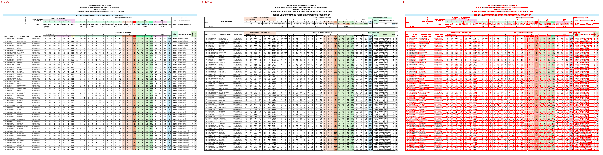
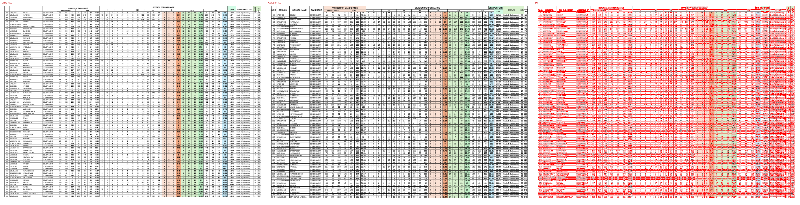
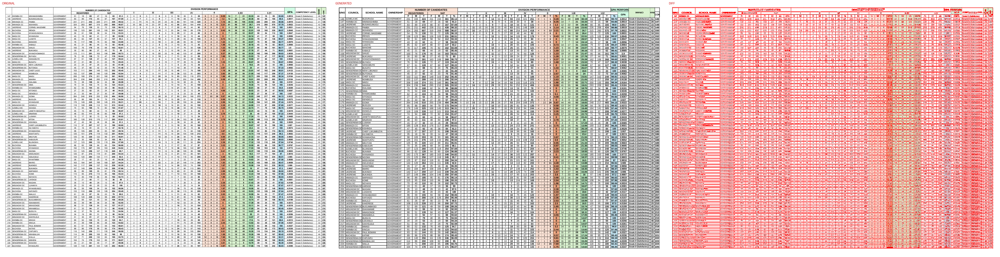
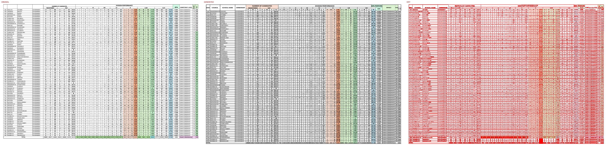

# Original vs generated

Columns: **original | generated | diff** (pink = sub-pixel differences, red = real differences).

Pixel diff = share of pixels that differ at 110 dpi; tolerant = still different when a 1px shift is allowed (ignores sub-pixel anti-aliasing).

| page | pixel diff | tolerant diff | words missing | words extra | fills only in original | fills only in generated |
|---|---|---|---|---|---|---|
| 1 | 34.24% | 16.48% | 43 | 19 | #65ffab #ccffff #e8e8e8 #f2ceef #ff0000 #ffffcc | - |
| 2 | 41.99% | 21.53% | 64 | 49 | - | - |
| 3 | 41.81% | 21.50% | 99 | 81 | - | - |
| 4 | 39.69% | 21.03% | 19 | 128 | #9eeaea #b5e6a2 #f2ceef #f7c7ac | - |

## Page 1
missing: `{'DC': 13, '97.70': 2, '54302': 1, '28414': 1, '22856': 1, '51270': 1, '93.73': 1, '2258': 1, '4060': 1, '8053210721470235774': 1}`
extra: `{'PERFORMANCE': 1, 'GPA': 1, '5430228414228565127093.73': 1, '22584060': 1, '8053210721470235774643': 1, '97.703.823': 1, 'DCKATUNGURU': 1, 'DCSAVANA': 1, 'DCNYITUNDU': 1, 'DCBITOTO': 1}`

## Page 2
missing: `{'DC': 11, '0': 2, '1': 2, '2': 2, '146': 2, '211': 2, '150': 2, 'GOVERNMENT': 1, '6': 1, '14': 1}`
extra: `{'F': 9, 'M': 9, 'T': 9, '%': 4, 'PERFORMANCE': 1, 'GPA': 1, 'S/NO.': 1, 'COUNCIL': 1, 'SCHOOL': 1, 'NAME': 1}`

## Page 3
missing: `{'DC': 16, '3': 3, '4': 3, '5': 2, '9': 2, '2': 2, '226': 2, '17': 2, '10': 2, '227': 2}`
extra: `{'F': 9, 'M': 9, 'T': 9, '%': 4, '146': 2, '211': 2, '150': 2, 'PERFORMANCE': 1, 'GPA': 1, 'S/NO.': 1}`

## Page 4
missing: `{'DC': 7, 'NYAMTELELA': 1, 'NYAMPANDE': 1, 'KAHUMULO': 1, 'CHAMABANDA': 1, 'KIJUKA': 1, 'TAMABU': 1, 'NYAMATONGO': 1, '3920': 1, '8053': 1}`
extra: `{'F': 9, 'M': 9, 'T': 9, '%': 4, '2': 4, '0': 3, '4': 3, '1': 3, '3': 3, '226': 2}`

