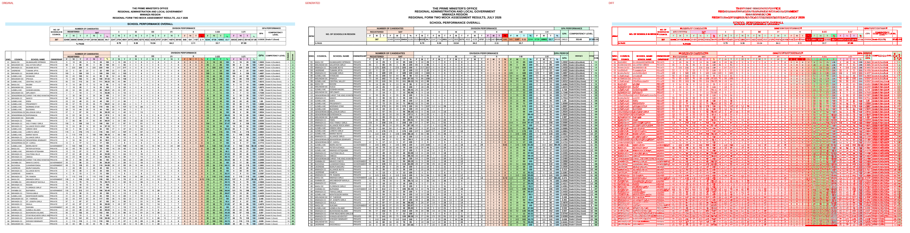
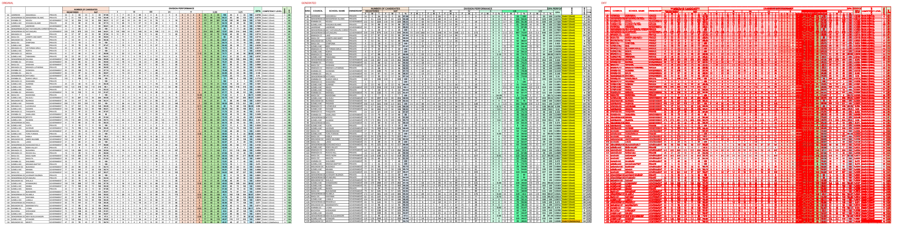
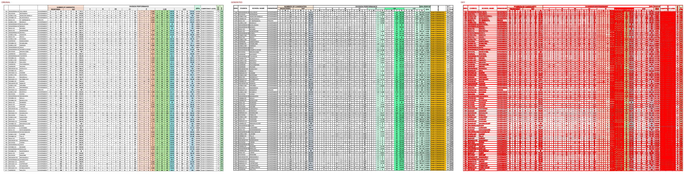
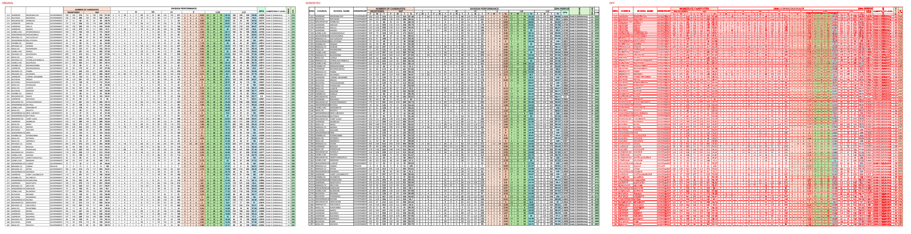
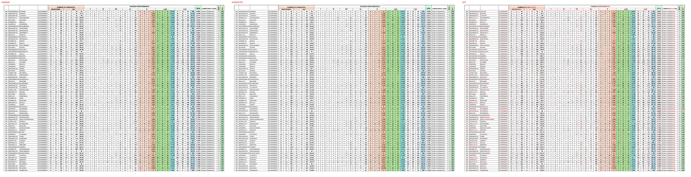
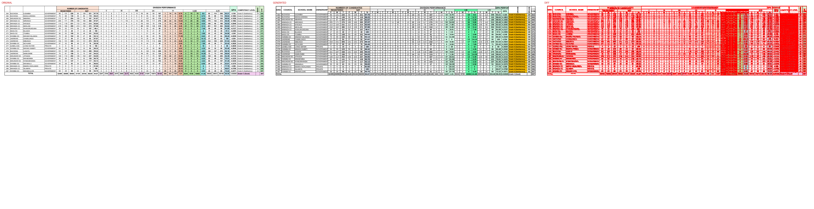

# Original vs generated

Columns: **original | generated | diff** (pink = sub-pixel differences, red = real differences).

Pixel diff = share of pixels that differ at 110 dpi; tolerant = still different when a 1px shift is allowed (ignores sub-pixel anti-aliasing).

| page | pixel diff | tolerant diff | words missing | words extra | fills only in original | fills only in generated |
|---|---|---|---|---|---|---|
| 1 | 33.36% | 17.35% | 42 | 62 | - | - |
| 2 | 39.07% | 20.14% | 34 | 71 | - | - |
| 3 | 40.86% | 20.54% | 30 | 69 | - | - |
| 4 | 40.90% | 20.54% | 31 | 68 | - | - |
| 5 | 40.50% | 20.46% | 27 | 65 | - | - |
| 6 | 13.33% | 5.71% | 67 | 40 | #f2ceef | - |

## Page 1
missing: `{'O': 3, 'L': 3, 'E': 3, 'C': 2, 'N': 2, 'I': 2, 'V': 2, 'NYANTAKUPBRWIVAA': 2, 'SC': 1, 'H': 1}`
extra: `{'0': 14, '33': 6, '100': 2, '6': 2, '7': 2, '60': 2, '20': 2, '34': 2, 'NYANTAKPRIVATE': 2, 'REGION': 1}`

## Page 2
missing: `{'0': 12, '33': 6, '60': 2, '34': 2, '100': 2, 'UKEREWE': 1, 'KAGUNGULI': 1, 'PRIVATE': 1, '97.06': 1, '7': 1}`
extra: `{'F': 9, 'M': 9, 'T': 9, '%': 4, '22': 4, '12': 3, '1': 3, '19': 2, '136': 2, 'PERFORMANCE': 1}`

## Page 3
missing: `{'22': 4, '12': 3, '136': 2, '4': 2, '6': 2, '19': 2, '0': 1, 'SENGEREMA': 1, 'DCIGULUMUKI': 1, '24': 1}`
extra: `{'F': 9, 'M': 9, 'T': 9, '%': 4, '159': 2, '212': 2, 'PERFORMANCE': 1, 'GPA': 1, 'S/NO.': 1, 'COUNCIL': 1}`

## Page 4
missing: `{'212': 2, '159': 2, 'UKEREWE': 1, 'NDURUMA': 1, 'DAY': 1, '156': 1, '162': 1, '318': 1, '151': 1, '310': 1}`
extra: `{'F': 9, 'M': 9, 'T': 9, '0': 5, '%': 4, '19': 3, '2': 3, '288': 2, '15': 2, '36': 2}`

## Page 5
missing: `{'0': 5, '288': 2, '19': 2, '17': 2, '36': 2, '2': 2, 'SENGEREMA': 1, 'DCLWENGE': 1, '21': 1, '40': 1}`
extra: `{'F': 9, 'M': 9, 'T': 9, '%': 4, '364': 2, 'PERFORMANCE': 1, 'GPA': 1, 'S/NO.': 1, 'COUNCIL': 1, 'SCHOOL': 1}`

## Page 6
missing: `{'364': 2, '2': 2, '1': 2, '3': 2, '4': 2, '15': 2, '0': 1, 'BUCHOSA': 1, 'ILIGAMBA': 1, 'GOVERNMENT': 1}`
extra: `{'F': 9, 'M': 9, 'T': 9, '%': 4, 'PERFORMANCE': 1, 'GPA': 1, 'S/NO.': 1, 'COUNCIL': 1, 'SCHOOL': 1, 'NAME': 1}`

