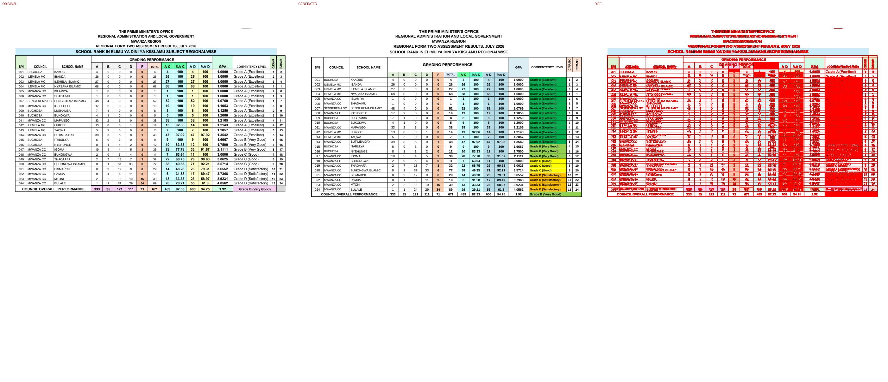

# Original vs generated

Columns: **original | generated | diff** (red = pixels that differ).

| page | pixel diff | words missing | words extra | fills only in original | fills only in generated |
|---|---|---|---|---|---|
| 1 | 16.80% | 1 | 0 | #65ffab #caedfb #d2fce6 #d9d9d9 #daf2d0 #f2ceef #f2f2f2 #f7c7ac #fbe2d5 #ffffcc | #00b050 #66ff99 #66ffcc #92d050 #b7dee8 #daeef3 #ddebf7 #e2efda #f8cbad #fce4d6 #ffc000 #ffff00 |

## Page 1
missing: `{'SUBJECT': 1}`

