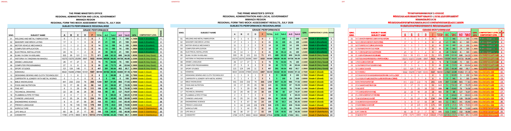
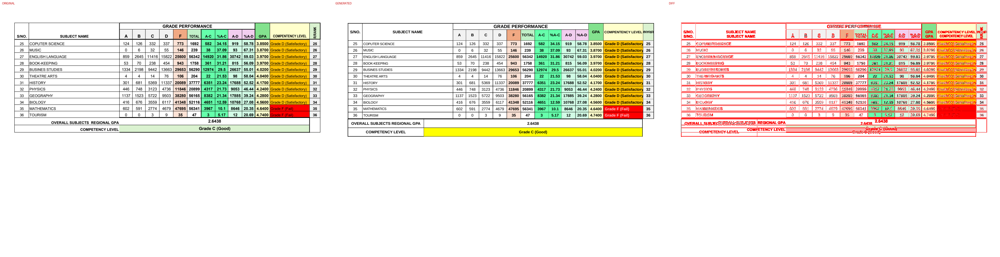

# Original vs generated

Columns: **original | generated | diff** (pink = sub-pixel differences, red = real differences).

Pixel diff = share of pixels that differ at 110 dpi; tolerant = still different when a 1px shift is allowed (ignores sub-pixel anti-aliasing).

**Verdict** is the stricter >=96%-match bar (position-by-position across colours, borders, data and cell sizes): a page **PASS**es when tolerant diff <= 4% (>=96% pixel match) AND there are zero fills-only diffs both ways AND zero words missing/extra; otherwise **FAIL** with the failing dimension(s) named.

| page | pixel diff | tolerant diff | words missing | words extra | fills only in original | fills only in generated | verdict (>=96%) |
|---|---|---|---|---|---|---|---|
| 1 | 18.24% | 11.00% | 2 | 1 | - | - | ❌ FAIL (pixels 11.00%>4%, words 2miss/1extra) |
| 2 | 12.24% | 7.70% | 2 | 1 | - | #ffff00 | ❌ FAIL (pixels 7.70%>4%, fills 0orig/1gen, words 2miss/1extra) |

**Verdict summary: 0/2 pages meet the >=96% bar** (tolerant diff <= 4% AND zero fill diffs AND zero word diffs).

## Page 1
missing: `{'LEVEL': 1, 'KNAR/R': 1}`
extra: `{'LEVELKNAR/R': 1}`

## Page 2
missing: `{'LEVEL': 1, 'KNAR/R': 1}`
extra: `{'LEVELKNAR/R': 1}`

