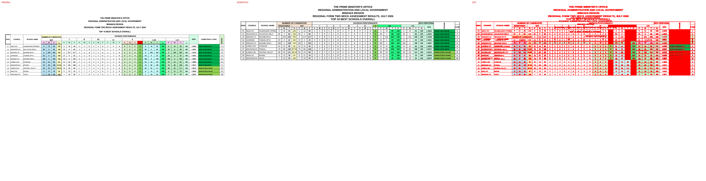
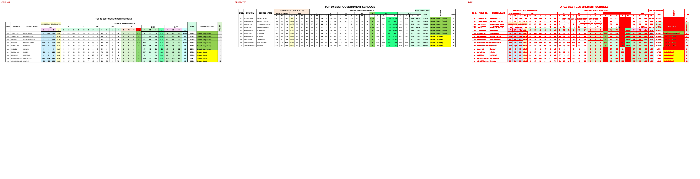
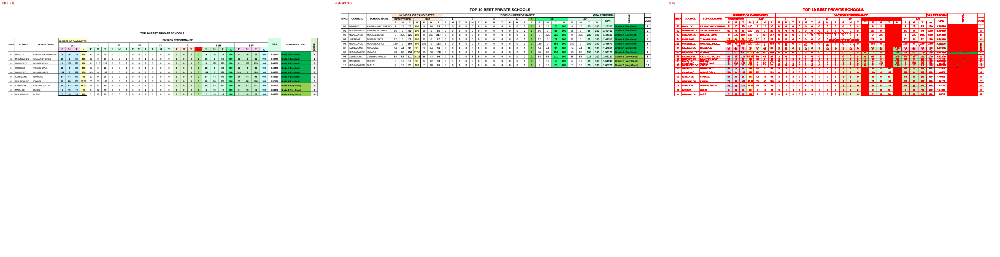
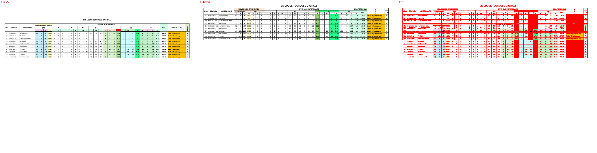
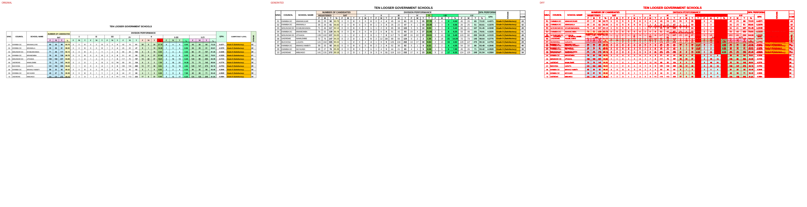
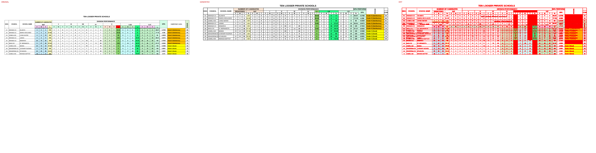

# Original vs generated

Columns: **original | generated | diff** (red = pixels that differ).

| page | pixel diff | words missing | words extra | fills only in original | fills only in generated |
|---|---|---|---|---|---|
| 1 | 11.27% | 1 | 4 | #65ffab #8ed973 #c0e6f5 #c1f0c8 #ccffff #d2fce6 #daf2d0 #f2ceef #f2f2f2 #fbe2d5 #ff0000 | #8fd968 #d2fbe6 #fce9d9 |
| 2 | 10.36% | 5 | 6 | #65ffab #8ed973 #c1f0c8 #caedfb #ccffff #d2fce6 #daf2d0 #f2ceef #f2f2f2 #fbe2d5 #ff0000 | #29ff8a #8fd968 #d2fbe6 #fce9d9 |
| 3 | 11.44% | 1 | 4 | #65ffab #b5e6a2 #c1f0c8 #caedfb #ccffff #d2fce6 #daf2d0 #f2ceef #f2f2f2 #fbe2d5 #ff0000 | #29ff8a #8fd968 #d2fbe6 #fce9d9 |
| 4 | 11.20% | 1 | 4 | #b5e6a2 #c1f0c8 #caedfb #ccffff #d2fce6 #daf2d0 #f2ceef #f2f2f2 #fbe2d5 #ff0000 | #8fd968 #d2fbe6 #fce9d9 |
| 5 | 11.30% | 1 | 4 | #65ffab #b5e6a2 #c1f0c8 #caedfb #ccffff #d2fce6 #daf2d0 #f2ceef #f2f2f2 #fbe2d5 #ff0000 | #29ff8a #8fd968 #d2fbe6 #fce9d9 |
| 6 | 9.98% | 5 | 6 | #8ed973 #c1f0c8 #caedfb #ccffff #d2fce6 #daf2d0 #f2ceef #f2f2f2 #fbe2d5 #ff0000 | #8fd968 #d2fbe6 #fce9d9 |

## Page 1
missing: `{'%': 1}`
extra: `{'PERFORMANCE': 1, 'GPA': 1, 'REGISTERED': 1, 'T': 1}`

## Page 2
missing: `{'DC': 2, '%': 1, 'KATUNGURU': 1, 'SAVANA': 1}`
extra: `{'PERFORMANCE': 1, 'GPA': 1, 'REGISTERED': 1, 'T': 1, 'DCKATUNGURU': 1, 'DCSAVANA': 1}`

## Page 3
missing: `{'%': 1}`
extra: `{'PERFORMANCE': 1, 'GPA': 1, 'REGISTERED': 1, 'T': 1}`

## Page 4
missing: `{'%': 1}`
extra: `{'PERFORMANCE': 1, 'GPA': 1, 'REGISTERED': 1, 'T': 1}`

## Page 5
missing: `{'%': 1}`
extra: `{'PERFORMANCE': 1, 'GPA': 1, 'REGISTERED': 1, 'T': 1}`

## Page 6
missing: `{'DC': 2, '%': 1, 'JUVENARY': 1, 'NTUNDURU': 1}`
extra: `{'PERFORMANCE': 1, 'GPA': 1, 'REGISTERED': 1, 'T': 1, 'DCJUVENARY': 1, 'DCNTUNDURU': 1}`

