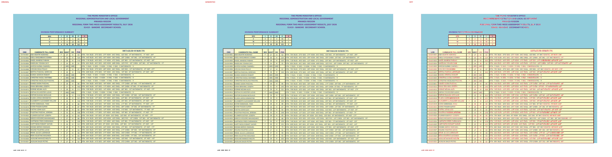
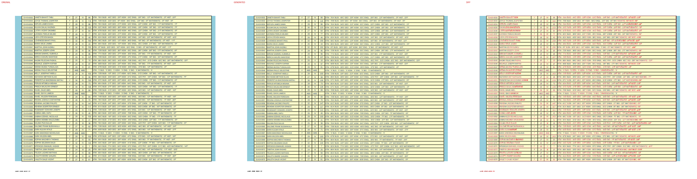
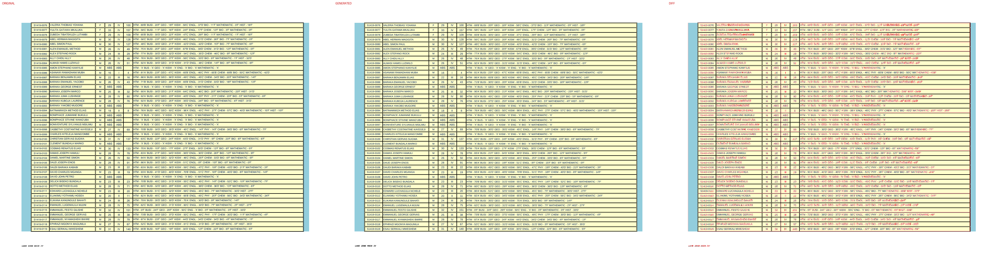
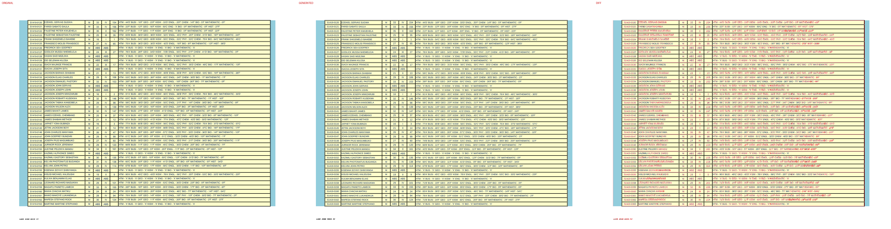
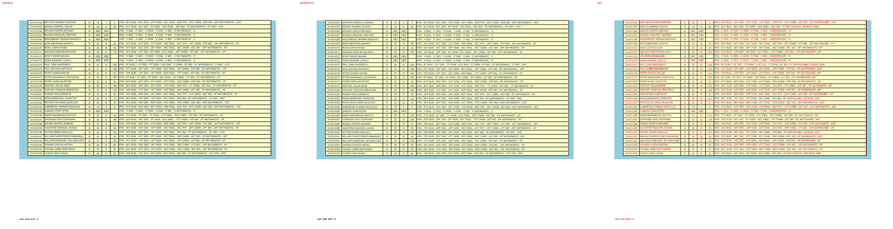
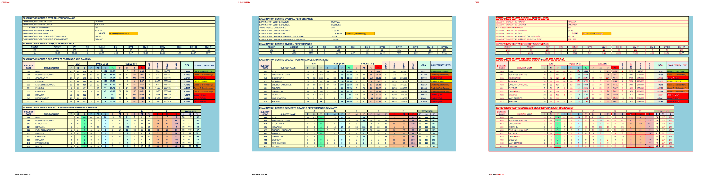

# Original vs generated

Columns: **original | generated | diff** (pink = sub-pixel differences, red = real differences).

Pixel diff = share of pixels that differ at 110 dpi; tolerant = still different when a 1px shift is allowed (ignores sub-pixel anti-aliasing).

**Verdict** is the stricter >=96%-match bar (position-by-position across colours, borders, data and cell sizes): a page **PASS**es when tolerant diff <= 4% (>=96% pixel match) AND there are zero fills-only diffs both ways AND zero words missing/extra; otherwise **FAIL** with the failing dimension(s) named.

| page | pixel diff | tolerant diff | words missing | words extra | fills only in original | fills only in generated | verdict (>=96%) |
|---|---|---|---|---|---|---|---|
| 1 | 7.63% | 0.56% | 0 | 0 | - | - | ✅ PASS |
| 2 | 9.58% | 0.61% | 0 | 0 | - | - | ✅ PASS |
| 3 | 9.44% | 0.56% | 0 | 0 | - | - | ✅ PASS |
| 4 | 9.58% | 0.60% | 0 | 0 | - | - | ✅ PASS |
| 5 | 6.98% | 0.41% | 0 | 0 | - | - | ✅ PASS |
| 6 | 11.70% | 1.26% | 20 | 4 | - | - | ❌ FAIL (words 20miss/4extra) |

**Verdict summary: 5/6 pages meet the >=96% bar** (tolerant diff <= 4% AND zero fill diffs AND zero word diffs).

## Page 1

## Page 2

## Page 3

## Page 4

## Page 5

## Page 6
missing: `{'K': 4, 'N': 4, 'A': 4, 'R': 4, '/S': 1, '/C': 1, '/R': 1, '/Z': 1}`
extra: `{'KNAR/S': 1, 'KNAR/C': 1, 'KNAR/R': 1, 'KNAR/Z': 1}`

